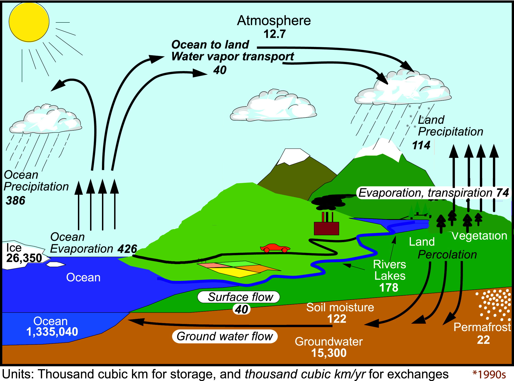
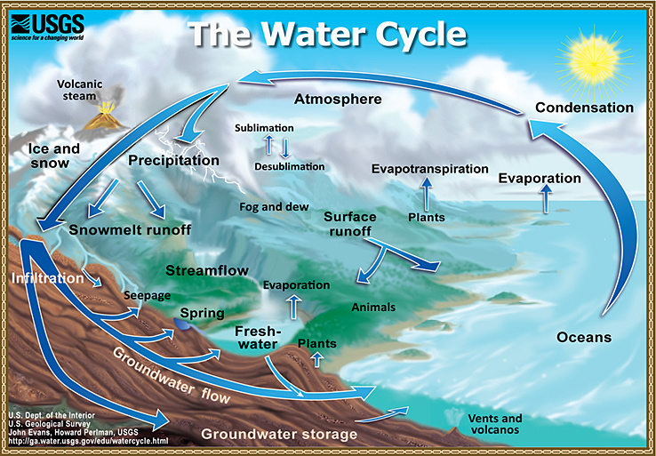
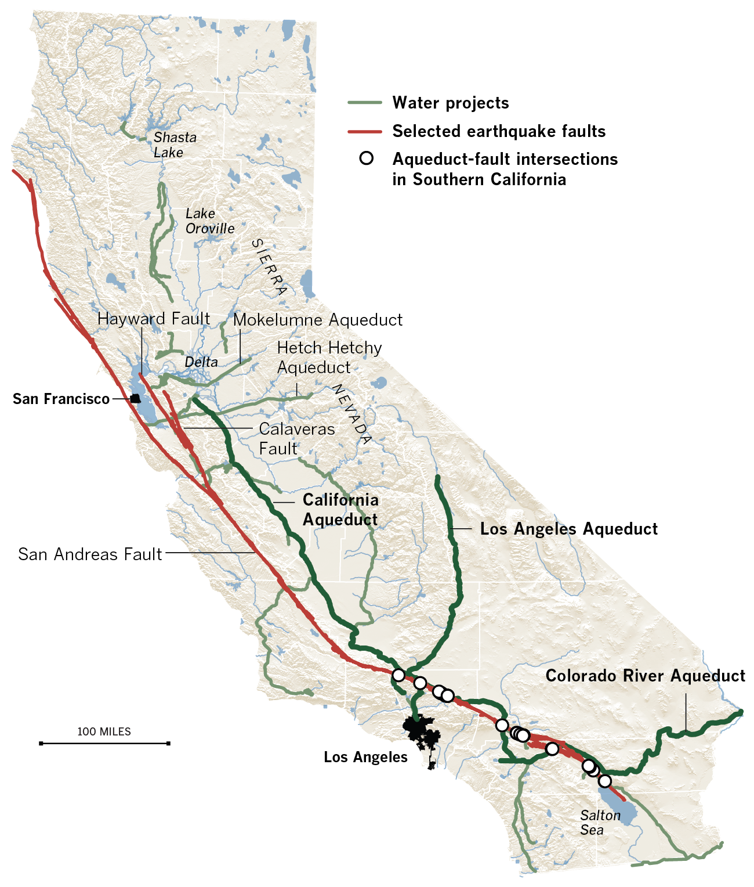
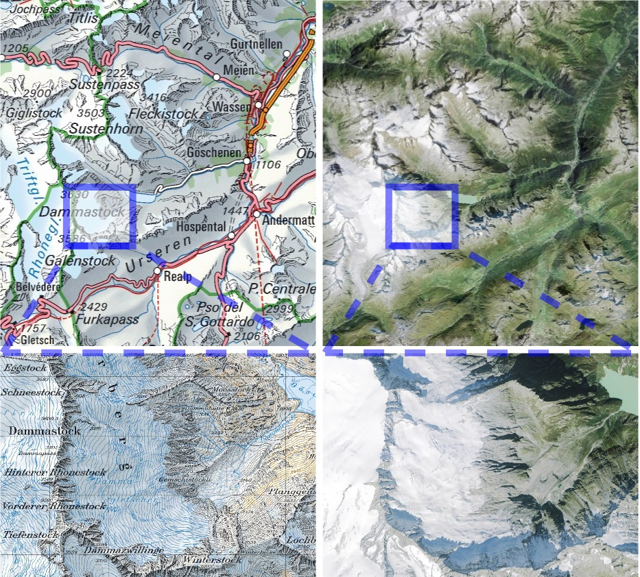
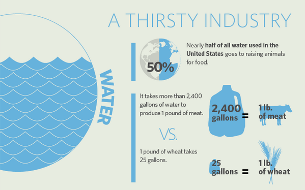
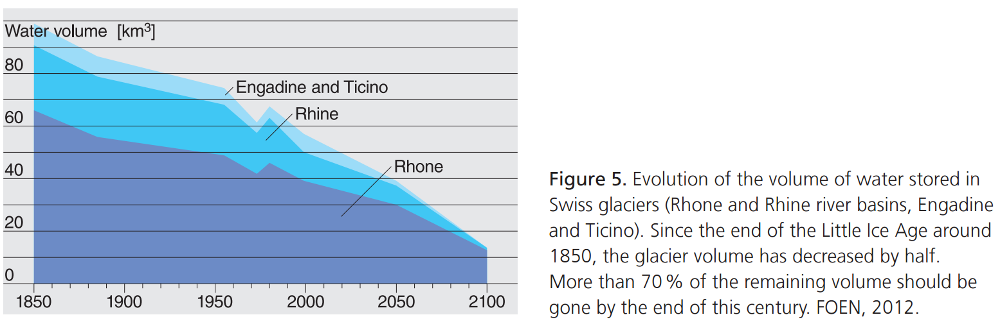
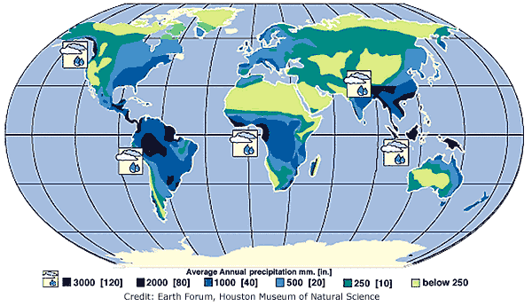

## Plan

- [Main components of the water cycle](./1_water_cycle.html#main-components-of-the-water-cycle)
<!-- - Global figures: storages, fluxes and residence times -->
<!-- - Water budget for Switzerland and Norway -->
<!-- - Definitions and example of catchments -->
- [Interaction with other cycles](./1_water_cycle.html#interactions-with-other-cycles)
- [Human impacts](./1_water_cycle.html#human-impacts)
- [Water balance calculations](./1_water_cycle.html#water-balance-calculations)
- [Hydro-meteorology](./1_water_cycle.html#hydro-meteorology)
- [Climate change and the hydrological cycle](./1_water_cycle.html#climate-change-and-the-hydrological-cycle)
- [Take home messages](./1_water_cycle.html#take-home-messages)

<!--

- Water storage in oceans
- Water in the atmosphere
- Water storage in ice and snow
- Water storage in aquifers
- Precipitation: rain, snow, hail...
- Interception
- Sublimation
- Evapotranspiration
- Condensation
- Infiltration

Draw together a conceptual sketch of the water cycle
How were the numbers evaluated?
How does this sketch link to the next session?
-->

# Main components of the water cycle

##  Draw the water cycle with water storages, and processes between each storage.
<!--
## Interactive water cycle questions:
http://techalive.mtu.edu/meec/module01/HydrologicCycleQuiz.htm
-->

## {.fullpage} 

<!--
from
http://www.metlink.org/climate/ipcc-updates-for-a-level-geography/the-changing-water-cycle/

## {.fullpage}

-->

## Calculate residence times

> - **How do we estimate residence times?**
> - *T = Volume / Yearly fluxes*
> - **Estimate the residence times in the atmosphere and lake/rivers.**
> - Atmosphere: 12.7 / (386+114) = 0.025 yr (9 days)
> - Rivers and lakes: 178 / 40 = 4.45 yr

## Residence time distribution

> - **What does it mean?**
> - The previous residence times are **mean values**.
> - They follow distributions (like probability distributions) at different scales: world, continents, catchments...
> - **Draw the residence time distribution of: snow in the Sogndal catchment, soil moisture and groundwater in the Sahara**

## {.fullpage} 

<!--
Water source	| Water volume (km^3)	| % freshwater	| % total water
--- | --- | --- | --- 
Oceans, Seass	| 1,338,000,000	| --- |	96.5
Ice caps, Glaciers	|	24,064,000	| 68.7 |	1.74
Groundwater	|	23,400,000	| --	| 1.7
Fresh	|	10,530,000	| 30.1	| 0.76
Saline	|	12,870,000	| --	| 0.93
Soil Moisture	|	16,500	| 0.05	| 0.001
Ground Ice & Permafrost	|	300,000	| 0.86	| 0.022
Lakes	|	176,400	| --	| 0.013
    Fresh	|	91,000	| 0.26	| 0.007
    Saline	|	85,400	| --	| 0.006
Atmosphere	|	12,900	| 0.04 | 0.001
Swamp Water	|	11,470	| 0.03	| 0.0008
Rivers	|	2,120	| 0.006	| 0.0002
Biological Water |	1,120	| 0.003	| 0.0001
Source: Igor Shiklomanov's chapter "World fresh water resources" in Peter H. Gleick (editor), 1993, Water in Crisis: A Guide to the World's Fresh Water Resources (Oxford University Press, New York).

## From Holy, 1982
Water Occurrence | 10^12 m3 | % of water | % of fresh water
--- | --- | --- | --- 
World Oceans |1300000 | 97
Salt lakes/seas | 100 | 0.008
Polar ice | 28500 | 2.14 | 77.6
Atmospheric water | 12 | 0.001 | 0.035
Water in organisms | 1 | 0.000 | 0.003
Fresh lakes | 123 | 0.009 | 0.335
Water courses | 1 | 0.000 | 0.003
Unsaturated zone | 65 | 0.005 | 0.18
Saturated zone | 8000 | 0.60 | 21.8
Total fresh water | 36700 | 2.77 | 100
Total water | 1337000 | 100
-->

## Different scales of water cycles/budgets

- Earth
- Catchment
- City
- Water balance of a human diversion

## Some vocabulary

There is great hydrology glossary online from the [Unesco](http://unesdoc.unesco.org/images/0022/002218/221862M.pdf)

> - **Discharge (or water flow):**
> - volume of water passing through a given point at a given time 
> - **Runoff:**
> - Often used for discharge. Should be only related to surface processes (water runs off an impervious surface)
> - **Watershed (or catchment):** 
> - the geographical area drained by a watercourse. It can range from small headwater catchments to large river or lake basins

<!--
> - **River basin:** 
> - the complex system of watersheds and subwatersheds crossed by a major river and its tributaries while flowing from the source to the mouth
> - **Upstream/downstream linkages:** 
> - the environmental, socio-economic and cultural flows, synergies exchanges and conflicts between the upper and lower parts of a watershed
> - **Watershed management:** 
> - any human action aimed at ensuring a sustainable use of watershed resources
> - **Recharge:** 
> - refill of a groundwater aquifer
-->

## Show me the watershed

## Exception: karstic aquifers

## Exception: karstic aquifers
Spring at Aachtopf: approx. 10m3/s

<!--
http://www.donauversickerung.info/querschnitt_1.html
-->

## Interactions with other natural cycles
> - **How does the water cycle interact with carbon cycle**
> - Water is needed for vegetation to grow and fix atmospheric carbon
> - The weathering of silicates traps CO2: 1 Gt/year against 30 Gt/yr of emissions (https://www.skepticalscience.com/weathering.html)
> - Those figures could change with glacier retreat and warmer temperatures.

> - **How does it interact with the nitrogen cycle?**
> - Gets transported by water
> - Gets fixed by plant growth

## Oscillations in CO2 concentration
> - **Explain the oscillations**

> - Seasonal variations in plant growth affect CO2 concentrations

## Cycles in the Artic / Norway

# Human impacts

## Irrigation and drinking water

## Hydropower

## Hydropower tunnels

## Virtual water in agriculture

> - Cowspiracy says that:

> - The USGS says that livestock withdrawals accounted for about 1 percent of total freshwater withdrawals for all uses excluding thermoelectric power.

> - Crazy difference
> - The larger estimate counts everything, including precipitation on the fields
> - But many fields are not useable for other crops
> - **Reality probably in between**

# Water balance calculations

## Water budget at the catchment scale
<!--  -->

The variation in volume of water stored in a catchment can be written as:

> - $r_s = p - gw - et - \frac{dv}{dt}$
> - $\frac{dv}{dt} = p - gw - et - r_s$
> - where $p$ is the precipitation rate, $r_s$ the surface runoff, $gw$ the net rate of groundwater flow and $et$ the rate of evapotranspiration.

> - $\frac{dv}{dt}$ comprises variations in any water storage: groundwater, surface water, snow and ice

## Swiss water budget (a)
Musy, 2001: http://echo2.epfl.ch/VICAIRE/mod_1a/chapt_1/main.htm

Water cycle component | Contribution (mm/year)
--- | ---
Precipitation | 1546
Total runoff | 1296
Influx into Switzerland | 318
Evapotranspiration | 484

> - **What's missing?**
> - The glacier melt input (1546-1296+318-484=84mm). But the sign is wrong...

## Swiss water budget (b)
https://naturalsciences.ch/topics/water/water_balance

## Water balance for Switzerland

> - **Anything new?**
> - The virtual water component
> - **Approximate country area with 1500mm of annual precipitation?**
> -    $60 / (1.431 * 10^-3) = 42000 km^2$

## How much glacier melt was missing?
Glacierized areas in Switzerland: 944 km2
<!--
(http://adsabs.harvard.edu/abs/2014EGUGA..16..200F)
-->

> - Average glacier mass balance?

> - **Which water balance seems more accurate / coherent?**
> - 85-55 km3 lost in 100 years = 0.03 km3 / year. So 0.03km3 /1000km2 = 30mm / year

## What about those figures for Norway?

Water cycle component | Contribution (mm/year)
--- | ---
Precipitation | 1415
Total runoff | 1180
Flow from neighbours | 30
Flow into Sweden | 30
Evapotranspiration | 235

> - **How much glacier melt: do you think it is a big approximation?**
> - 0mm for glacier melt. I don't think it's too big: only 1% of glacier covered areas. Their mass balance is probably less negative than in Switzerland.

# Hydro-meteorology

## Energy balance
> - **What is the expression of $Q_m$, the energy flux available for melt?**
> - 

## What are turbulent heat fluxes?
> - Heat exchanges that are driven mass movement (wind) and involve phase changes 
> - **Latent heat flux?** 
> - Heat flux during phase changes

> - **How can latent heat fluxes affect temperatures at the local level?** 
> - When it snows very intensely, the melting of snow flakes can progressively cool the lower areas, resulting in lower snow line than initally expected

## Latent heat fluxes?
> - **On the other hand, what impact can dry soils have on local temperatures?**
> - The lack of soil water to evaporate can increase temperatures (reduced latent heat fluxes)
> - This can lead to heat waves later in the summer. Warsaw and Lyon have for example record highs in August
> - Latent heat is also the reason why the snowpack may remain hard on a warm spring day, if initially covered by a thin layer of new snow 

> - **Think of a natural cooling device based on this process?**
> - Wet pottery jars as low-tech fridges

## Sensible heat fluxes?
> - **What is sensible heat?**
> - Heat exchanged by a body or thermodynamic system in which the exchange of heat changes the temperature of the body or system

> - **In meteorology, the term sensible heat flux means?**
> - the heat fluxes between the Earth's surface and the atmosphere which result in temperature changes

## Radiative fluxes
> - Shortwave radiation from the sun (can be reflected by the earth's surface)
> - Longwave radiation emitted by the earth's surface (from the earth) and the atmosphere (towards the earth)

## What is albedo?
> - Percentage of shortwave radiation reflected by a surface
> - **Fresh snow?**
> - 80-95%
> - **Forests**
> - 10-20%
> - **Asphalt**
> - 5-10%
> - **Average earth's albedo**
> - 30-35%

## Feedback between climate and local hydrological variables
> - **Which important negative feedback effect from land surface changes will affect the climate in alpine / polar areas?**
> - Albedo effect: one reason why high latitude are more affected by warming

## What's the Foehn wind?
> - A warm and dry wind that
> - blows than the lee side of a mountain range
> - **Why?**
> - Orographic precipitation forcing
> - Adiabatic cooling and warming with different lapse rates (9.8 vs 5°C/km)
> - **Why different lapse rates?**
> - Less moisture means less latent heat spent to evaporate water
> - **Geographical examples?**
> - Eastern Patagonia, deep valleys (Eikesdalen, Valais in CH), chinook wind in Calgary, Finnmark east of Lyngen

## Precipitation map: regions with foehn effect?

# Climate change and the hydrological cycle

## Potential impacts of climate change

- Water-holding capacity of the atmosphere increases exponentially by about 7% for every 1 °C
- Increased evaporation rate of surface water
- Intensification of the global water cycle
- More evaporation could reduce soil moisture. Potential temperature and vegetation growth feedbacks
- Drier tropics (low/mid latitudes)
- Increased inequalities in water resources
- Likely more intense and frequent extreme rain events
- Wetter mid/high latitudes (Norway!)

## Take home messages
<!--  -->

- Hydrology: study of water volumes and flows on and beneath the earth's surface
- Vapor formation and transport driven by solar energy
- Precipitation, surface and sub-surface flows driven by gravitational and capillary forces
- Catchment: area of land in which all water flows towards a defined outlet
- Water budget based on conservation of mass principle
- Usually precipitation = surface runoff + evapotranspiration
- Pay attention to human interactions and ice / groundwater storages
- Questions figures you may find, especially when they are indirect (i.e. virtual water)

<!--
## Quiz preparation
Prepare general knowledge questions such as:

- What is the driest region in Norway? 
- What are its precipation and mean annual temperature values? 
- Why is it so dry?

This can include the impact of climate changed:

http://www.metlink.org/climate/ipcc-updates-for-a-level-geography/the-changing-water-cycle/
-->

# Further resources

## Book chapters and online courses

Elements of physical hydrology. Chapters 1, 2, 11

Hydrology in Practice. Chaper 1

"Integrate" online course on Critical Zone science:
[Unit 1.2: Exploring the Hydrologic Cycle](https://serc.carleton.edu/integrate/teaching_materials/ecosystem_water/unit1.2.html)

## Other online resources
Norway / Europe:

- [Hydrological atlas of Switzerland](http://www.hydrologischeratlas.ch)
- [Norwegian realtime hydrological data](https://www.nve.no/hydrologi/hydrologiske-data)

USA:

- [Post-drougth groundwater in California](https://californiawaterblog.com/2017/03/19/post-drought-groundwater-in-california-like-the-economy-after-a-deep-recession-recovery-will-be-slow/)
- [USGS summary of the water cycle](https://water.usgs.gov/edu/watercyclesummary.html)

[Climate change impact on water resources](http://drought.unl.edu/DroughtBasics/ClimateChange.aspx#Water_Resources)

## [Manuals from the World Meteorological Organization](http://www.wmo.int/pages/prog/hwrp/manuals.php)

Includes: 

- glossary of hydrology (http://hydrologie.org/glu/aglo.htm)
- manual on flood forecasting and warning (in french)
- manual on stream gauging
- manual on estimation of probable maximum precipitation
- manual on low-flow estimation and prediction
- guidelines on the role, operation and management of National Hydrological Services

## Recent and likely future changes in the hydrological cycle

<iframe width="560" height="315" src="https://www.youtube.com/embed/bQ8_UZpbtz8" frameborder="0" allowfullscreen></iframe>

<!-- # Annoted video resources -->

<!-- ## Sonia Seneviratne - Effects of land hydrology on atmospheric processes and climate change -->

<!-- https://www.youtube.com/watch?v=zMjchti6LdM -->

<!-- - 8: Interaction between land and atmosphere -->
<!-- - 18: Dry springs followed by hot summers -->
<!-- Meteorological drought: critical precipitation deficit -->
<!-- Soil-moisture drought: soil-moisture deficit -->
<!-- Hydrological drought: streamflow and groundwater deficit. -->
<!-- - 25: How are they inter related -->
<!-- - 28: Comparing 2 methods for potential evapotranspiration -->

<!-- ## Sonia Seneviratne - Effects of land hydrology on atmospheric processes and climate change -->

<!-- - 29: Uncertaincy in evapotranspiration (can be up to 30%) -->
<!-- - 34: Wetter gets wetter, drier gets drier? no! -->
<!-- - 39: Impact of no-till farming. crop residues modify the albedo: increases the albedo. strongest cooling for the strongest temperature -->
<!-- very strong asymetric impact of temperature: a bit like forest -> importance of looking at extremes and not mean -->
<!-- - 45: Question: with climate change, less cloud cover more cooling? feedback loops  -->
<!-- - 51: Question: how strong is the link between soil moisture storage and streamflow? -->

