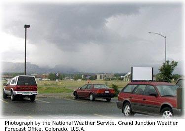
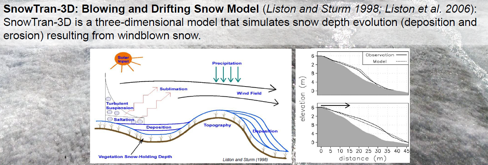
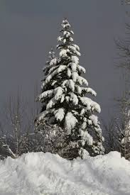
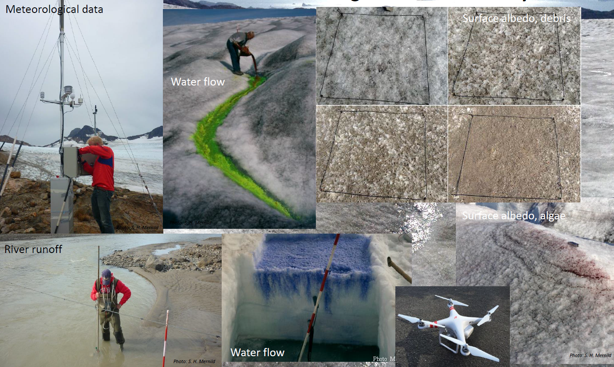
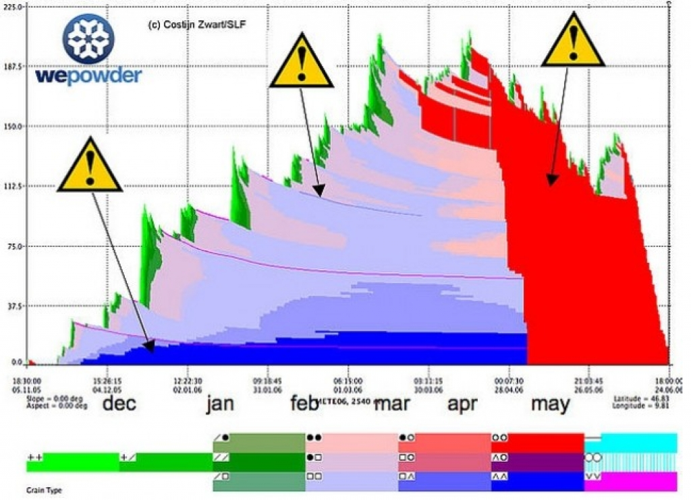
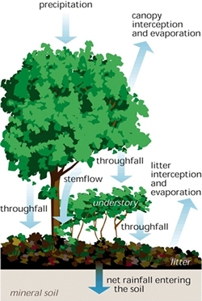

## Plan

-  [Precipitation](./2_hydrological_processes_1.html#precipitation)
- [Snow](./2_hydrological_processes_1.html#snow)
- [Vegetation](./2_hydrological_processes_1.html#vegetation)
- [Take home messages](./2_hydrological_processes_1.html#take-home-messages)

<!--
Link to snow science?
html widget on evapo? snowmelt?
Bring sand and sil, dry and saturated to demonstrate the relationship between hydraulic conductivity and soil moisture.
-->

# Precipitation

## Strong non uniformity

- Lapse rate with altitude
- Rain shadow effect
- Convective storms
- Showery weather

## Measuring precipitation
- Hyetograph represents: rainfall intensity as a function of time
- Rain gauges: tend to underestimate, only point measure
- Weather radars: variability shown, but less precise for specific locations
- Various methods to interpolate measured precipitation: isohyetal method, Thiessen polygons...
- For urban aplications, rainfall events are often modelled with a simplified shape: uniform rectangle or double triangle

# Snow

## Snow distribution
> - **Which factors affect the spatial distribution of snow?**
> - 

## Snow and water resources

> - **How does snow affect the water cycle?**
> - Storage effect creates highly seasonal hydrological regime
> - Long infiltration event during snowmelt. 
> - Can be the main aquifer recharge event for some catchments (arid mountains)

> - **How do you link snow depth to the "Snow Water Equivalent" (SWE) of the snowpack?**
> - density relative to water (< 1) * height ($m$) = SWE in $m$
> - density ($kg/m^3$) * height ($m$) = SWE in $kg/m^2$ 
> - SWE in $kg/m^2$ = SWE in liters of water / $m^2$ = SWE in $mm$ 

## Snow and forest
> - **What is the impact of forest on snow?**
> - Interception leads to increased sublimation
> - Interception leads to threshold effects and time lags in snow depth
> - Wind break effect leads to accumulation on one side
> - Less radiative cooling can increase melt rates at night
> - High albedo when snow has dropped 

## Snow and climate
> - **How do glaciers affect the enery-balance downstream? Why does this phenomena happen?**
> - Katabatic wind
> - Radiative cooling of air on the glacier, which is heavier and drops down the valley

> - **How can a reduced snow covered area impact the climate?**
> - negative albedo feedback: more heating

## Snow and climate
> - **What are expected effects of climate change on the contribution of snow to river discharge regimes?**
> - The whole hydrograph shifts to earlier in the year 
> - Earlier peak discharge
> - Lower flows in late summer

## Snow and climate

## Meltwater infiltration through the snowpack

## Snowmelt
> - **When does snowmelt, as contribution of melting snow to the hydrological cycle, actually start?**
> -  when the snowpack becomes isothermal: the whole snowpack has some liquid water content and water can start infiltrating into the soil or running of it's surface
> - **If the snowpack is deep enough, it doesn't start on the first day of positive temperature. Why?**
> - The snowpack takes time to warm. Liquid water takes time to infiltrate through the snowpack and reach its base

## [Snowpack model](https://models.slf.ch/docserver/snowpack/html/general.html) and melt

## Melt rate

> - **What was the peak snow water equivalent assuming 150cm of snow at a density of 0.33?**
> - 500mm
> - **It took about 50 days to melt. What's the average melt rate?**
> - 10mm/day

## Snowmelt models

Conceptual approaches:

- $M = C*(T-T_0)$ with C calibrated melt factor and $T_0$ calibrated temperature threshold
- $M = (C_1+C_2*u)*(T-T_0)$ with $u$ wind speed
- $M = (C_1+C_2*I)*(T-T_0)$ with $I$ solar short wave radiation
- $M = C_1*(T-T_0)+C_2*I*(1-\alpha))$ with $\alpha$ snow albedo

Other option: energy balance model

Recommended reading for exercise session 1: [Different models for snowmelt - T. Schuler UiO](http://www.uio.no/studier/emner/matnat/geofag/GEO4430/v06/undervisningsmateriale/geo4430_meltmod_tvs.pdf)

# Vegetation

## Vegetation's impact on hydrological response 

- Transpiration
- Storage of water
- Higher infiltration in the root zone
- Interception

<!--
> - **How does sap come up in trees?**
> - TO CLARIFY
> - **How do you think evapotranspiration can be modelled?**
-->

## Evapotranspiration
> - **What is the difference between potential and actual evapotranspiration?**
> - Potential evapotranspiration only depends on energy input and the atmosphere's ability to transfer moisture. It is the ET without moisture limitation (most soils will be moisture-limited)
> - Actual evapotranspiration is limited by soil moisture and can be much smaller
> - [Typical monthly values around the world](http://www.waterandclimatechange.eu/evaporation/average-monthly-1985-1999)

## Estimating evaporation

- Calculating local mass transfers of water vapor (Dalton's law)
- Calculating the local energy balance (Bowen ratio method)
- Combining both approaches gives the Penman's equation which requires daily mean temperature instead of surface temperature
- Additional required inputs are: wind speed, relative humidity and solar radiation.

> - **How can you reduce evaporation from bare soil?**
> - Cover it
> - Create a wind break

## Estimating actual evapotranspiration

- Average catchment values can be estimated closing the hydrological balance
- Local water balance with the help of percolation gauges / lysimeters
- Penman Monteith equation: most widely-used for actual ET. It takes stomatal regulation into account: crop coefficients are parameters taking into account how much plants actually transpire

<!--
## Penman-Montieth's equation

\[ET=\frac{\Delta (R_n-G) + \rho_a c_p \left( \delta e \right) g_a }{ \left( \Delta + \gamma \left ( 1 + g_a / g_s \right) \right) L_v }\]

with $ET$ the volume flux rate of ET (in mm/s)

$L_v = 2453 \ MJ. m^−3$ volumetric latent heat of vaporization

$\Delta$ Rate of change of saturation specific humidity with air temperature. (Pa K−1)

## Penman-Montieth's equation
$R_n$ Net irradiance (W m−2), the external source of energy flux

$G$ Ground heat flux (W m−2), usually difficult to measure

$c_p$ Specific heat capacity of air (J kg−1 K−1)

$\rho_a$ dry air density (kg m−3)

$\delta e$ vapor pressure deficit, or specific humidity (Pa)

$g_a$ Conductivity of air, atmospheric conductance (m s−1)

$g_s$ Conductivity of stoma, surface conductance (m s−1)

$\gamma = 66 \ Pa.K^-1$ Psychrometric constant
-->

<!--
Written with energy flux rate
\[\lambda_v E = \frac{\Delta (R_n-G) + \rho_a c_p \left( \delta e \right) g_a }{\Delta + \gamma \left ( 1 + g_a / g_s \right)}\]
-->
## Interception losses
> - **Interception losses are due to**
> - **a**: evaporation
> - **b**: transpiration
> - **c**: streamflow
> - **d**: none of the above
> - Answer: **a**

## How can those properties be useful with regards to green SW infrastructure?

> - Interception provides storage and mitigates the effect of heavy precipitation
> - Enhanced root zone infiltration
> - Evapotranspiration helps drying saturated ground after a heavy rain event

## Other advantages of trees in urban areas?

> - Shading limits heat island effect due to dark urban surfaces. Evapotranspiration too
> - Evergreen trees can have a warming effect in winter
> - Windbreak, air purification?
> - Beautiful, can have edible by-products!

## What are key problems with trees

> - They like water pipes
> - Branches can break on large less managed trees
> - Leaves litter need to be taken care of with deciduous trees

## Take home messages

- Hyetograph: precipitation intensity versus time
- Precipitation is non uniform. Radar measurements can help when station density is low.
- Snow storage measured in SWE: Snow Water Equivalent
- Snowmelt models either energy-balance or degree day approach
- Interception: temporary storage of precipication by vegetation
- Evapotranspiration (ET): sum of all vaporization processes in a catchment (open water, soils, transpiration from plants).
- Potential ET is the maximum achievable ET with unlimited soil moisture supply. Function of air temperature, solar radiation, wind speed and relative humidity
- Actual ET <= Potential ET. Substantial difference in moisture-limited catchments: can be estimated experimentally by closing the water balance.

<!--
## Waterlogging
> - **A piece of land is waterlogged when:**
> - **a**: the wilting point is reached
> - **b**: gravity drainage has ceased
> - **c**: the capillary fringe reaches the root zone of the plants
> - **d**: none of the above
> - Answer: **c**
-->

# Further resources

## Book chapters

Elements of physical hydrology. Chapter 2: good presentation of estimation methods for evapotranspiration

Hydrology in Practice. Chapers 2, 3, 4, 9, 11

## Vegetation

[Crop evapotranspiration - Guidelines for computing crop water requirements - FAO](http://www.fao.org/docrep/X0490E/x0490e00.htm#Contents)

[FAO report - Forest and water](http://www.fao.org/docrep/011/i0410e/i0410e00.htm)

# Annoted video resources

## [Sally Thompson "Breakthroughs in Complex Water Systems"](https://www.youtube.com/watch?v=gM8KENCWHMg)

A good application of hydrological science to complex water resources pbs.

- 05: The mysterious dispoapearance of a river in india
- 26: eucalypts trees pumping water out of the aquifer.
- 27: need a common conceptual understanding of what is going on with the river
- 29: put all hypotheses on the table. test all different perceptions of people (good to involve people)

## Sally Thompson "Breakthroughs in Complex Water Systems"

- 31: First pb: climate change, stopped raining. second hypo: too form
third: connectiviy in the channel lost, final related to land use change and eucapypts.
scientists hypo: too much gw abstraction
- 33: no change in evapotranspiration according to data
- 34: no long term change in rainfall
- 37: expansion of forestry
- 50: prob 50% of decrease from gw level drop, 50% from forestry
- 39: difficult to get hold of good depth to gw data

## [Dr Christina Tague - Forest eco-hydrology and drought: Why geology matters!](https://www.youtube.com/watch?v=wNi6Lgt-nRg)

She presents some examples from california, and mediteranean climates in general. Impact of snowpack too.
Shift of hydrological towards earlier in the season is not what we want or what forests want.
Impact of rooting depth on the impact of cliamte change on forest.
Field capacity and it's control on plant water use.
Wilting point to define
macropores, rocks in the soil...

<!--
## Dr. Harry Vereecken - Breakthroughs in Watershed Observatory Networks

Soil moisture measurements

https://www.youtube.com/watch?v=qifFPLh6nZM

- 17: root water uptake

## Chris Soulsby: Breakthroughs in Tracer-Aided Modelling (difficult)
https://www.youtube.com/watch?v=yFBL4ffTFUU

- 14: modelling with tracers to test hypothesis
- 22: presentation of conceptual model
- 42: impact of urbanisation on isotopes

## Brian Berkowitz: Breakthroughs in Groundwater Oct.28 2015 (difficult)
https://www.youtube.com/watch?v=Wye3mWBFoqI

- 03: the fastest path is not a straight line. Preferential flow in soils and GW
- 05: classic example brachistochrone
- 10: arguments for upscaling
- 12: heterogeneity at all scales
- 14: average arrival of plume rather than first arrival
- 16: as homogenous as possible experiment

-->

<!--
## Some quiz sources
http://wps.pearsoned.co.uk/ema_uk_he_holden_physgeo_3/230/58969/15096115.cw/index.html
http://global.oup.com/uk/orc/geography/hendriks/01student/mcqs/
-->

