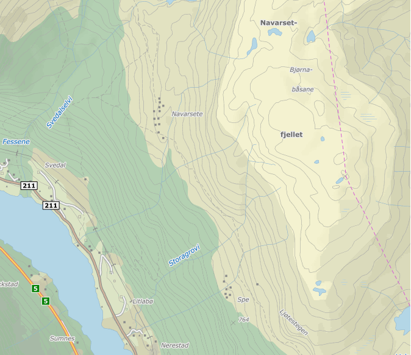
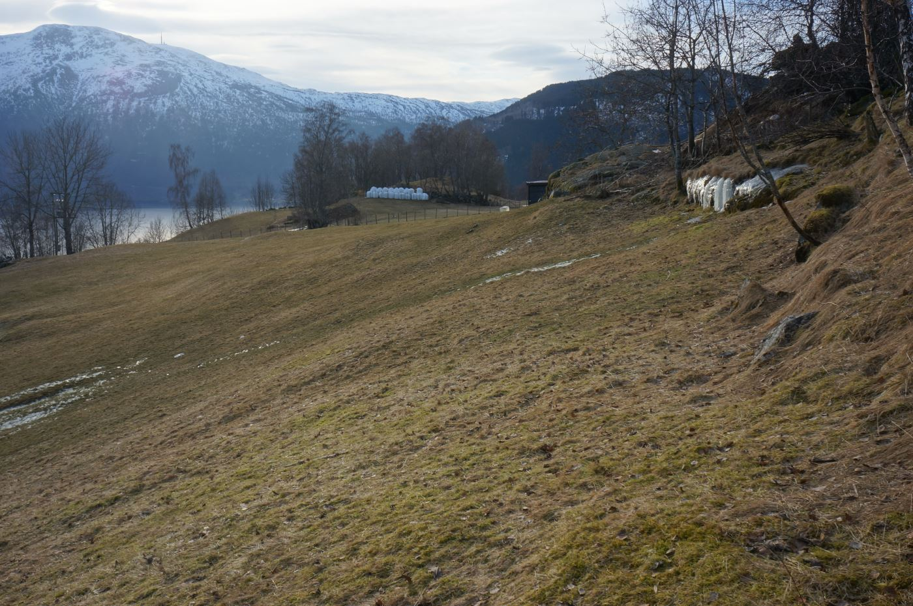

## Plan

- [Groundwater](./2_hydrological_processes_2.html#groundwater)
- [Soil water](./2_hydrological_processes_2.html#soil-water)
- [Runoff generation](./2_hydrological_processes_2.html#runoff-generation) 
- [Take home messages](./2_hydrological_processes_2.html#take-home-messages)

<!--
Link to snow science?
html widget on evapo? snowmelt?
Bring sand and sil, dry and saturated to demonstrate the relationship between hydraulic conductivity and soil moisture.
-->

# Groundwater

## Vocabulary

**Aquifer:**

Geological formation capable of storing, transmitting and yielding exploitable quantities of water. 

**Groundwater:**

Subsurface water occupying the saturated zone

<!--
Soil water: 
Water suspended in the uppermost layer of soil,
or in the aeration zone near the ground surface,
that can be discharged into the atmosphere by
evapotranspiration.

Capillary Zone (or fringe): Zone immediately above the water table in which almost all of the interstices are filled with water that is under pressure less than atmospheric. 
-->

## Types of aquifers

## Types of aquifers

> - **What's interesting about the town "Artesia"?**
> - There's desert everywhere, except the moutain tops and the area around this town!

> - **What type of aquifer is probably feeding this town?**
> - "artesian" or "confined" aquifer: an aquifer which holds water under pressure. Its piezometric surface can lie above the ground surface  
> - Some artesian aquifers can have elastic properties ([more details](http://www.ngwa.org/Fundamentals/hydrology/Pages/Confined-or-artesian-groundwater.aspx)) 

## Artesian or "confined" aquifer

[www.twdb.texas.gov](http://www.twdb.texas.gov/publications/reports/limited_printing/doc/LP-22.pdf)

## Artesian or "confined" aquifer

<!--

[www.twdb.texas.gov](http://www.twdb.texas.gov/publications/reports/limited_printing/doc/LP-22.pdf)

-->

## Types of aquifers

> - **What in an unconfined (or water table) aquifer?**
> - An aquifer whose upper water surface is the water table and is not under pressure 

> - **What is a perched aquifer?**
> - An unconfined aquifer that lies on top of an impermeable layer (confining unit)

## Types of aquifers

## Karst aquifers

## World aquifers
<!--
https://ensia.com/features/groundwater-wake-up/
-->

## Renewable freshwater resources
<!--
https://commons.wikimedia.org/wiki/File:Total_Renewable_Freshwater_Resources_in_mm_per_year_By_WaterGAP_Average_1961-1990.jpg
-->

## Renewable GW ressources
<!--
https://commons.wikimedia.org/wiki/File:Renewable_Groundwater_Resources_in_mm_per_year_By_WaterGAP_Average_1961-1990.jpg
-->

## Typical aquifer residence times

## Hydraulic head

> - **Also called piezometric head, groundwater head**
> - **Total head = elevation head + pressure head. Write its expression**
> - $\phi = \frac{p}{\rho g}+z$

## [Darcy's experiment](http://www.geo.citg.tudelft.nl/~uffink/syllabusCT3320/part1/1.1/1.1.html)

Darcy found $Q = \frac{KAH}{L}$

## Darcy's law
General formulation with $q = Q/A$ the specific discharge (discharge $Q$ per unit area $A$)

\[q = - K \nabla{\phi}\]

$K$ the saturated hydraulic conductivity, 

$\nabla{\phi}$ is the hydraulic gradient ($H/L$ in Darcy's experiment)

## Analogy to Fourier's law

The heat flux density $q$ in W/m2 (amount of energy that flows through a unit area per unit time) is:

$q=-k{\nabla }T$ where:

$q$ is the local heat flux density 

$k$ is the material's conductivity in $W/m/K$

$\nabla{T}$ is the temperature gradient in $K/m$

<!--
is equal to the product of thermal conductivity $k$, and the negative local temperature gradient $-\nabla T$ The heat flux density is the .

-->
## Analogy to Ohm's Law

The current $I$ through a resistor is:

\[I = \frac{V}{R}\]

where $V$ is the voltage in volts (difference in electrical potential)

$R$ is the resistance in ohms

<!--
## Groundwater recession exercise
Put the recession figure from my paper, or from sogndal (february 2017)
-->

## [Steady flow in an unconfined aquifer](http://www.geo.citg.tudelft.nl/~uffink/syllabusCT3320/part1/6.1/6.1.html)

> - **Most aquifers are thin and quite flat. Which flow direction can we neglect?**
> - We can neglect vertical flow. Groundwater is hydrostatic (vertical equipotential lines)
> - Groundwater discharge is proportional to the depth of the aquifer
> - This is the Dupuit–Forchheimer assumption

## Find Q as a function of $K$, L, $\phi_1$ and $\phi_2$

> 1. **Express Q as a function of h and q (flow per unit area)**
> 1. **Use the conservation of mass across each $dx$ slice of aquifer**
> 1. **With the reference level as the base of the aquifer ($\phi = h$), write Darcy's Law**
> 1. **Combine 2 and 3**
> 1. **We assume that *K* is uniform, integrate, and express $h^2$ and $h$ as a function of x, L, $\phi_1$ and $\phi_2$**
> 1. **Using steps 1 and 3, we want to express $Q$ without $x$**
> 1. Finally we have: $Q = -K\frac{(\phi_2^2-\phi_1^2)}{2L}$

<!--
## Aquifer transmissivity
- Discharge through thickness of aquifer per unit head gradient
- Product of conductivity and thickness
-->

## Typical saturated hydraulic conductivities

> - Gravel: $0.1$ - $1$ m/s
> - Sand:  $10^{-4}$ - $10^{-2}$ m/s
> - Silt:  $10^{-5}$ - $10^{-8}$ m/s
> - Clay:  $< 10^{-8}$ m/s

<!--
 
-->

## Specific yield vs porosity

## Maps: discuss location of streams

## Maps: discuss location of streams

## Signs of high water table / soil moisture

## Signs of high water table / soil moisture

<!--
dec1_2011.jpg
-->

## Signs of high water table / soil moisture
- Surface ice forms in winter
- First areas where snow disappears
- Water loving plants (thistles in my phd catchment)
- You can try your luck at the [water witch stick](https://water.usgs.gov/edu/dowsing.html)!

# Soil water

## Vocabulary

**Matric potential (capillary potential, soil moisture tension):**

Negative pressure (suction) to which water must be subjected in order to be in hydraulic
equilibrium, through a porous permeable wall or membrane, with the water in the soil. 

**Field capacity:**

Amount of water held in the soil after
gravitational water has drained away.

**Wilting point:**

Moisture content of a soil that cannot be released by capillary forces

## Soil types and grain size
> - **Can you list different soil grain sizes and names?**
> - Cobble (64-256$mm$)
> - Gravel (2-63$mm$)
> - Sand (0.063$mm$ - 2$mm$)
> - Silt (0.002-0.063$mm$)
> - Clay ( <0.002$mm$)

## Water in soils

> - **Why does water up a straw?**
> - Surface tension of water
> - **What is this phenomenon called?**
> - Capillarity
> - **How do you think it could be related to water flow in soils?**
> - Movement of water through soils can be compared to a bunch of straws

## Infiltration in soils

<!--
## Hagen-Poiseuille equation

\[\Delta P= \frac{8\mu LQ}{\pi r^{4}}\]

where:

$\Delta{P}$ is the pressure reduction,
$L$ is the length of pipe,
$\mu$ is the dynamic viscosity,
$Q$ is the volumetric flow rate,
$r$ is the pipe radius,

For the courageous: 

[On the origins of Darcy's law](https://web.stanford.edu/~csoulain/PORE_SCALE/Chap1_Darcy.pdf)

\[\Delta P= \frac{128\mu LQ}{\pi d^{4}}\]
\[\Delta P= \frac{32\mu Lv}{d^{2}}\]

$d$ is the pipe diameter,
$v$ is the average velocity,

## Why are trees so high and what limits their height?
to watch again
https://www.youtube.com/watch?v=BickMFHAZR0&list=WL&index=236
How high can you suck on a straw
-->

## Green Ampt infiltration equation

\[i(t) = K\left[{\psi \,\Delta \theta  \over F(t)}+1\right]\]

where
$i(t)$ is the infiltration rate

$\psi$ the wetting front soil suction head (L)

$\theta$  the water content (-)

$K$ the saturated hydraulic conductivity (L/T)

$F(t)$ the cumulative depth of infiltration (L)

## Soil water storage

<!--
## Soil water storage: ratios

-->

## Unsaturated hydraulic conductivity
Darcy's Law is applicable with specific values for unsaturated hydraulic conductivity

> - Soil (loam) is more conductive than sand when dry

<!-- ## Vertical flow through the unsaturated zone -->

<!-- Richards equation: -->

<!-- \[\frac{\partial \theta }{\partial t} = \frac {\partial }{\partial z}\left[K(\theta )\left({\frac {\partial h}{\partial z}}+1\right)\right]\] -->

<!-- $K$ is the hydraulic conductivity, -->
<!-- $h$ is the matric head induced by capillary action, -->
<!-- $z$ is the elevation above a vertical datum, -->
<!-- $\theta$  is the volumetric water content, and -->
<!-- $t$ is time. -->

## Heterogeneity: flow through macropores

## Heterogeneity: example from the field

## Heterogeneity: longitudinal spread

## Heterogeneity: perpendicular spread

# Runoff generation

## Overland flow
> - **Infiltration excess overland flow** (also called Hortonian or unsaturated overland flow)
> - Surface runoff when rainfall intensity exceeds the infiltration capacity
> - Runoff from urban surfaces is quickly "infiltration excess"
> - Can also happen in arid regions where soil infiltration is low due to surface sealing / crust
> - **Saturation excess overland flow** 
> - Surface runoff following full soil saturation
> - Depends on antecendent soil moisture
> - Typical after snowmelt in Norway

## Runoff generation

## Stream types
> - **A stream which doesn't have any baseflow contribution is called**
> - **a**: perennial stream
> - **a**: intermittent stream
> - **a**: ephemeral stream
> - Answer: **c**

## Intermittent alpine stream

## Stream / groundwater interactions
> - **What is a "losing" and "gaining" reach?**
> - Losing reach: some water leaves to the stream to recharge the aquifer
> - Gaining reach: the aquifer recharges the stream

> - **What is the most important soil zone that should be protected from pollution?**
> - The riparian zone
> - **Why?**
> - Pollution is quickly mobilized in areas that are easily reached by alluvial groundwater

## Irrigation and soil water
> - **What risks to the soil does irrigation present? (especially in arid regions)**
> - Soil salinization

> - **Why does irrigation tend to lead to soil salinization?**
> - The solutes contained in irrigation water infiltrate into the soil but cannot reach the saturated zone if it is too deep. Meanwhile, water evaporates or is transpired by plants and leaves the solutes in the ground

## Irrigation and soil water
> - **How can this be reversed / mitigated?**
> - Drainage to evacuate salty water, preferably during wet season only

> - **Some problematic examples of soil salinization?**
> - Ancient Mesopotamia, Aral sea catchment, Australia

## Irrigation and soil water
[Causes of farmland salinization and remedial measures in the Aral Sea basin](http://www.sciencedirect.com/science/article/pii/S0378377406000977)

Interesting (but depressing!) article on the Aral sea crisis:

http://www.columbia.edu/~tmt2120/introduction.htm

The environmental impacts section discusses many processes and feedbacks (evaporation, increasing water temperature, impact of vegetation on winds...).

<!--
could be used for the quiz: why do lakes create high pressures which slow winds?
## Questions
> - **If both a sandy soil and a claying soil are dry, which one will first have the highest infiltration rate?**
-->

## Take home messages

- Various types of aquifers
- Major aquifers present in arid regions
- Darcy's Law governs saturated flow
- GW flow is proportional to hydraulic head gradient
- Groundwater flow often coupled to topography
- In unsaturated soils, negative pressure is the result of capillary forces acting on curved air/water infterfaces
- Soil water storage: porosity, field capacity, wilting point, residual water
- Darcy's Law also applicable in unsaturated media with lower K

<!--
## Waterlogging
> - **A piece of land is waterlogged when:**
> - **a**: the wilting point is reached
> - **b**: gravity drainage has ceased
> - **c**: the capillary fringe reaches the root zone of the plants
> - **d**: none of the above
> - Answer: **c**
-->

# Exercise: application of Darcy's law

## Conductivity of "Dyna Sand" sand filters
I found [there](https://www.parkson.com/sites/default/files/documents/document-dynasand-ecowash-filter-full-scale-test-report-463.pdf) that the loading rate of the filters was 3.5gpm/SqFt

> - **Check whether this makes sense, considering what you heard on Wednesday!**
> - **The whole thing is done here without calculator with "useful" approximations!** 
> - The reservoir was 1000$m3$ and represented 6h max of daily consumption
> - So daily consumption: 4000m3
> - The sand filters need to be able to produce the daily consumption in 24h!

## Conductivity of "Dyna Sand" sand filters
> - **Calculate the required flow per minute**
> - 4000 / 60x24 = 4000 / 1440 -> 4000 / 1600 (easier) = 2.5$m^3/min$
> - **Calculate the required surface for this flow**
> - 3.5$gpm/SqFt$ -> 3.5x4 = 14 $l/min/sqft$ -> 14x10 $l/min/m^2$ = 0.14 $m^3/min/m^2$
> - Recapitulation: 2.5$m^3/min$ is required and the sand filter has a capacity of 0.14 $m^3/min/m^2$
> - So 15-20$m^2$ required: 5 filters of 3-4$m^2$
> - Makes sense!

## Conductivity of "Dyna Sand" sand filters
> - **The input hydraulic head was 10 bars, the sand thickness was 4m and the free water surface was about 1m higher (5m higher than the base of the filter). Calculate the hydraulic conductivity of the sand**
> - 10 bars makes 100m of head at the inlet
> - The free flowing water surface at the top of the filter is 5m higher, so 5m head in reference to the base of the filter
> - So hydraulic head gradient across the sand filter: 95 / 4 -> 24
> - using Darcy's Law: $q=-k \nabla{\phi}$
> - $K*24 = 0.14m^3/min/m^2$ -> $K = \frac{2.3*10^{-3}}{24} = 10^{-4} m/s$ 
> - Makes sense!

## Online exercises

[Groundwater hydrology exercises](http://echo2.epfl.ch/VICAIRE/mod_3/chapt_4/exercices.htm)

[Groundwater hydrology solutions](http://echo2.epfl.ch/VICAIRE/mod_3/chapt_4/sol_exercices.htm)

[Some exercises from Hendriks: Introduction to Physical Hydrology](http://global.oup.com/uk/orc/geography/hendriks/01student/mcqs/)

# Further resources

## Book chapters

Elements of physical hydrology. Chapters 2, 6, 7, 8

Hydrology in Practice. Chapers 2, 3, 4, 5, 7, 9, 11

## Online textbooks and manuals

Good and very complete online material from TU Delft:

[Mechanics and Transport of Flow through Porous Media](http://www.geo.citg.tudelft.nl/~uffink/syllabusCT3320/home.html)

[USDA - Groundwater hydrology manual](https://directives.sc.egov.usda.gov/OpenNonWebContent.aspx?content=18373.wba)

[Cornell University - Soil and water management](https://nrcca.cals.cornell.edu/soil/CA2/summary.php)

[Soil water potential - Concepts and measurements](http://lawr.ucdavis.edu/classes/ssc107/SSC107Syllabus/chapter2-00.pdf)

## Selected scientific articles

[Groundwater and climate change](https://www.uni-frankfurt.de/46222973/Taylor_Scanlon_Doell_et_al_2013_groundwater_and_climate.pdf)

## Videos

[Hydraulic conductivity as a function of matric potential](https://www.youtube.com/watch?v=fmt_h32PcwI&t=275s)

[Estimating soil moisture by texture](https://www.youtube.com/watch?v=B8hRPziKkAY)

A deeper look at the equations in soil physics:

[Oklahoma State University Soil Physics: Online lectures](https://www.youtube.com/channel/UC1hb8hm8lzqt21G0OD-i78Q/videos?shelf_id=0&sort=dd&view=0)

## Physical aquifer model
<iframe width="900" height="500" src="https://www.youtube.com/embed/AtJyKiA1vcY" frameborder="0" allowfullscreen></iframe>

# Annoted video resources

## [Prof. Kevin Bishop: Breakthroughs in the biogeochemistry of Nordic aquatic systems](https://www.youtube.com/watch?v=hiC32HMZ_Xk)

- 33: Natural pollution in sweden. influence of depth to water table
riparian controls are the place to begin when looking at water quality in streams
start simple and then see what we have to explain afterwards.
