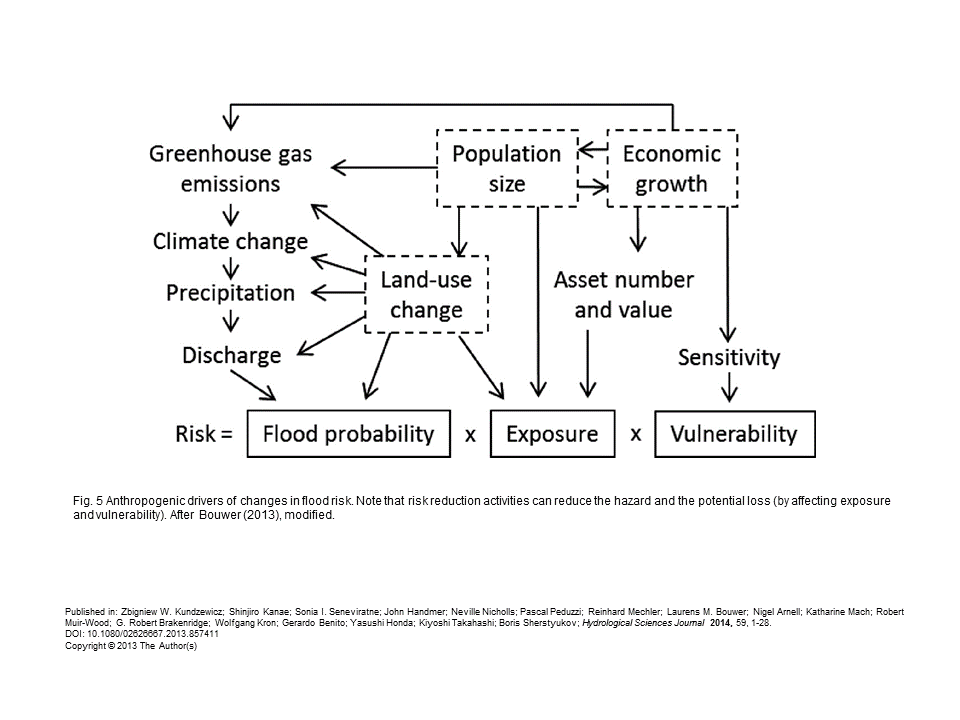
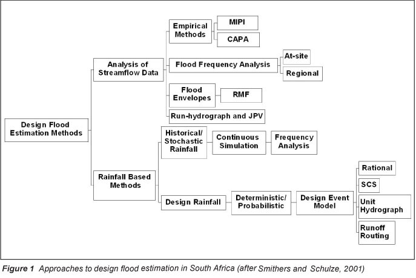
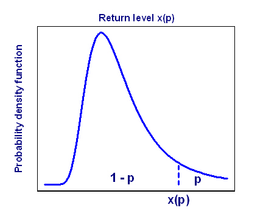
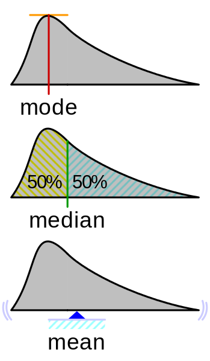
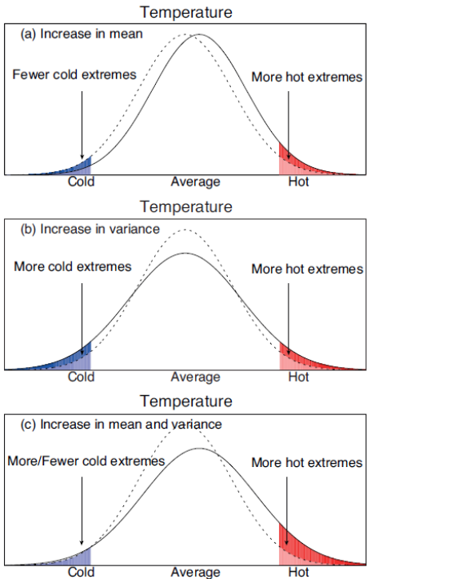
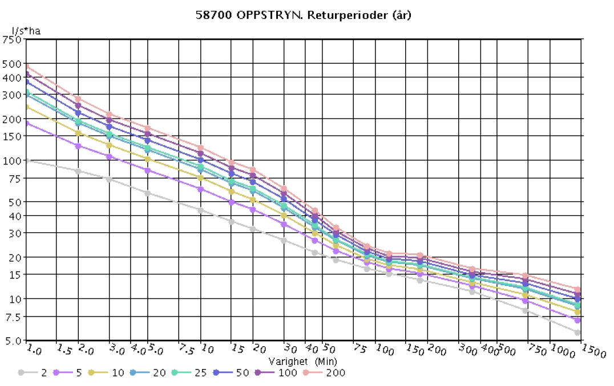
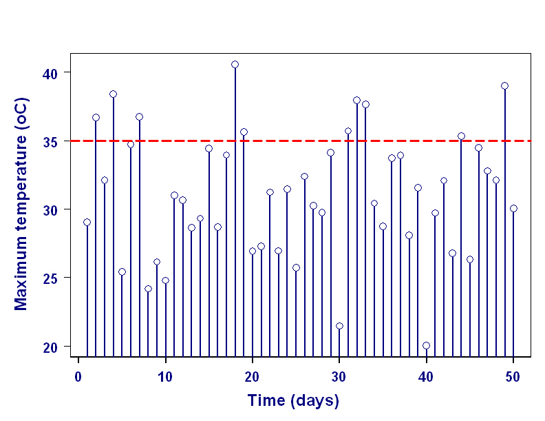
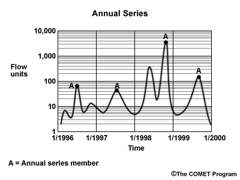
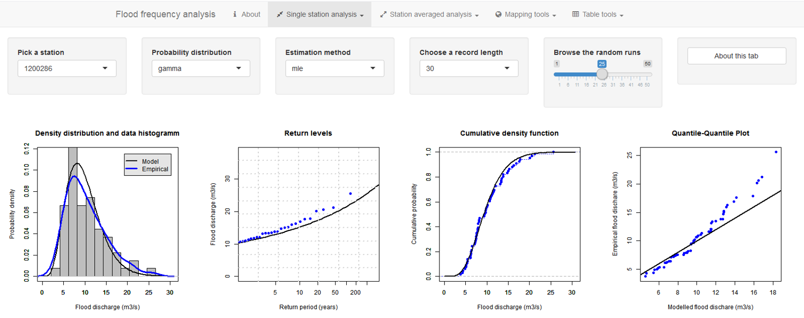
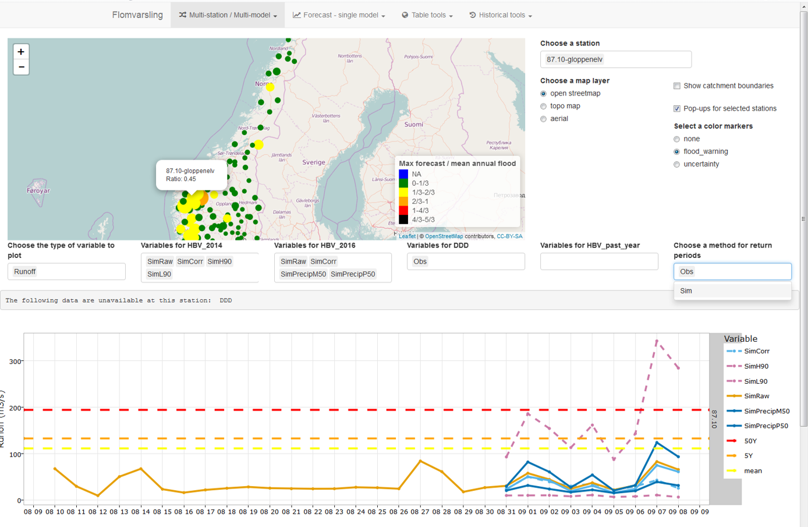

## Plan

- [Flood risk](./3_hydrological_extremes.html#flood-risk)
- [Key probability concepts](./3_hydrological_extremes.html#key-probability-concepts)
- [Flood frequency analysis](./3_hydrological_extremes.html#flood-frequency-analysis)
- [Further resources](./3_hydrological_extremes.html#further-resources)

<!--
## TODO
Quote: Sir Ronald Fisher 
"The one 'chance in a million' will occur, with no less and no more than its appropriate frequency, however surprised we may be that it should occur to us."
html widget to play with distribution parameters
-->
# Flood risk

## Types of flood
> - **flash floods:** rapid, localized, associated with intense precipitation
> - **coastal floods:** sea level rise from tsunamis or storm surges
> - **urban floods:** flooding resulting from urbanization, usually linked to intense rather than sustained precipitation
> - **fluvial floods:** rivers rise out of the banks, due to sustained intense rainfall (catchment-scale)
> - **ponding (pluvial flood):** local ponding due to rainfall intensity exceeding infiltration
> - **groundwater rise (very local):** flood of cellars and other low areas due to extraordinary shallow water table

## Defining flooding risk

## Flood zoning and risk assessment

- Get flood return levels (design flood) for an area (or model discharge from extreme precipitation)
- Use a hydraulic model to understand how high the water level will come ([HEC-RAS](http://www.hec.usace.army.mil/software/hec-ras/) for example)
- Intersecting those water levels with the topography gives flood zone maps(see [NVE map catalog](http://gis3.nve.no/kartkatalog/metadatahg_datasett.html))
- Do a risk and vulnerability assessment (ROS: risiko og sårbarheitsanalyse) of the infrastructure in the flood zones
- Decide on protection measures, change the land use plan, or implement warning systems

## Design flood estimation methods

# Key probability concepts

## Vocabulary
> - **Annual exceedance probability**
> - Probability ($p$) that a flood will be equal or greater than a specific flood discharge called return level (or design flood).
> - **Return period (also called return interval)?**
> - The recurrence period ($T$) of a flood event equal or greater than the corresponding return level ($Q_T$)
> - Also means: the average time until the next occurrence of an event equal or greater than $Q_T$ is $T$ years
> - **What is the relationship between the probability $p$ and the return period $T$?**
> - $T = 1/p$

## [Flood probability exercises - see link](http://www.sciencecourseware.com/VirtualRiver/FloodingDemo/Files/page01a.html)
<!--
http://www.sciencecourseware.com/VirtualRiver/FloodingDemo/Files/page13.html
-->
> - **What is the probability of a 100-year flood happening in any given year?**
> - 1/100 = 0.01
> - **Can a 100-year flood happen 2 years in a row?**
> - Yes
> - **What would be the probability of this happening?**
> - $0.01*0.01 = 0.0001$

## Flood probability exercises

> - **Probability of a 100-year flood not happening in 100 years?**
> - $(1-0.01)^{100} = 36.6\%$
> - Of course, if the expected floods don't happen anymore, the flood should maybe be re-estimated.
> - **What is the probability of having a 25-year flood in a 10 year period?**

## Last question in steps
> - **What's the probability of a 25-year flooding event occurring each year?**
> - $1/25 = 4\%$
> - **What is the probability that a 25-year flood will not occurr in any given year?**
> - $1 - 1/25 = 96\%$
> -	**What's the probability that there will not be a 25-year flood in a 10 year period?**	 
> - $0.96^{10} = 66.5\%$
> -	**What's the probability that there will be a 25-year flood with a 10 year period?**
> - $100 - 66.5 = 33.5\%$

<!--
Good exercise table:
http://www.sciencecourseware.com/VirtualRiver/FloodingDemo/Files/page14.html
-->

## Probability distribution functions (pdf) 

> - **Why does the mean annual flood correspond to a return period of 2.3 years?**
> - The Gumbel probability distribution is designed so that the average flood (arithmetic mean of all floods in the record) has a theoretical return period of 2.33 years.
> - **On the other hand, the median flood corresponds to a return period of ...?**
> - 2 years, because the median corresponds to a 50% probability of occurence

## Probability distributions
> - **mode, mean and median?**
> - 

## Mean, median, mode

<svg height="450" width="auto">
  <image xlink:href="images/mean_median.svg" src="svg.png" min-width="100%" height="450"/>
</svg>

## Probability distributions moments
> - **Name the first 3 moments (0th, first and second) of a probability distribution**
> - Mean, variance, skewness
> - **Draw the impacts of an increase in mean of hydrological extremes**
> - **Draw the impacts of an increase in variance of hydrological extremes**

## Probability distributions (mean and variance)

## Analogy between moments of a pdf and mechanics
> - **Analog of the mean?**
> - Center of mass
> - **Analog of variance?**
> - Moment of inertia (also know as angular mass or rotational area)
> - **The $0^{th}$ moment is mechanics is the weight. What is it for a pdf?**
> - 1: the integral of the pdf is equal to a 100% probability!

<!--
## Analogy in formulas

> - **Variance (squared standard deviation)**
> - $Var(X) = \sum_{i=1}^{n}{p_i * (x_i-\mu)^2}$ with $\mu = \sum_{i=1}^{n}{p_i*x_i}$
> - **Moment of inertia?**
> - $I = \int_{Q}{r^{2}\mathrm {d} m}$

## Probability density function
<svg height="450" width="auto">
  <image xlink:href="images/Boxplot_vs_PDF.svg" src="svg.png" min-width="100%" height="450"/>
</svg>

## Gumbel distribution

\[\frac {1}{\beta }e^{{-(z+e^{{-z}})}}\]

where $z=\frac{x-\mu }{\beta }$

$\mu$ location (real)

$\beta >0$ scale (real)
-->

<!--
## Generalized extreme value distribution

\[f(x;\mu ,\sigma ,\xi ) = \frac{1}{\sigma }(1+\xi s)^{(-1/\xi )-1}\exp(-(1+\xi s)^{-1/\xi })\]
with $\xi \neq 0\] and \[>-1/\xi$

\[f(x;\mu ,\sigma ,0)={\frac {1}{\sigma }}\exp(-s)\exp(-\exp(-s))\]

$\mu$ location,

$\sigma > 0$ scale,

$\xi$ shape.
-->

# Extreme precipitation

## Intensity-Duration-Frequency Curve
> - **Draw what you think an IDF curve looks like (no need for numbers)**
> - 

<!--
> - ** What is an "Intensity-Duration-Frequency Curve"?**
> - A plot of precipitation intensity of a function of rain event duration for various return periods
-->
## Intensity-Duration-Frequency Curve
[IDF (IVF in Norwegian) for various regions in Norway: klimaservicesenter.no](https://klimaservicesenter.no/faces/desktop/article.xhtml?uri=klimaservicesenteret/dimensjonerende-nedbor/ivf-verdier-fra-et-utvalg-malestasjoner)
[Example for Oppstryn](./pdf/IVF_58700_OPPSTRYN.pdf)

Important concept to size stormwater infrastructure in small urban catchments

> - **Does a 100-year storm always cause a 100-year flood?**
> - No, there are different types of 100-year precipitation events and there are other important factors such as pre-storm ground condition, timing and spatial variability of the storm...

# Flood frequency analysis

## Two main methods to select flood data

> - **Peak over threshold or annual maximum series?**
> - Peak over threshold

## Two main methods to select flood data
<!--
http://stream1.cmatc.cn/pub/comet/HydrologyFlooding/flood/comet/hydro/basic/FloodFrequency/print_version/03-analyzing.htm
-->

> - Annual maximum series

## Flood frequency analysis

## Flood forecasting

## Take home messages
- Extreme values derived for both river discharge and precipitation (IDF curves)
- Annual exceedance probability is the probability $p$ that a flood will be **equal or greater** than a specific return level $Q_T$ (for the return period $T=1/p$)
- Flood frequency analysis: various statistical methods based on fitting probability distributions to historical data
- Most methods used (so far in most countries) assume stationarity
- Extremes discharge values can be hydrological modelling results of applying extreme precipitation to specific catchments

# Further resources

## Norway and Europe

[Klimaendring og framtidige flommer i Norge (NVE report)](http://publikasjoner.nve.no/rapport/2016/rapport2016_81.pdf)

[Norsk Klimaservice senter: Nedbør med kort varighet](https://klimaservicesenter.no/faces/desktop/article.xhtml?uri=klimaservicesenteret/dimensjonerende-nedbor/korttidsnedbor)

NVE Reports:
[Flommen på Vestlandet - oktober 2014](http://publikasjoner.nve.no/rapport/2015/rapport2015_11.pdf)
[Flomsonekartprosjektet - Flomberegning for Sogndalselvi](http://publikasjoner.nve.no/dokument/2003/dokument2003_06.pdf)
[Flomberegning for Flåmselvi ved Brekke bru](http://publikasjoner.nve.no/rapport/2015/rapport2015_27.pdf)
[Anbefale metoder for flomberegninger i små uregulerte felt](http://publikasjoner.nve.no/rapport/2015/rapport2015_97.pdf)

## World

[USDA: Frequency Curve Determination](https://www.nrcs.usda.gov/wps/portal/nrcs/detailfull/national/water/manage/hydrology/?cid=stelprdb1042910)

Good list of resources on flood and drought: 
http://fdmt.iwlearn.org/en/resources-and-e-learning

[Decision-Support for the Selection of Flood Forecasting Models](http://www.wmo.int/pages/prog/hwrp/documents/FFI/Intercomparison_of_flood_forecasting_models_for_review.pdf)

## [Types of droughts](http://drought.unl.edu/DroughtBasics/TypesofDrought.aspx)
> - **Think about different types of drought**
> - meteorological (lack of precipitation)
> - hydrological (lack of streamflow, soil moisture and/or groundwater)
> - agricultural (lack of plant available water, during specific periods of growth)
> - socioeconomic (impact human activities like energy production)
> - ecological (long and widespread deficit in water, affecting whole ecosystems)

## Low flows

California water blog - UC Davis center for watershed sciences:
[California's drought and floods are over and just beginning](https://californiawaterblog.com/2017/04/09/californias-drought-and-floods-are-over-and-just-beginning/)

World Meteorological Organisation: [Manual of low-flow estimation and prediction](http://www.wmo.int/pages/prog/hwrp/publications/low-flow_estimation_prediction/WMO%201029%20en.pdf)

# Annoted video resources

## [G. Bloeschl: Breakthroughs in Flood Research](https://www.youtube.com/watch?v=ClpTlBQzOxE)
- 21: seasonality of floods in austria / CH
- 22: importance of antecedent soil moisture conditions
- 26: use of indicator plants in the field
- 29: two very different catchment responses. Interesting influence of lanscape forms / geology.
- 32: climate change scenarios
- 37: hydrodynamic simulations
- 40: socio hydrology: green society vs techno society. Very good!
- 44: flood damage with those 2 scenarios

## [Richard Vogel: Breakthroughs in water resource engineering](https://www.youtube.com/watch?v=AMGeyf9CI24)
On non stationarity in flood frequency analysis:
- Changes in the last 30/40 years are the effect of urbanization not climate change
- Be careful in assessing the cause of a non stationarity
