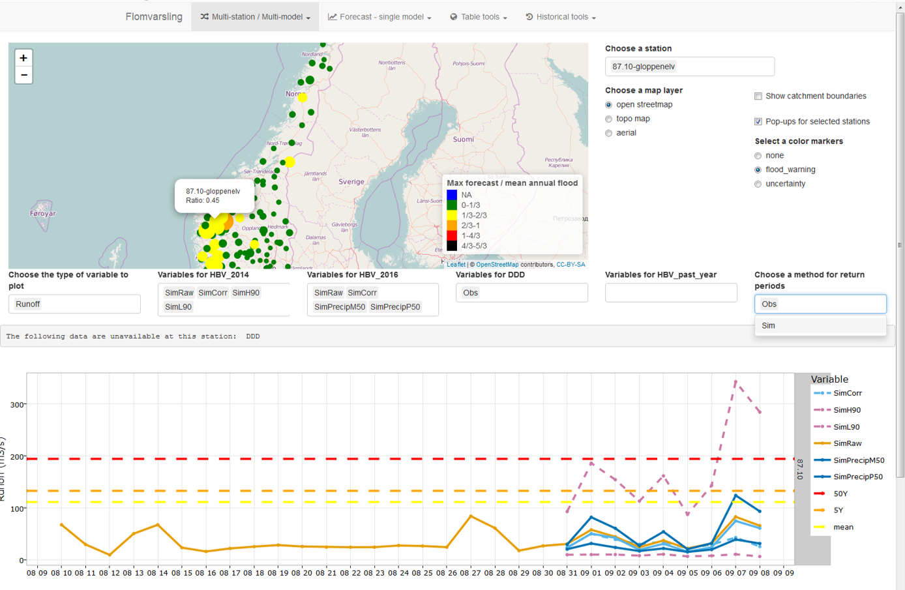
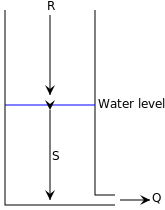

## Plan

- [Modelling options](./4_hydrological_modelling.html#modelling-options)
- [Field intuition and modelling](./4_hydrological_modelling.html#field-intuition-and-modelling)
- [Climate change - PhD example](./4_hydrological_modelling.html#climate-change-phd-example)
- [Further resources](./4_hydrological_modelling.html#further-resources)
<!--
## putting text in specific location
`r echo = FALSE
x = '
'
sprintf("%s%s
", x, "blabla")
`
-->

<!--
## Trying to automatically read a folder with many pictures
`r echo = FALSE
subfolder = "./images/damma"
img_list <- list.files(path = subfolder, pattern = ".jpg")
for (img in img_list) {
 x = ''
sprintf(x)
}
`
-->

<!--
## { .fullpage }
A widget
<iframe src="../00_Widgets/test_widget.html" width="100%" height="100%" frameBorder="0"></iframe>

Data source: US Census Bureau
-->

<!--
## { .fullpage }
crosstalk between 2 graphs
<iframe src="../00_Widgets/cross_talk.html" width="100%" height="100%" frameBorder="0"></iframe>
-->

<!--
## { .fullpage }
crosstalk selector
<iframe src="../00_Widgets/test_widget2.html" width="100%" height="100%" frameBorder="0"></iframe>
-->

# Modelling options

## Purpose of hydrological modelling

> - **Why do hydrological modelling**
> - To predict future discharge
> - To size infrastructure
> - To understand hydrological processes in a catchment

## Example: flood forecasting

## Main modelling approaches

> - Physically-based
> - Conceptual
> - Data based models: machine learning, non-linear regressions...
> - Lumped (Hydrological Response Units) vs distributed

<!--
## Vocabulary
> - **Rising limb** 
> - The rising limb of hydro graph, also known as concentration curve, reflects a prolonged increase in discharge from a catchment area, typically in response to a rainfall event
> - **Recession (or falling) limb** 
> - The recession limb extends from the peak flow rate onward. The end of stormflow (a.k.a. quickflow or direct runoff) and the return to groundwater-derived flow (base flow) is often taken as the point of inflection of the recession limb. The recession limb represents the withdrawal of water from the storage built up in the basin during the earlier phases of the hydrograph.

> - **Peak discharge**
> - The highest point on the hydro graph when the rate of discharge is greatest

## Vocabulary
> - **Lag time** 
> - The time interval from the center of mass of rainfall excess to the peak of the resulting hydrograph

> - **Time to peak** 
> - Time interval from the start of the resulting hydro graph

> - **Discharge** 
> - the rate of flow (volume per unit time) passing a specific location in a river or other channel

## Time of concentration

-->

## Physically-based models?
> - **Limitations**
> - High quality distributed data required

> - **Advantages**
> - Less parametrization required

## Conceptual models
> - **Limitations**
> - Risk of over-parametrization
> - Risk of right answers for wrong reasons

> - **Advantages**
> - Can help help conceptually understand hydrological processes in a catchment
> - Good if data is lacking

## Variable data availability

## Distribution of meteorological variables

## Conceptual approach: linear reservoir

 

Assumption:

Q is proportional to S, the storage volume

R is a recharge term (rainfall and/or GW recharge)

<!--
> - **Why do linear conceptual models tend to work OK?**
-->

## Linear reservoir equations
Based on 2 equations:

Linear flow equation: $Q = A*S$

Water balance equation:   $R = Q + \Delta{S}/\Delta{T}$

where $Q$ is the runoff or discharge, $A$ is the recession constant [unit 1/T] and $S$ is the water storage

if the recharge term R = 0, then:

$Q(t) = Q_0*exp^{-A*t}$ with $Q_0$ the flow at the start of the recession event (t=0)

<!--
A combination of the two previous equations results in a differential equation, whose solution is:

\[Q2 = Q1 * exp { −A (T2 − T1) } + R [ 1 − exp { −A (T2 − T1) } ]\]

$\Delta{S}$ is a small variation of S
$\Delta{T}$ is a small variation of T
-->

## Example: structure of HBV model

## Calibration / Validation process
> - **What is it?**
> - It consists in calibrating the model on one period, and testing its predictive ability on another period
> - **Why is it important?**
> - There are often several sets of parameters which "work" for a specific period.
> - If the model is over-parametrized, it is also possible that several parameter sets pass the validation process
> - This is called equifinality

<!--
## Model parametrization
> - **What is equifinality? (an issue we can run into when using too complex mopdels)**
> - This is when 2 (or more) different sets of parameters can lead to the same results
> - This means the model is oper-parametrized and does not give the right answers for the right reasons
-->

## Getting the right answers for the right reason

## How quality measures can be deceiving

Nash–Sutcliffe efficiency coefficient:

\[E = 1-\frac{\sum_{t=1}^{T} \left(Q_m(t)-Q_o(t)\right)^2}{\sum_{t=1}^{T} \left(Q_o(t)-\overline{Q_o}\right)^2}\]

where $\overline{Q_o}$ is the mean of observed discharges, $Q_o(t)$ and $Q_m(t)$ are observed and modeled discharge at time $t$

> - **Which value has a perfect model?**
> - 1
> - **Why is it not very good when used on different hydrological regimes?**
> - It is much easier to have a good value with highly variable hydrographs

## Other model assessment criteria

- Benchmark efficiency
- Root Mean Square
- Volumetric error
- Kling-Gupta Efficiency

<!--
video on conceptual GW model
<iframe width="800" height="450" src="https://www.youtube.com/embed/g414kKPGqDE" frameborder="0" allowfullscreen></iframe>
-->

# Field intuition and modelling

## Conceptual view of my PhD catchment

## Electrical conductivity: natural tracer

<!--
> - **From this graph, what can you tell about the relationship between electrical conductivity and streamflow?**
> - There is an inverse proportionality which seems to depend on the season and the discharge.
> - **From this graph, what can you tell about the relationship between stream stage and groundwater stage near and far from the stream?**
> - **Cite another example where such dynamics happen on a daily basis. (tip: this is linked to a another periodical natural phenomenon)**
-->

## Initial data and modelling results

## Two component mixing model
> - **Write the water balance to express $Q(t)$, the total discharge at time t, as a function of $Q_{gw}(t)$, the groundwater exfiltration and $Q_{gl}(t)$, the glacier melt contribution (we neglect rain and evapotranspiration)**
> - $Q(t) = Q_{gw}(t) + Q_{gl}(t)$
> - **Write the solute mass balance to express $Q(t) EC(t)$ (the mass of solutes exiting the catchment per second) as a function of $Q_{gw}(t)$, $Q_{gl}(t)$ as well as $EC_{gw}$ and $EC_{gl}$, which are respectively the constant electrical conductivity values for groundwater and glacier melt. EC is a proxy for the concentration of solutes in water.**
> - $Q(t) * EC(t) = Q_{gw}(t)*EC_{gw} + Q_{gl}(t)*EC_{gl}$

## Total discharge as a function of $Q_{gw}(t)$

> - **By substituting $Q_{gl}(t)$ in one of the previous equations, express $Q(t)$ as a function of $Q_{gw}(t)$, $EC(t)$ and the constants $EC_{gw}$ and $EC_{gl}$**
> - $Q(t) = \frac{Q_{gw}(t)*(EC_{gw} - EC_{gl})}{EC(t) - EC_{gl}}$

## Modelled baseflow recession

<!--
> - $Q(t)=Q_{gw}(t)*(EC_{gw}−EC_{gl})/(EC(t)−EC_{gl})$
$Q(t) = \frac{(EC_{gw}−EC_{gl})Q_{gw}(t)}{EC(t)−EC_{gl}}$

## GW exfiltration as a function of groundwater level
\[Q_{gw}(t) = V_{slow}(t)*T_{slow} + V_{fast}(t) T_{fast}\]
-->

<!--
## Recession discharge
\[Q_{recession}(t) = Q_{meas}(t_{end})*e^{\frac{t_{end} − t}{T_{slow}}}\]
-->

<!--
## Groundwater storage as a function of field GW measurements
\[L_{integral}(t) = L_{integral}(t − 1t) + P_n i+1 L_i(t)−L_i(t−1t) n \]
with $L_{integral}(t_{end}) = L_{residual}$

##  Total groundwater flow as a function of field GW measurements
\[Q_{gw}(t) = baseflow_{max} + A_{fast} × L_{integral}(t) × \Phi * T_{fast}\]

## Benchmark efficiency
\[E = 1 − P_t (Q_{meas}(t) − Q_{mod}(t))^2 P_t (Q_{meas}(t) − Q_{bench}(t))^2\]

## Verifying $A_{slow}$ with snowmelt recharge
\[V_{slow}(t) = V_{slow}(t−\Delta{t}) + (R(t) − \frac{V_{slow}(t−\Delta{t})}{T_{slow}})* \Delta{t}\]
-->

## Aquifer recharge with snowmelt

## Mass balance verification for the infiltration rate

> - **Write the infiltration rate as a function of the storage volume and the exfiltration rate $Q_{gw}$**
> - We neglect evapotranspiration and recharge from rain 
> - $Q_{inf}(t) = dV(t)dt + Q_{gw}(t)$

<!--
## Figure 4

-->

## Seasonaly variable GW contribution

# Climate change PhD example

## Climate change impacts

> - **Remember what "downscaling" is?**
> - Downscaling adds small-scale details, like topography-induced variations, which are not seen on the GCMs larger grid
> - **Which parameters are affected?**
> - Air temperature
> - Precipitation
> - Relative humidity
> - Wind speed
> - Wind direction

<!--
> - **What is an ensemble forecast?**
> - A forecast using many different models
-->

## Climate change scenarios

## Map of the study area

<!--
## Difference between modeled and measured runoff during validation period

-->
## Climate change predictions

## Differences in mean flow

## Differences in cumulative flow

## Take home messages

- Why modelling
- The why influences the how
- Conceptual approaches vs physically based models
- Assessing model quality is not straightforward 
- Equifinality problem with over-parametrization
- Know the assumptions and their impact
- Plotting choices can influence analysis

# Exercise preparation

The goal is to complete exercises 1, 2 and 3 suggested by Jan Seibert with the hydrological model [HBV Light](https://www.geo.uzh.ch/en/units/h2k/Services/HBV-Model.html).
The program, accompanying data and an introduction lecture to the model can be accessed on the University of Zürich, Department of geography [webpage](https://www.geo.uzh.ch/en/units/h2k/Services/HBV-Model/HBV-Download.html)
You can try to install the software on your laptop but there was a resolution problem on mine.
Otherwise, the program is installed on the computers of room: XXX

# Further resources

## Book chapters

Elements of physical hydrology. Chapters 5, 7, 9

Hydrology in Practice. Chapers 10, 12, 17

## Nevina web tool from NVE

http://nevina.nve.no/

We will use this tool in an exercise session and during the "Flood mapping" lecture.

<!--
quiz theme?
-->
## Norway / Europe

[Hydrological atlas for Norway](http://publikasjoner.nve.no/dokument/2002/dokument2002_02.pdf)

[Hydrological atlas of Switzerland](http://www.hydrologischeratlas.ch)

[Models for green stormwater infrastructure](http://www.ciwem.org/wp-content/uploads/2016/04/Richard-Kellagher-Part-Two.pdf)

## Resources from the USDA

[National Engineering Handbook: hydrology](https://www.nrcs.usda.gov/wps/portal/nrcs/detailfull/national/water/manage/hydrology/?cid=stelprdb1043063)

An interesting old USGS report making analogies between conceptual hydrological models and electrical circuits:
[Use of analog models in the analysis of flood runoff](https://pubs.usgs.gov/pp/0506a/report.pdf)

# Annoted video resources

## [Prof. Hubert Savenije: Breakthroughs in landscape-based rainfall-runoff](https://www.youtube.com/watch?v=BTmIAA0R4Tc)

- Linking landscape to hydrological modelling concepts. 
- 12: interesting sorting of landscapes that can apply to Norway: wetland, hillslope, plateau
- 19: Very good introduction of calibration vs validation
- 30: Rooting depth deeper on sand that on clay. Ecosystems tune their root zone storage capacity to a drought of 1/15 years, which is a good proxy of their lifetime. If it becomes drier, plants will root deeper

## Prof. Hubert Savenije: Breakthroughs in landscape-based rainfall-runoff

- 41: interesting question on his model
- 45: don't model a catchment that you don't know. analyse the landscape
His appproach can be linked to my conceptual analysis in Damma. The idea is to have a model to learn, rather than to predict

## [Hoshin Gupta: A General Theory of Learning with Models & Data](https://www.youtube.com/watch?v=eH6vwiukIsA&t=848s)

Interesting but not easy!

- 14: dynamic environmental systems models. A DESM is a simplified representation of the structure and function of a dynamical system that: enables Simulations (that are quite accurate), Testable predictions (under new circumstances), Reasoning (with an idealized framework). By encoding knowledge about: Physics, System properties (geometry and materials), Uncertainty (what we know that we don't know)
- 29: conceptual modelling of a watershed
- 41: darcy's law works well at the small / medium scale but non-uniformities at the larger scale will affect it.

## Hoshin Gupta: A General Theory of Learning with Models & Data
- 43: what happens when the model doesn't work: inference process in an educated way
- 54: trade-off between performance and uncertainty between different model structures
- 58: conclusions

<!--
## R packages
airGR
http://meetingorganizer.copernicus.org/EGU2017/EGU2017-7311.pdf
http://meetingorganizer.copernicus.org/EGU2017/EGU2017-11789.pdf
-->

