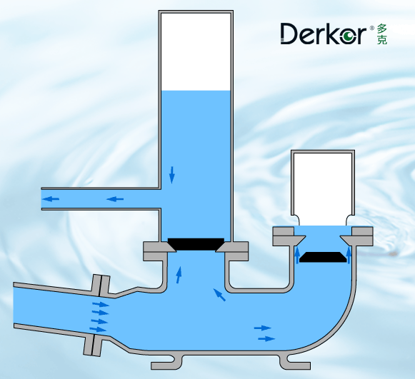
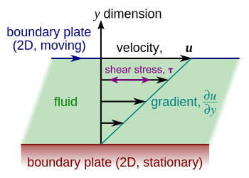

##  Plan

- [Flow neglecting friction](./1_fluid_dynamics.html#flow-neglecting-friction)
- [Flow with friction](./1_fluid_dynamics.html#flow-with-friction)
- [Types of flows](./1_fluid_dynamics.html#types-of-flows)
- [Take home messages](./1_fluid_dynamics.html#take-home-messages)
- [Further resources](./1_fluid_dynamics.html#further-resources)

# Flow neglecting friction

## Air pressure and water pressure
> - **What is the pressure under a 10m water collumn?**
> - 1 bar = 100 kPa
> - **Why?**
> - 1 Pa is 1 $N/m^2$ which is equivalent to 0.1 $kg/m^2$ with $g = 10 m/s^2$
> - So $10^5 Pa$ is equivalent to $10 000 kg/m^2$
> - 1$m$ water is 1000$kg/m^2$
> - 10$m$ water is 10 000$kg/m^2$

## Total head:  elevation head + pressure head + velocity head

> - Elevation head: $z$
> - Pressure head: $\frac {p}{\rho g}$
> - Elevation head + pressure head = the piezometric head $h$ (static hydraulic head) that we used for Darcy's Law
> - **But we neglected the velocity head, because of slow velocities in porous media**
> - Velocity head:$\frac {v^{2}}{2g}$

## Bernouilli's equation

States that the total head $H$ is constant:

\[H = z+{\frac {p}{\rho g}}+{\frac {v^{2}}{2g}}= h + \frac {v^{2}}{2g} = constant\]
where $z$ is the elevation head and $h$ the piezometric head

Assumptions:

- no friction
- incompressible fluid
- steady flow
- homogeneous fluid

## Exercise: flow out of a reservoir

> - **An open top reservoir (atmospheric pressure) is pierced at $z_1$, d=20cm below the top water level $z_2$. Calculate the average flow velocity out of the hole.**
> - $z_1 + p_{atmo}/\rho g = v^2/(2g)+z_2+p_{atmo}/\rho g$
> - $v= (2gd)^{1/2} = (20*0.20)^{1/2} = 2m/s$  

## Pump example: the ram pump
> - **How would we design a pump that doesn't use any external energy (only gravity)?**
> - By using the momentum of falling water and wasting much water in the process: the ram pump
> - drive pipe brings intake water
> - delivery pipe is the pressurized pipe
> - check valve to stop pressurized pipe from emptying
> - waste valve to evacuate excess water and control the ram effect
> - air chamber to make the ram effect smoother to avoid damaging the pump

<!--
http://www.rampumps.net/face/20120410150106.html
-->
## Schematics of a ram pump

## Animation of a ramp pump

## How much water can it pump
> - **Think in terms of energy balance to express $D$, the delivered flow ($m^3/s$) as a function of:**
> - $Q$ the flow of water supplied from the source in cube meters per hour
> - $F$ the fall or height of the source above the ram in meters.
> - $L$ the lift height of the point of use above the ram in meters
> - $E$ the efficiency of the ram (typically 60%)
> - $D = E*Q*F/L$
> - **How does the efficiency likely vary as a function of the lift / working fall ratio**
> - The efficiency is likely to drop with high lift / working fall ratios due to more water wastage, higher velocities, turbulence...

## Other instances of water hammer
> - **Why can a water hammer be a problem with pumps and pipes?**
> - The ram effect can destroy valves or pipes by applying sudden high pressure

> - **How is that mitigated in pump pressurized networks?**
> - Pressure release chambers or pressure release valve

## Analogy with the cardio vascular system

> - **The cardio-vascular system also has a pulse pump. The flow in blood vessels is however more regular, like in the ram pump after the air chamber. Which mechanical property of the blood vessels plays an analog role as the air chamber?**
> - The elasticity of the arteries

# Flow with friction

## Shear forces and viscosity

## Shear stress and viscosity
The shear stress $\tau$ (unit of pressure: Pa), is the ratio of shear forces $F$ per unit area $A$:
$\tau=\frac{F}{A} = \mu {\frac {du}{dy}}$

with $\mu$ the viscosity (in $Pa*s$), and $\frac{du}{dy}$ the velocity gradient perpendicular to the flow direction ($m/s$ per $m$ gives $s^{-1}$)

**Viscosity of water at $20^{\circ} C$ is $10^{-3}$ Pa.s**

## Bernouilli's equation + friction factor

A head loss term $h_l$ is added to Bernouilli's equation to account for total head losses due to friction:

\[H = z+{\frac {p}{\rho g}}+{\frac {v^{2}}{2g}} +h_l\]

$h_l$ can be expressed as a function of a dimensionless friction factor $f$:

$h_l=f*\frac{L.v^2}{D*2g}$
where $L$ and $D$ are the length and diameter of the pipe

# Types of flows

## Laminar vs turbulent flows
> - **What kind flows can we have (from a fluid dynamics perspectice)?**
> - Laminar flow occurs when a fluid flows in parallel layers, with no disruption between the layers (viscous forces are dominant). Requires very slow flow.
> - Turbulent flow characterized by sudden changes in pressure and flow velocity (inertial forces are dominant). White water, wind behind an obstacle are turbulent

## Characterizing turbulent flow: Reynolds number
The Reynolds number is defined as

$Re =\frac{\rho vL}{\mu }$

where: $\rho$ is the density of the fluid ($kg/m^3$)

$v$ is a characteristic velocity (m/s), mean velocity in our case

$L$ is a characteristic linear dimension. In the case of a pipe, it is its diameter

$\mu$ is the dynamic viscosity of the fluid ($Pa.s$ or $N.s/m^2$ or $kg/(m·s)$)

## Reynolds number example for flow in a pipe

$Re < 2000$ usually qualifies as laminar
$Re > 4000$ is clearly turbulent.
In between is a transition between those 2 flow regimes

> - **Example: Water at 20c ($\mu = 10^{-3}$), flowing at 0.1m/s in a 10cm wide pipe:**
> - **Calculate the Reynolds number:** $Re =\frac{\rho vL}{\mu }$
> - $Re = 0.1*0.1*1000/10^{-3} = 10 000 > 4000$
> - So the flow in the pipe is turbulent

## Friction factor
<!--
https://fr.wikipedia.org/wiki/%C3%89quation_de_Darcy-Weisbach#/media/File:Moody_diagram.jpg
-->

## Poiseuille Law for laminar flow
Can be derived theoretically

$v =-\frac{dh}{ds} \frac{\rho g D^{2}}{32\mu}$

$v$ is the water velocity in the pipe
$\frac{dh}{ds}$ is the hydraulic head gradient over the length of pipe (often the slope of the pipe, but not always),

$\mu$ is the dynamic viscosity,

$D$ is the pipe diameter.

## Hazen Williams equation for turbulent flow
It is an empirical formula used to design water networks, irrigation systems... 

$v=C{\sqrt{RS}}$

$v$ is the water velocity in the pipe

$C$ is a roughness coefficient

$R$ is the hydraulic radius (pipe radius in case of a pipe)

$S$ is the slope of the pipe

<!--
## Questions
> - **What is the typical pressure recommended for residence drinking water supply?**
> - 300 kPa
> - **How to deal with the presence of air in a pressurized water network?**
> - Install an air release valve at a high point
> - **What is cavitation?**
> - Depression in a pumping system that creates air bubbles and can lead to pump failure (TO CHECK)
> - **What influences the optimal size of arteries and veins?**
> - Balance between big arteries and cost of blood production
> - **Flow in a pipe is proportional to a power of the pipe radius. Which and why?**
> - XX
-->

## Take home messages

- Bernouilli equation: conservation of total head if we ignore friction
- Frictional losses of energy create head losses
- If head losses are important, they must be added to Bernouilli's Law
- Viscosity is temperature dependent. It is ratio of shear stress / cross-sectional velocity gradient
- Reynolds number measures importance of viscous forces
- In pipes: if Reynolds number > 2000, then turbulent flow
- Friction factor for laminar pipe flow: f = 64/R
- This gives the mean velocity of laminar flow in a pipe (Poiseuille)
- Mean velocity proportional to $D^2$ for laminar flow and $D^{1/2}$ for turbulent flow

# Further resources

## Book chapters

Elements of physical hydrology: Chapter 3 (covers key topics in a clear and math-light way)

## Selected online resources

US National Engineering handbook (Part 654 - Stream Restoration Design):
[Chapter 6 - Stream hydraulics](https://directives.sc.egov.usda.gov/OpenNonWebContent.aspx?content=17782.wba)

More details, more equations: [Isaac Wait online lectures](https://www.youtube.com/playlist?list=PLQv9IPdrtoKjRyCQlzxss9LsvzQf2EOYa)

[Bernouilli's equation](http://www.caee.utexas.edu/prof/kinnas/319LAB/Lab/lab%204-Bernoulli%27s%20equation/4-Bernoulli.htm)

<!-- Different kinds of pumps: IN FRENCH!-->

<!-- http://www.fao.org/docrep/010/ah810f/AH810F12.htm -->

<!--
http://www.physics.usyd.edu.au/teach_res/jp/fluids/viscosity.pdf
-->

## Cardiovascular and tree water pumping analogy

[The determinants of cardiac output - Video](http://cardiac-output.info/the-determinants-of-cardiac/the-determinants-of-cardiac/)

[The physiological principle of minimum work: the vascular system and the cost of blood volume](https://www.ncbi.nlm.nih.gov/pmc/articles/PMC1084489/pdf/pnas01840-0073.pdf)

[The physiological principle of minimum work: Oxygen exchange in capillaries](https://www.ncbi.nlm.nih.gov/pmc/articles/PMC1084544/pdf/pnas01842-0027.pdf)

Water transport in plants:

[Water transport in plants obeys Murray's Law](http://biologylabs.utah.edu/sperry/publications/nature03.pdf)

[On connection large vessels to small: the meaning of Murrays Law](http://jgp.rupress.org/content/jgp/78/4/431.full.pdf)

