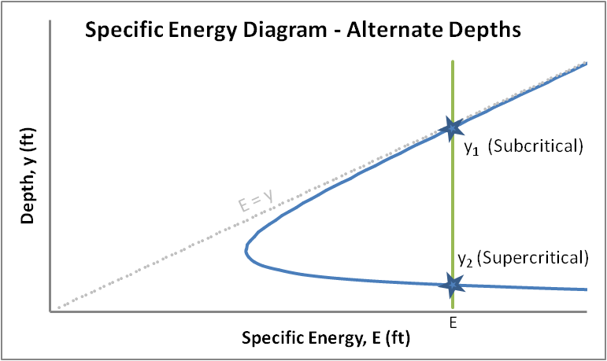
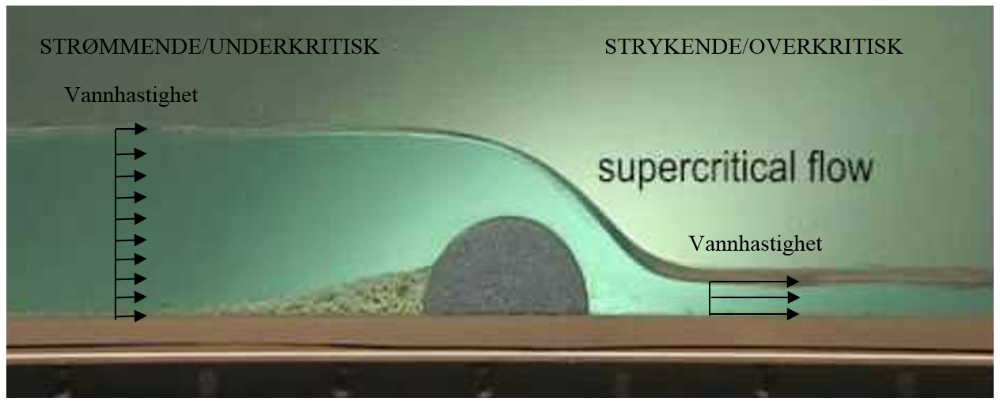
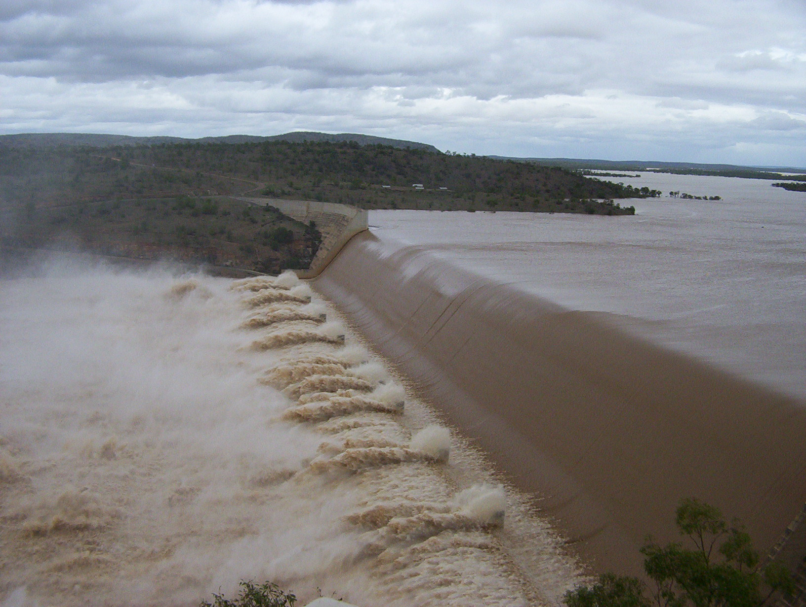
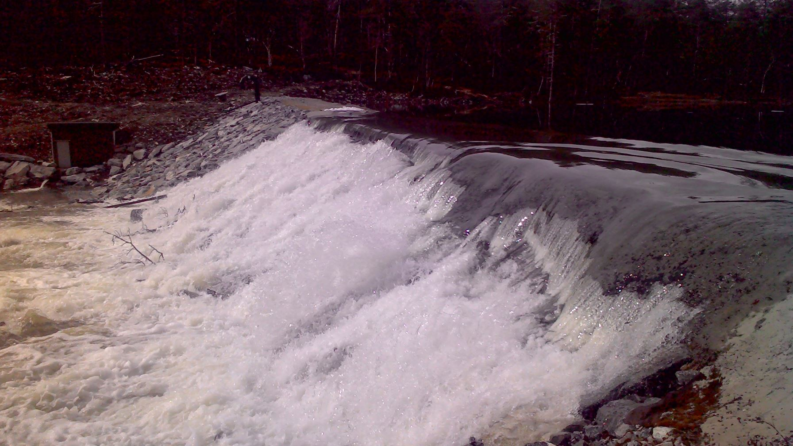
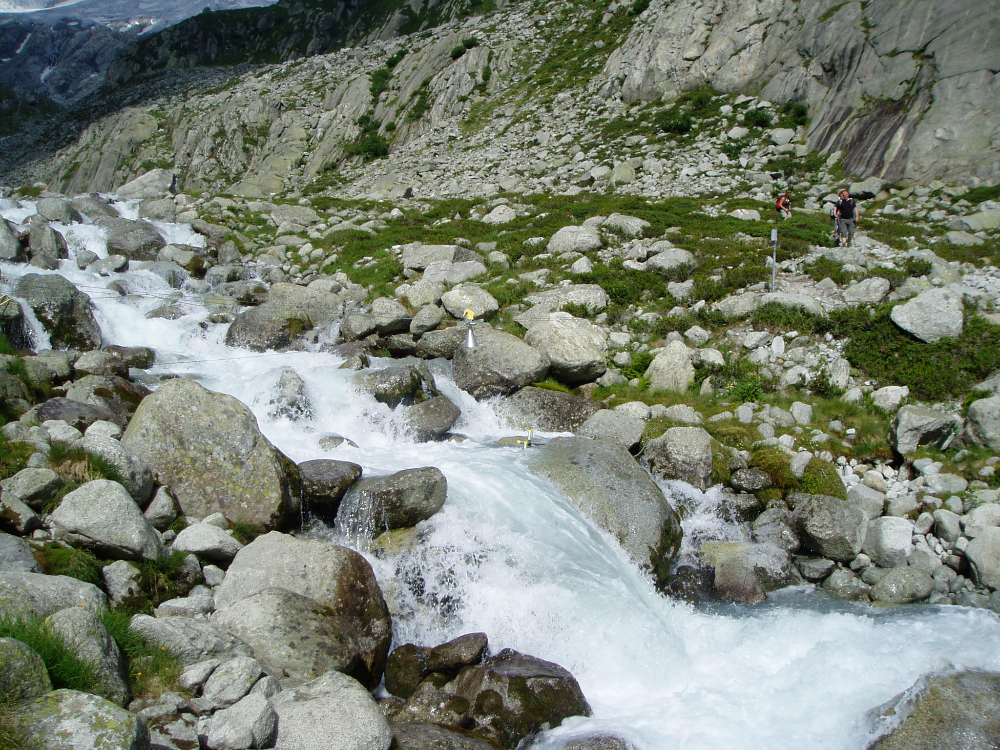
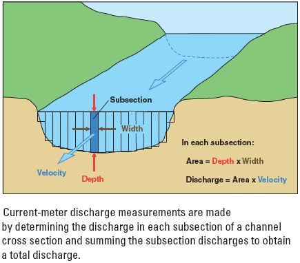
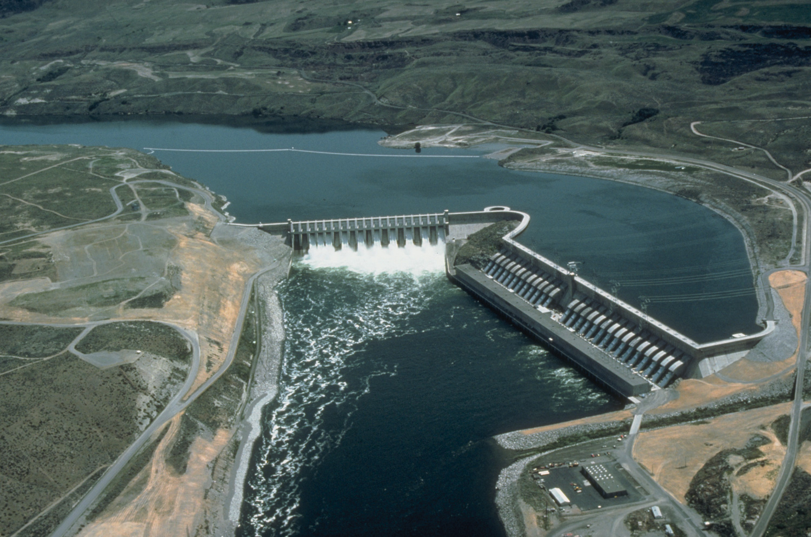

## Plan

- [Flow criticality](./2_open_channel.html#flow-criticality)
- [Open channel equations](./2_open_channel.html#open-channel-flow)
- [Streamflow gauging](./2_open_channel.html#streamflow-gauging)
- [Take home messages](./2_open_channel.html#take-home-messages)
- [Further resources](./2_open_channel.html#further-resources)

<!--
Exercises
-->
# Flow criticality

## Specific energy
With [Bernouilli's Law](1_fluid_dynamics.html#bernouillis-equation), we defined the total hydraulic head:

\[H = z+{\frac {p}{\rho g}}+{\frac {v^{2}}{2g}}\]

where $v$ the mean flow velocity.

In rivers, there is no pressure term and $z=h+z_b$ is the sum of the water depth $h$ and the elevation of the stream bed $z_b$. So we can define the specific energy:

$E = h+{\frac {v^{2}}{2g}}$ 

$E+z_b=H$

## 2 alternate depths for a given specific energy

<!--
https://en.wikipedia.org/wiki/Energy%E2%80%93depth_relationship_in_a_rectangular_channel
-->

## Froude number and flow criticality
Solving $dE/dh=0$ yields a condition for which there is only 1 possible water depth for a given specific energy: $h_0=v_0^2/g$. This is the condition for **critical flow**

The **Froude number** is defined as:

$Fr=\frac{v_{0}}{\sqrt{g*h_{0}}}$

If $F=1$, the flow is **critical** and $h=2*E/3$

If $F<1$, the flow is **subcritical**

If $F>1$, the flow is **supercritical**

## Transition from subcritical to supercritical

## Hydraulic jump: high velocity discharges into low velocity

> - **What is often the purpose of a hydraulic jump / well designed spillways?**
> - Lose energy through turbulence

## Local spillway above Kaupanger

# Open channel equations

## Weir formula
From the previous equations can be derived a general formulation for discharge $Q$ over weirs:

$Q = C L H^n$

$C$ is the flow coefficent for the structure. $C= \sqrt { \frac{8g}{27}}$ for a horizontal weir.

$L$ is the width of the weir at its crest

$H$ is the height of water over the crest (where the flow is critical)

$n$ varies with structure (e.g., 3/2 for horizontal weir, 5/2 for v-notch weir...)

## Chézy formula for open channel flow

Using the [friction factor](1_fluid_dynamics.html#friction-factor), the Chézy formula can be derived as:

\[v=C{\sqrt {R_h\,S}}\]

$v$ is the mean velocity (m/s),

$C$ is the Chézy coefficient in $m^{1/2}/s$,

$R_h$ is the hydraulic radius in m: cross-sectional area / wetted perimeter (~ water depth for wide rivers)

$S$ is the slope of the river bed (unitless).

## Chézy formula
Theoretically, the Chézy coefficient $C$ can be expressed as a function of the friction factor:

$C= \sqrt { \frac{8g}{f}}$

As it depends on both the hydraulic radius $R_h$ and the channel roughness, this empirical formula was proposed:

$C = \frac {1}{n}R_h^{1/6}$

where $R_h$ is the hydraulic radius and $n$ is Manning's roughness coefficient.

## Manning's equation
Replacing the last expression for $C$ into Chézy's equation yields:

\[v = {\frac{R_h^{2/3} S^{1/2}}{n}} \]

$v$ is the cross-sectional average velocity

$n$ is the Manning coefficient. (in $s*m^{-\frac {1}{3}}$)

$R_h$ is the hydraulic radius in meters

$S$ is the gradient in hydraulic head, which is the channel bed slope when the water depth is constant

## Typical Manning roughness coefficients
According to "Elements of physical hydrology"

Channel material	| Manning's n
--- | ---
Glass	| 0.01	
Smooth concrete	|	0.012
Earth canal | 0.02
Natural streams | 0.024-0.075

## Application
> - **Calculate the flow in a rectangular earth canal (width = height= 1m) of 1% slope**
> - $v = {\frac{R_h^{2/3} S^{1/2}}{n}}$
> - $R_h = 1/3$, $S = 1/100$ and $n = 0.02$
> - So $Q=v*1=2.4 \ m^3/s$

## Flood routing methods

Useful to forecast the attenuation of a flood wave through a stream channel, assess the impact of mitigation measures, a dam failure...

- Shallow water equations (or Saint-Venant equations): extensively used in computer models such as HEC-RAS, InfoWorks, MIKE SHE...
- Weir discharge formulas for flood routing through a reservoir
- [The Muskingum method](http://nptel.ac.in/courses/105101002/downloads/module5/lecture3.pdf) uses a more conceptual approach

# Streamflow gauging

## Stage-discharge relationship
> - **From Manning's equation, Which parameters affect flow in an open channel?**
> - slope
> - channel roughness
> - cross-sectional area
> - wetted perimeter 

## Stage-discharge relationship: rating curve
At a specific location, slope is constant so discharge can be expressed as a function of water height, typically a power law: 

$Q=a*H^b$ 

where $a$ and $b$ are constants and $H$ is the river stage

This relationship need to be calibrated for a variety of flows and needs regular re-calibration in erosive environments

More details: [WMO - Manual on stream gauging](https://library.wmo.int/opac/index.php?lvl=notice_display&id=540#.WR3PnuvyhaR)

## Stage-discharge relationship: field setup

## Streamflow measurements

> - **Many streamflow measurements are required to calibrate the rating curve. How to measure flow in a stream?**
> - Dilution gauging with salt / dye + electrical conductivity meter / fluorometer
> - Portable current meter
> - To skip the streamflow measurements: use / build a weir

<!--
> - **How to run a dilution gauging experiment and intepret the results?**
> - Salt or dye dilution
> - **Let's call C(t) the concentration of salt or dye. Find the equation relating it to discharge.**
-->

## Streamflow measurements:dilution

- Salt and/or dye dilution experiments
- Here, very low flow in a mountain torrent

## Streamflow measurements: current meter

- Measuring average flow for a series of channel sub-sections
- With $H$ the height of a section, the mean velocity is at $h=0.4*H$ (logaritmic profile)

<!--
## Shallow water equations: Saint-Venant equations
\[\frac{\partial A}{\partial t} + \frac{\partial \left(Au\right)}{\partial x} = 0 \]
and
\[\frac{\partial u}{\partial t} + u\frac{\partial u}{\partial x}+g\frac{\partial \zeta }{\partial x} = -\frac {P}{A}\frac {\tau }{\rho}\]

where x is the space coordinate along the channel axis, $t$ denotes time, $A(x,t)$ is the cross-sectional area of the flow at location $x$, $u(x,t)$ is the flow velocity, $\xi(x,t)$ is the free surface elevation and $τ(x,t)$ is the wall shear stress along the wetted perimeter $P(x,t)$ of the cross section at $x$. Further $\rho$ is the (constant) fluid density and $g$ is the gravitational acceleration.

## Run-of-river hydroelectricity
> - **What is a run-of-river hydroelectricity installation?**
> - A hydropower plant which has no or very little storage
> - **What are its main properties in terms of hydraulic head and flow?**
> - Low head, high flow.
Typically installed on big rivers: Rhin, rhone.
In France 30% of hydro comes from this. 50% in Switzerland.

-->

## Take home messages
- For a given discharge, the specific energy is minimum at critical flow, when the Froude number $Fr=\frac{v_{0}}{\sqrt{g*h_{0}}} = 1$
- For F<1, the flow is subcritical, slow and not agitaded
- For F>1, the flow is supercritical, rapid and torrential
- Some specific weir / channel shapes have either theoretical or empirical stage / discharge relationships
- Many flow phenomena in rivers can be explained by: the equation of continuity, the Bernouilli equation, and the friction factor relationships

## Take home messages
- For steady, uniform open channel flows, the friction slope is equal to the bottom slope: depth, velocity and specific energy are constant
- Hydraulic radius $R_h$ of a stream channel: cross-sectional area / wetted perimeter
- The Chézy equation can be derived from the friction factor
- The widely used Manning's equation relates mean velocity to slope and hydraulic radius. 
- Mean velocity for flow with a logarithmic profile at 0.4h above the stream bed

<!--
# Exercices 

## [Water and fluids](http://engineeringinterviewquestions.com/hydraulics-and-fluid-mechanics-interview-questions-civil-engineering-objective-type-questions-and-answers/)
> - **The density of water is maximum at:**
> - **a**: $0^{\circ}C$
> - **b**: $0^{\circ}K$
> - **c**: $4^{\circ}C$
> - **d**: $100^{\circ}C$
> - **e**: $20^{\circ}C$ 
> - Answer: **c**

## Water and fluids
> - **The density of ice in $g/cm^3$ at $0^{\circ}C$:**
> - **a**: 1
> - **b**: 1000
> - **c**: 920
> - **d**: 1.1
> - **e**: 0.92
> - Answer: **e**

## Water and fluids
> - **The specific weight of water is 1000 $kg/m^3$**
> - **a**: at normal pressure of 760 mm
> - **b**: at 4°C temperature
> - **c**: at mean sea level
> - **d**: all the above 
> - **e**: none of the above.
> - Answer: **d**

## Water and fluids
> - **A fluid is a substance that:**
> - **a**: cannot be subjected to shear forces
> - **b**: always expands until it fills any container
> - **c**: has the same shear stress at a point regardless of its motion
> - **d**: cannot remain at rest under action of any shear force
> - **e**: flows
> - Answer: **d**

## Water and fluids
> - **A fluid offers no resistance to a change of:**
> - **a**: pressure
> - **b**: flow
> - **c**: shape
> - **d**: volume
> - **e**: temperature
> - Answer: **c**

## Water and fluids
> - **In a static fluid,**
> - **a**: resistance to shear stress is small
> - **b**: fluid pressure is zero
> - **c**: linear deformation is small
> - **d**: only normal stresses can exist
> - **e**: viscosity is nil
> - Answer: **d**

## Water and fluids
> - **Mercury does not wet glass. This is due to a property of liquids known as**
> - **a**: adhesion
> - **b**: surface tension
> - **c**: cohesion
> - **d**: compressibility
> - **e**: viscosity
> - Answer: **b**

## Water and fluids
> - **When the flow parameters at instant $t$ are the same at every point, the flow is**
> - **a**: quasi static
> - **b**: steady state
> - **c**: laminar
> - **d**: static
> - **e**: uniform
> - Answer: **e**

## Water and fluids
> - **In a chute spillway, the flow is usually**
> - **a**: uniform
> - **b**: subcritical
> - **c**: critical
> - **d**: supercritical
> - Answer: **d*

## Water and fluids
> - **Generally, a weir is perpendicular to the main river flow because**
> - **a**: it keeps the weir shorter
> - **b**: it gives the weir more discharge capacity
> - **c**: it is economical
> - **d**: all of the above
> - Answer: **d*
> - **The ratio of average values of shear stresses produced on the bed and the banks of a channel due to flowing water is?**
> - **a** < 1
> - **b** = 1
> - **c** > 1
> - **d** = 0
>- Answer: **c**
-->

# Further resources

## Book chapters

Elements of physical hydrology: Chapters 4, 5

Hydrology in Practice: Chapters 6, 16

Vassdragshåndboka: Chapters 4, 10

## Handbooks and online lectures

[USDA - National Engineering Handbook Section 5 Hydraulics](https://www.wcc.nrcs.usda.gov/ftpref/wntsc/H&H/NEHhydraulics/neh5.pdf)

[Discharge measurement at gauging stations](https://pubs.usgs.gov/twri/twri3a8/html/pdf.html)

Hydraulics course with a lot more detail: [Isaac Wait online lectures](https://www.youtube.com/playlist?list=PLQv9IPdrtoKjRyCQlzxss9LsvzQf2EOYa)

