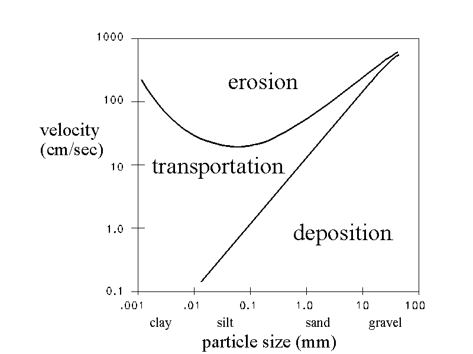
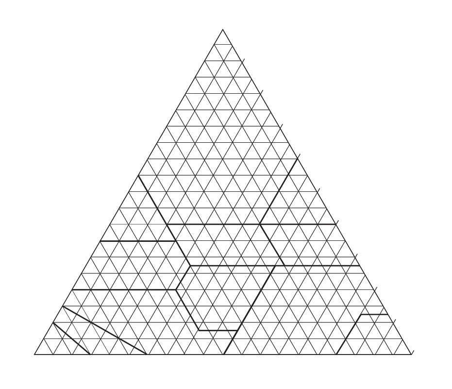
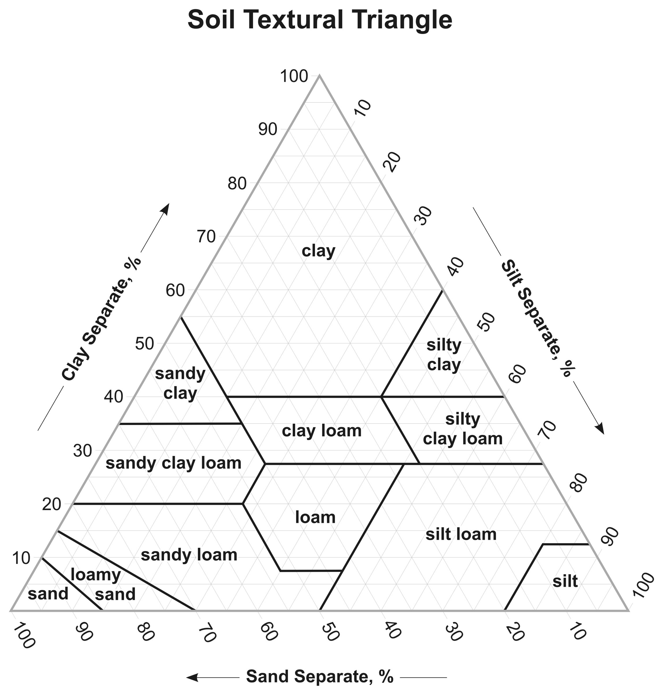
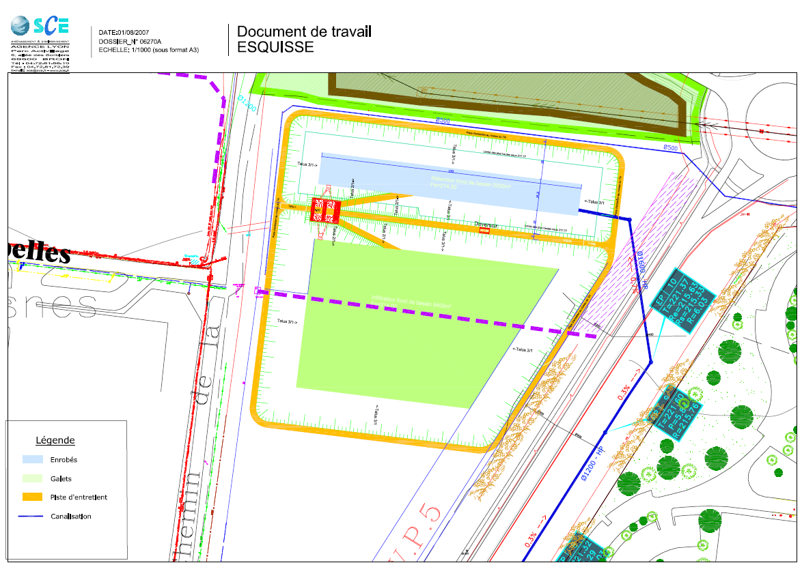
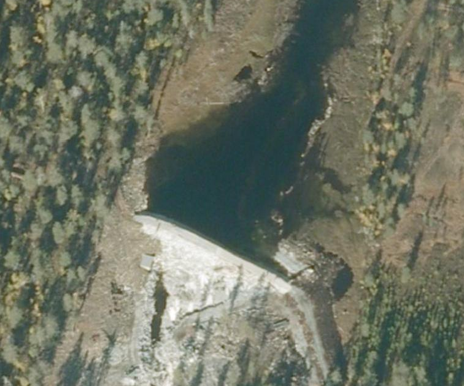
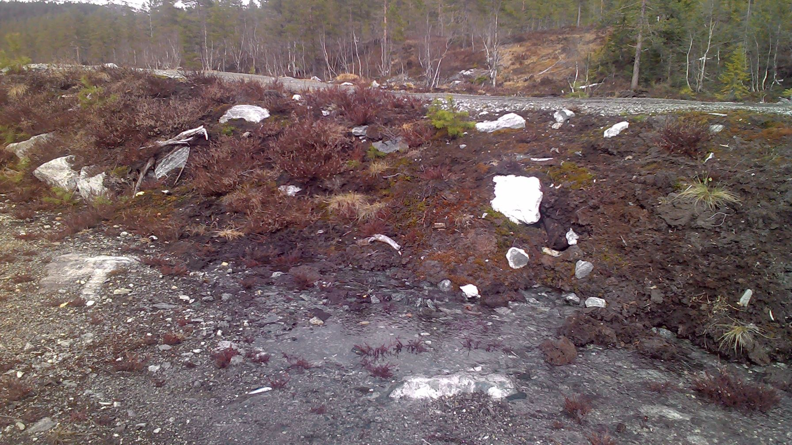
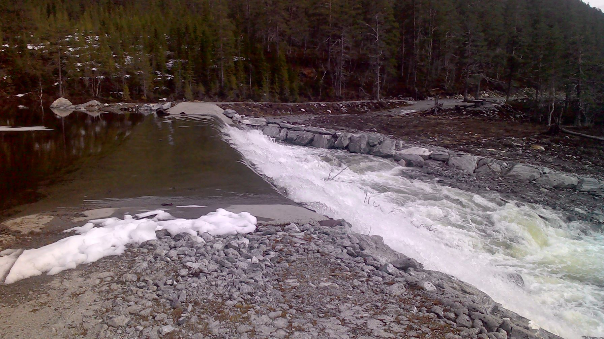
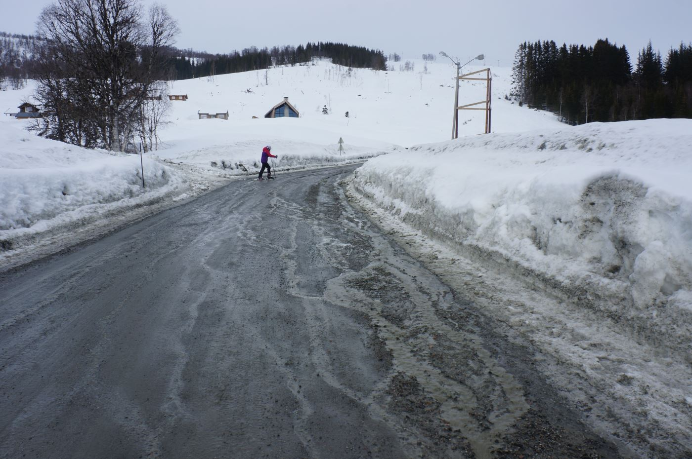
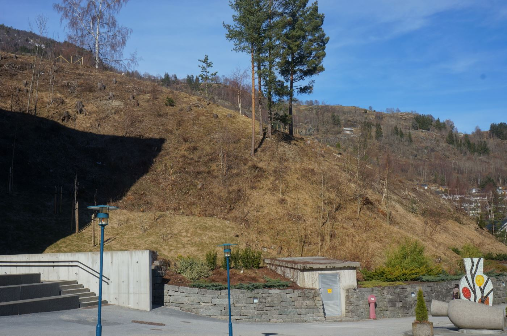

##  Plan

- [Erosion and deposition](./3_erosion_deposition.html#erosion-and-deposition)
- [Sedimentation rates](./3_erosion_deposition.html#sedimentation-rates)
- [Take home messages](./3_erosion_deposition.html#take-home-messages)
- [Examples around Sogndal](./3_erosion_deposition.html#examples-around-sogndal)
- [Exercise: sizing flood protection infrastructure](./3_erosion_deposition.html#application-exercise)
- [Further resources](./3_erosion_deposition.html#further-resources)

<!--
[Soils](./3_erosion_deposition.html#soils)
grain sizes
pollution load as a function of grain size
-->

<!--
typical mobilization velocities
deposition velocities as a function of particle size
solid load in rivers
-->

<!--
Link to geohazards?
Bjørnar NVE on his master thesis?

## Available water capacity in soils

Source: https://stormwater.pca.state.mn.us/images/d/d5/Available_water_capacity.png

The following 2 documents can help designing the reinforced river channel

Technical supplement 14B to the US National Engineering handbook (Part 654 - Stream Restoration Design) 
[Scour calculations](https://directives.sc.egov.usda.gov/OpenNonWebContent.aspx?content=17811.wba)

Technical supplement 14C to the US National Engineering handbook (Part 654  - Stream Restoration Design) 
[Stone sizing criteria](https://directives.sc.egov.usda.gov/OpenNonWebContent.aspx?content=17812.wba)

Engineering Field Handbook (Part 650)
[Chapter 16 - Streambank and Shoreline Protection](https://directives.sc.egov.usda.gov/OpenNonWebContent.aspx?content=17553.wba)

-->

# Erosion and deposition

## Erosion / deposition: which forces are at play

> - Gravity
> - Buyancy (Archimedes' principle)
> - Shear stress (viscous forces) from water flow
> - Soil cohesion
> - **Where do silting and scouring happen in a river bend?**
> - silting on the convex side
> - scouring on the concave side

## Velocity gradients drive shear stress and erosion

> - **Where does erosion preferentially occur: stream bed  or stream bank?**
> - **For Wide and shallow river channels?**
> - Steeper gradient along bed than along banks: promotes bed erosion
> - **For narrow, deep channels?**
> - Steeper gradient along banks than along bed: promotes bank erosion

## Hjulström curve

## [Shields diagram](https://www4.uwsp.edu/geo/faculty/lemke/geomorphology/lectures/03_stream_sediment.html)

<!-- https://www4.uwsp.edu/geo/faculty/lemke/geomorphology/images/03_shields_diagram.gif -->

## Soil textural triangle

## Soil textural triangle

<!--
## Erosion / deposition processes as a function of grain size
> - **How are erosion / deposition processes related to grain size?**
> - 
> - **What is the impact of water reservoirs on those processes?**
> -
> - **Potential impact of climate change on erosion in the region?**
> -
> - **What is a debris flow?**
> -
> - **when / why does it tend to happen?**
> -
> - **How to alleviate erosion?**
> -
> - **What happens when water flows through those 2 soils: well aggregrated compost / forest soil vs "dirt"**
> -

## QUESTIONS

> - **Impact of erosion on the carbon and nitrogen cycles?**
> -
> - **Link between agricultural practices and erosion?**
> -
> - **Grain size is not the only control on erosion processes. What charactistic of a healthy agricultural / forest soil helps prevent erosion?**
> -
> - **Link between landslides and erosion?**
> -
> - **What is the relation between grain size and pollution in stormwater?**
> -
-->

## Types of sediment load

- Bed load: particles that are transported along the stream bed
- Suspended load: particles that are kept suspended by turbulence. Usually clay, sil or fine sand.
- Dissolved load: particles that have been dissolved by water (electrical conductivity is a proxy)

## Impact of reservoirs on erosion

- Water flowing out of reservoirs lacks sediment load. The shear stresses are not damped by a "protective layer" of sediments, which makes the erosion potential higher.
- This is how sediment-starved water can have an impact on downstream habitats

# Sedimentation rates

## [Pollution in sediments](http://www.fao.org/docrep/W2598E/w2598e05.htm)

> - Pollution by sediment has two main aspects:
> - Physical: top soil loss and land degradation leads to high turbidity and to later deposition in river and lake beds.
> - Chemical: the silt and clay fractions (<63m m fraction) are primary carriers of adsorbed chemicals, especially phosphorus, chlorinated pesticides and heavy metals
> - This is why sedimentations basins are often important for SW depollution
> - Of course a big part of the chemical pollution is also disolved

## Stokes sphere

## Stokes Law
If we assume: laminar flow, spherical particles, homogeneous material, smooth surfaces and particles not interfering with each other.

The force of viscosity on a small sphere moving through a viscous fluid is given by:

\[F_d = 6 \pi \mu r v\]
where: $F_d$ is the frictional force, Stokes' drag
$\mu$ is the dynamic viscosity
$r$ is the radius of the spherical object
$v$ is the flow velocity relative to the object.

## Velocity of a sphere falling in a fluid

At terminal (or settling) velocity, the excess force $F_g$ due to the difference between the weight and buoyancy of the sphere is:

\[F_g = \left(\rho _{p}-\rho _{f}\right)\,g\,{\frac {4}{3}}\pi \,R^{3},\]

with $\rho_p$ and $\rho_f$ the mass densities of the sphere and fluid

$R$ the particle diameter

$g$ is the gravitational acceleration ($m/s^2$)

## Velocity V (m/s) of a sphere falling in a fluid
$V={\frac {2}{9}}{\frac {\left(\rho _{p}-\rho _{f}\right)}{\mu }}g\,R^{2}$

$\rho _{p}$ is the mass density of the particles ($kg/m^3$)

$\rho _{f}$ is the mass density of the fluid ($kg/m^3$)

$\mu = 10^{-3} Pa.s$ is the dynamic viscosity.

$V > 0$ when a particle is falling. 

$V$ is proportional to $R^2$

## Settling velocities: some examples

Fine sand, 0.1$mm$: 0.7 $cm/s$

Silt, 0.02$mm$: 0.03 $cm/s$

Clay, 0.005$mm$: 0.0018 $cm/s$

## Example from my Master's thesis: plan

## Example from my Master's thesis: xls model 

<!--
## Universal soil loss equation
$A=RKLSCP$ The USLE has another concept of experimental importance, the unit plot concept. The unit plot is defined as the standard plot condition to determine the soil's erodibility. These conditions are when the $LS$ factor = 1 (slope = 9% and length = 72.6 feet) where the plot is fallow and tillage is up and down slope and no conservation practices are applied (CP=1). In this state:

$K=A/R$ A simpler method to predict $K$ was presented by Wischmeier et al.[7] which includes the particle size of the soil, organic matter content, soil structure and profile permeability. The soil erodibility factor $K$ can be approximated from a nomograph if this information is known. The $LS$ factors can easily be determined from a slope effect chart by knowing the length and gradient of the slope. The cropping management factor ($C$) and conservation practices factor ($P$) are more difficult to obtain and must be determined empirically from plot data. They are described in soil loss ratios ($C$ or $P$ with / $C$ or $P$ without).
-->

## Take home messages

- Particule density, shear stress from viscous forces and soil cohesive forces at play for erosion
- Hjulström diagram: erosion, transportation and deposition as a function of velocity and particle size
- Harder to initiate motion than to maintain motion
- Different types of sediment loads: bed load, suspended load or dissolved load
- Low sediment load downstream of reservoirs can lead to erosion
- Deposition velocity proportional to $R2$ (Stoke's law)
- SW pollution often bonded to fine sediments (adsorbtion): need to design for sedimentation

# Examples around Sogndal

## Internal erosion: Piping through dams

Water flow through soils can lead to (internal) soil erosion if quick enough.

It is a common cause of failure for earth dams and levees (dikes) as it is often detected too late. This is why they need to be regularly monitored.

It is one of the reasons for not planting vegetation on dikes

[Video: Piping failures at dams](https://www.youtube.com/watch?v=PC58mGG55io)

## Hydro dam below Breidesetevatnet 

NOTE: Taken as general example: probably no erosion problem but a similar site could

## Hydro dam below Breidesetevatnet 

## Hydro dam below Breidesetevatnet 

## Hydro dam below Breidesetevatnet 

## What's the problem

## Bad erosion management on construction site

- Not a huge issue in the case
- It will just create them more work to come tidy it up

Fixes:

- Easing the slope of the fill above
- Having a flat terrasse between the fill and the next slope
- Installing erosion control materials

## Road grit transported onto field!

## Road grit transported onto field!

## Unpaved access roads are hard to design in the region

## Consequences of erosion on SW grid

## Erosion at asphalt / gravel interface

## What's the problem and why?

## Signs of erosion: already!

- The local biome is resilient (regular rainfall, not too many extremes)
- But clear-cutting steep slopes can still lead to erosion
- In dry mediteranean, this could be more dramatic 

# Application exercises

## Sizing flood protection infrastructure in Laerdal

During the 2014 floods, the stream coming out of [Tynjadalen](http://www.norgeskart.no/#!?project=seeiendom&layers=1002,1015&zoom=13&lat=6791235.68&lon=97316.62) found a new flowpath and destroyed some agricultural land.

> - **Which measure would you suggest to avoid such an event in the future?**
> - NVE decided to build a riprap protection on the stretch of stream bank affected.
Discuss the potential location of this riprap and calculate its necessary height to protect against a 100 or 200 year flood.

## Key words and hints

- Streambank restauration design
- Stream channel / bank protection
- Open channel flow
- Hint: [Nevina](www.nevina.nve.no) helps you define the catchment area and the 200-year flood.
- Hint: The riprap protection will have a very controlled geometry, making it easy to use open channel formulas.
- Hint: For a quite precise measure of steepness, you can use [hoydedata.no](www.hoydedata.no).
- Sizing of rocks for riprap
- Hint: [Stream Restoration Design (National Engineering Handbook 654)](https://www.nrcs.usda.gov/wps/portal/nrcs/detail/national/water/manage/restoration/?cid=stelprdb1044707)

## Manning's equation
Replacing the last expression for $C$ into Chézy's equation yields:

\[V = {\frac{R_h^{2/3} S^{1/2}}{n}} \]

$V$ is the cross-sectional average velocity

$n$ is the Manning coefficient. (in $s*m^{-\frac {1}{3}}$)

$R_h$ is the hydraulic radius in meters

$S$ is the gradient in hydraulic head, which is the channel bed slope when the water depth is constant

## Typical Manning roughness coefficients
According to "Elements of physical hydrology"

Channel material	| Manning's n
--- | ---
Glass	| 0.01	
Smooth concrete	|	0.012
Earth canal | 0.02
Natural streams | 0.024-0.075

## Application and criticism

Potential geometry which fits data from hoydedata.no: 10m base width,20m full width, 1.7m water height.
Max velocity: 5.34m/s. D50 of at least 40-50cm required for the riprap material (see "Technical supplement: stone sizing criteria")

What are potential negative downstream impacts of such a measure?
Speeds up flow through this section. The whole section needs to be well designed and constructed.

Have a good look at the map in Norgeskart / NVE Atlas and try to find upstream features that could bring accrued sediments downstream.
Hint: The Laerdal tunnel is not far.

## Sedimentation analogy: [Why don't clouds fall?](http://lamp.tu-graz.ac.at/~hadley/whydontcloudsfall.html)

> - **Clouds can hold a lot of water so why don't they fall?** 
> - The small water droplets that make up clouds fall extremely slowly. The drag force of the air dominates over the gravitational force for small particles. The drag force increases as the size of an object decreases. Applying Stokes Law gives: $F = 6\pi\eta Rv$
> -$R$ is the radius of the sphere, $v$ is the velocity, and $\eta$ is the viscosity. The viscosity of air is about $0.018*10^-3 Pa.s$ and the viscosity of water is about $1.8*10^-3 Pa.s$. 
> - Stokes's law is valid if the Reynolds number $N_{reynolds} = 2R \rho v/\eta$ is less than about 2000. Here $\rho$ is the mass density.

## Why don't clouds fall?
> - A spherical particle falling under the force of gravity will reach terminal velocity when the gravitational force matches the drag force: $mg = 6\pi\eta Rv$
> - Solving this for the terminal velocity yields: $v_{terminal} = 2g\rho R^2/(9\eta)$
> - A water droplet with a 10 nm radius falls at 12 nm/s in air. It would take 2.6 years for this droplet to fall one meter. It is only when the small droplets begin to coalesce into larger droplets that they fall with significant speed.

<!--
In some sense, the inverse effect to rain is the rising of bubbles in beer. Bubbles are lighter than the surrounding liquid so gravity pushes them up. They rise with a constant velocity which is described by Stokes law. If you are the type that carefully observes your beer, you will have noticed that sometimes the bubbles move down. This is because of the circulation of liquid in the beer glass. The rising bubbles in the center of the glass drag some liquid along with them. After this liquid reaches the top of the glass, it returns to the bottom along the sides of the glass. This downward flow can drag bubbles, especially small bubbles, downwards against the force of gravity.

In a similar manner, small rain drops can be pull up by air currents against the force of gravity."
-->

# Further resources

## Online courses and technical documentation

MIT Open courseware: [Introduction to fluid motions, sediment transport and current-generated sedimentary structures](https://ocw.mit.edu/courses/earth-atmospheric-and-planetary-sciences/12-090-introduction-to-fluid-motions-sediment-transport-and-current-generated-sedimentary-structures-fall-2006/course-textbook/)

[Stream Restoration Design (National Engineering Handbook 654)](https://www.nrcs.usda.gov/wps/portal/nrcs/detail/national/water/manage/restoration/?cid=stelprdb1044707)

## Norway / Europe

The [RECARE](http://www.recare-hub.eu/) project presents 17 case studies in Europe dealing with prevention and mitigation of soil degradation.

One of the case studies is in a Norwegian catchment: [preventing soil degradation in the Vansjø-Hobøl catchment](http://www.recare-hub.eu/case-studies/vansjo-hobol-catchment-norway)

Erosive flood events: theory and protection measures
[Vegvesen - Flom- og sørpeskred - Sikring av veger og jernbaner](http://www.vegvesen.no/fag/publikasjoner/Publikasjoner/Statens+vegvesens+rapporter/_attachment/519072?_ts=140e2d18e58&fast_title=SVV_73_Flom-_og_sorpeskred.pdf)

## World

The Global Environment Facility report on ["Managing soil organic carbon for global benefits"](https://www.thegef.org/sites/default/files/publications/STAP-SOC-Report-lowres-1_0.pdf). This links to the theme "land use".

[FAO Soils portal](http://www.fao.org/soils-portal/soil-degradation-restoration/en/)

[Control of water pollution from agriculture - FAO irrigation and drainage paper 55](http://www.fao.org/docrep/W2598E/w2598e00.htm#Contents)

## USDA: Erosion control in agriculture

[Erosion control practices and systems](https://www.nrcs.usda.gov/wps/portal/nrcs/detail/vt/home/?cid=nrcs142p2_010552)

[Adoption of Agricultural Production Practices: Lessons Learned from the U.S. Department of Agriculture Area Studies Project](https://www.ers.usda.gov/publications/pub-details/?pubid=41202)

Includes [soil management](https://www.ers.usda.gov/webdocs/publications/41192/32127_aer792e_002.pdf?v=41304) and [water management](https://www.ers.usda.gov/webdocs/publications/41192/32128_aer792f_002.pdf?v=41304)

## Soils and erosion control in agriculture

[USDA Educational resources on soil](https://www.nrcs.usda.gov/wps/portal/nrcs/main/soils/edu/college/)

[USDA Guide to soil texture by feel](https://www.nrcs.usda.gov/wps/portal/nrcs/detail/soils/edu/?cid=nrcs142p2_054311)

[Soil health for educators](https://www.nrcs.usda.gov/wps/portal/nrcs/detail/soils/health/assessment/?cid=nrcs142p2_053870)

[Soil infiltration](https://www.nrcs.usda.gov/Internet/FSE_DOCUMENTS/nrcs142p2_051576.pdf)

[Cornell University: great online documents on soil conservation from an agricultural perspective](https://nrcca.cals.cornell.edu/soil/CA5/)

[Presentation on erosion from agricultural areas](http://www.topps-life.org/uploads/8/0/0/3/8003583/bmp_runoff_16_09_2015.pdf)

# Annoted video resources

## Erosion and soil cover

<iframe width="800" height="400" src="https://www.youtube.com/embed/im4HVXMGI68" frameborder="0" allowfullscreen></iframe>

Impact of stable soil aggregates on erodability: [Soil aggregation and water infiltration](https://www.youtube.com/watch?v=d1M7EFqqsMM)

## Rainfall simulator: Soil Management Impacts on Water Infiltration (very good)

<iframe width="800" height="450" src="https://www.youtube.com/embed/4IIoyFYEcBc" frameborder="0" allowfullscreen></iframe>

<!-- ## [Green Stormwater Infrastructure / Low-Impact Development Toolbox of Solutions](https://www.youtube.com/watch?v=CyCDQlguKPg) -->

<!-- 15:00 Compost blankets for erosion control during contruction -->
<!-- -> buildingsoils.org -->

## Scientific presentations

[Dr. Efi Foufoula-Georgiou - Breakthroughs in Engineering Hydrology](https://www.youtube.com/watch?v=auqXqTqhbSM)

20:00 reasons and effects of changes in erosion
23:00 sand transport velocity. non libear relationship with slope
36:00 definitions of resilience
49:00 EPA conlusions on expected change sin erosion / pollution patterns

[The evolution of floodplain complexity](https://www.youtube.com/watch?v=l7mLNc63lzg&list=WL&index=203)

Research combining erosion, sediment load and open channel flow  (long and difficult)

