##  Plan

[Runoff from small catchments](./4_urban_hydraulics.html#runoff-from-small-catchments)

[Water harvesting example](./4_urban_hydraulics.html#water-harvesting-example)

[Exercises](./4_urban_hydraulics.html#exercises)

[Further resources](./4_urban_hydraulics.html#further-resources)

<!--
## Vocabulary
> - **Rising limb** 
> - The rising limb of hydro graph, also known as concentration curve, reflects a prolonged increase in discharge from a catchment area, typically in response to a rainfall event
> - **Recession (or falling) limb** 
> - The recession limb extends from the peak flow rate onward. The end of stormflow (a.k.a. quickflow or direct runoff) and the return to groundwater-derived flow (base flow) is often taken as the point of inflection of the recession limb. The recession limb represents the withdrawal of water from the storage built up in the basin during the earlier phases of the hydrograph.

> - **Peak discharge**
> - The highest point on the hydro graph when the rate of discharge is greatest

## Vocabulary
> - **Lag time** 
> - The time interval from the center of mass of rainfall excess to the peak of the resulting hydrograph

> - **Time to peak** 
> - Time interval from the start of the resulting hydro graph

> - **Discharge** 
> - the rate of flow (volume per unit time) passing a specific location in a river or other channel

-->

# Runoff from small catchments

## Rational method
Recommended for catchments up to 5$km^2$.
Sogndal's overvassnorm, as in Lindholm (2008), recommends up to 0.5$km^2$ (50 Ha)

$Q = C * i * A * S$ where:

$Q$ is discharge ($m^3/s$), 

$C$ is a runoff coefficient, 

$i$ is the precipitation intensity ($m/s$),

$A$ is the contributing catchment area ($m^2$) and $S$ is a safety (and climate change) factor

## Runoff coefficient and land use
Concrete, asphalt, bare rock: 0.6-0.9

Gravel roads: 0.3-0.7

Agricultural and grass areas: 0.2-0.5

Forests: 0.2-0.5

C should be adapted to the duration D of the rain event (NVE / Vegvesen veileder):

- If D < 1h: better to use the lower value
- If D > 3h: better to use the higher value

## Runoff coefficient and design return period
If the return period is high, increase the value of C:

25-year event: +10%

50-year event: +20%

100-year event: +25%

200-year event: +30%

## Safety / climate factor

Sogndal's overvassnorm recommends a safety factor $S=1.2$. 

Vegvesen goes up to $S=1.5$ for long lasting infrastructure

## Intensity-Duration-Frequency Curve
Which precipitation event should we choose for peak discharge?
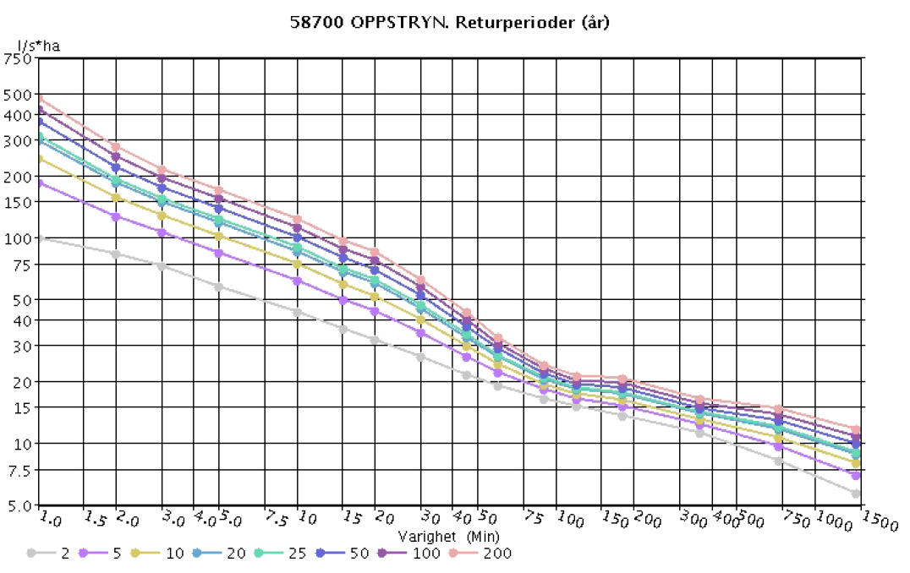

## Time of concentration
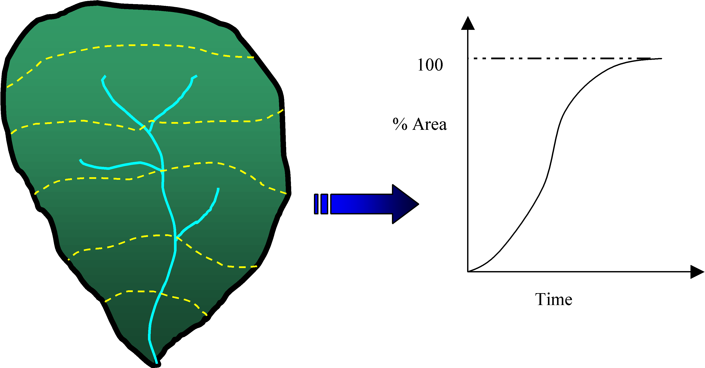

Time when 100% of the catchment area contributes to discharge at the outlet:

Also the longest time taken by surface runoff to reach the outlet

## Time of concentration

Concentration time $T$ for natural catchments (non urbanized)
$T=0.6*L*H^{-0.5}+3000*P_l$

For urban catchments:

$T=0.02*L^{1.15}*H^{-0.39}$

where $L$ is the length of the longest flow path in the catchment

$H$ the total height difference of the catchment

$P_{l}$ the percentage of lake area in the catchment

<!--
## Time of concentration

> - **For rain events of equal intensity, which parameter will affect peak discharge at the outlet of the basin?**
> - The duration of the rain event
> - **What is the minimum duration to leads to the highest discharge?**
> - The "lag time" or "concentration time" of the catchment

-->

## Time of concentration

Other possible methods:

- Hydraulic routing formulas for surface runoff through the catchment (open channel flow, sheet flow...)
- Hydrological modelling of the whole catchment
- Measuring the (hydrograph) response of the catchment to a typical rain event

## Example: proposed development

## Example: measuring active runoff surfaces
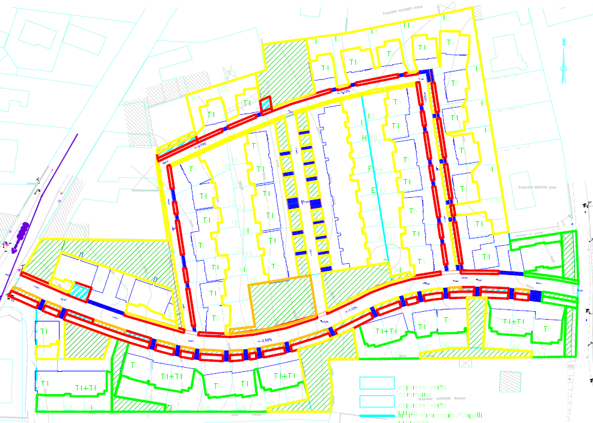

Does this level of precision make sense?

<!--
## Methode des pluies

-->

## Runoff curve number (only as an example)
Popular method in the USA:

\[Q = \begin{cases}0\ \ \text{for }P<I_{a}\\{\frac{(P-I_a)^2}{P-I_a+S}\ \ \text{for }P>I_a}\end{cases}\]

where $Q$ is runoff, $P$ is rainfall, $S$ is the potential maximum soil moisture retention after runoff begins, $I_a$ is the initial interception / depression storage

$S = \frac{1000}{CN}-10$ where $CN$ ranges from 30 to 100; lower numbers indicate low runoff potential while larger numbers are for increasing runoff potential. Numbers depend on antecedent moisture conditions

## Take home messages

- A variety of empirical formulas for the response of small catchments to precipitation
- Runoff coefficients are a conceptual simplification of infiltration / retention processes
- Time of concentration: longest time taken by rain on the catchment to reach the outlet
- Time of concentration decreases with increase urbanization / impermeabilization
- Follow your local guidelines, understand the limitations and maybe look for improvements
- Keep in mind the assumptions and how much precision really makes sense
- SW control at the source will always help downstream: slow it, spread it and sink it.
- Always keep in mind where the overflow will go

# Water harvesting example

## Overview of [Brad Lancaster's](https://www.youtube.com/watch?v=xdvmJ-AFlRA&list=PLsnOsjFNnFqacBToigfx0YeDee7Tlqeli&index=2&t=256s) water harvesting strategies: street SW

- Cut street curb to let SW infiltrate into a sunken mulch basin with native trees
- We can guess a drainage grate from the municipal network in the middle of the pedestrian footpath (dirtpath).

## Walking paths and lower roof

- Home paths discharging into a sunken mulch basin with citrus tree
- Raised planting bed doubles as seating area
- Salvaged playground ladder
- Roof turned into terrace strong enough for many people (30m2 incl. non-terraced part)
- Roof painted white to reflect summer heat, and non-toxic
- His roof doesn't have any edges to avoid water falling onto the sides. Maybe the roof is slightly concave

## Higher roof and storage tanks

- Water goes into 2*1000 gallons tanks (8000$L$ total, 2$m$ high x 2$m^2$ each)
- Water from higher roof (3$m$ high, 50$m^2$) is gathered into a wet system which discharges onto the lower gutter (2.5$m$), before the tanks
- Let's assume 100$mm$ downspouts
- Rain is filtered by a self-sleaning filter before going into the tanks
- The 2$mm$ screen is at an angle for self-cleaning

## First flush

- First flush goes into a 2$m$ high, 100$mm$ first flush pipe
- Screwcap end on this pipe conveniently located close to the entrance, so that he doesn't forget emptying it
- Grape vine to use the dirty (fertilized) water.
- Grape will grow over the trellis to shade and cool the tanks
- Not mentioned: we can see the pipe out of the bottom of his tanks with 2 valves
- Youtube comment: link a slow, drip irrigation setup to the first flush pipe so that you don't even need to empty it.

## Storage overflow and greywater

- Overflow pipe goes behind the fence and into a mulch bed with trees
- Not mentioned: there is a black pipe sticking out of the ground at the start of his overflow mulch / tree bed. I think it is his second overflow safety to the SW network
There was also one sticking out of his grape (very high though)
- Some greywater also discharges into this rather large infiltration bed
- Soil care: no sodium soap
- 4 options for the greywater. Every load sends its water to a different tree
- Daylights about the mulch so no roots can grow into the pipe.
- Meets the arizona greywater guidelines as the water goes below the mulch: nobody can come in direct contact with standing water

## Wet system drainage

- The wet system can be flushed into the citrus tree (T jonction + screw cap)
- The screw cap is also conviniently placed so that he doesn't forget about it
- Be careful with this system in cold climate
- I think he should be careful in his climate too as roots like to attack wet pipes

## Simen's comments: Pro

- If emptied prior to rain flooding events it can reduce the flow spike (very locally)
- Storage of contaminated water to fertilize plants
- Outlet Points in case of periods below freezing to prevent destruction by thaw freeze cycles

## Simen's comments: Con

- Pipe runs underneath plants unclear whether or not he has accounted for roots destroying the pipe in the wet system
- In the video things get stuck in his filter. this could contaminate the water in the tanks. If this happens emptying the tanks may prove challenging
- If neglected for an extended period of time (vacation) all pipes and tanks may be contaminated and in need of extensive cleaning for further use

<!--
## He is trying to avoid installing this downstream
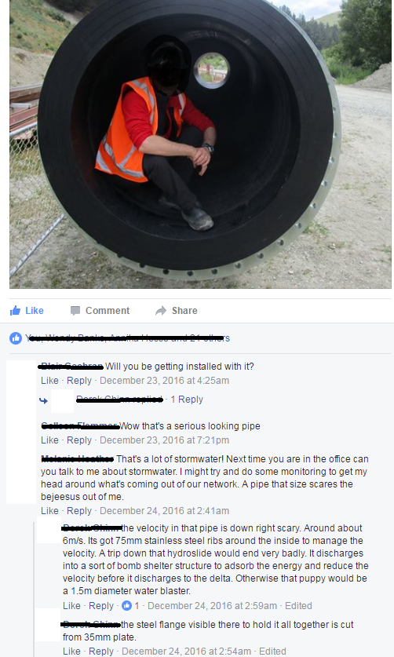

-->

# Exercises

## Street SW infiltration
> - Let's say his system handles 5m of road width with a 1m wide infiltration strip
> - So 5$m^2$ of road runoff + 1$m^2$ of infiltration strip needs to infiltrate in 1$m^2$
> - What is the required infiltration rate to avoid ponding during a 5min 10-year precipitation event (100$l/s$ per Ha)
> - By infiltration rate, I mean the vertical velocity at which water wil infiltrate into the soil (in $m/s$). You do not need to relate it to hydraulic conductivity (see [there](https://fbaffie.github.io/Runoff_management_course/01_Hydrology/2_hydrological_processes_2.html#green-ampt-infiltration-equation) for the link between infiltration rate and saturated hydraulic conductivity)

## Street SW infiltration
> - We use the rational formula for the road runoff
> - $Q = C*i*A = 0.9*i*A$ we use 0.9 as arunoff coefficient. You could also use 1 if you neglect the small retention and infiltration properties of the asphalt.
> - Unit conversion: 100l/Ha of precipitation intensity is $0.1m3/s$ for $10000m^2$ (1 Ha is $100*100m$)
> - So for $5m^2$ of road $Q = C*i*A = 0.9*0.5/10000 = 4.5*10^{-5} m3/s$
> - In addition, $Q = i*A = 0.1*1/10000 = 1*10^{-5} m3/s$ of rain fall onto the infiltrationa area
> - So in total, for an infiltration area of 1m2, we required an infiltration rate of $4.5*10^{-5}+1*10^{-5} = 5.5*10^{-5} m/s$ 

## Amount of precipitation to fill up the tank
> - We assume $80m^2$ of total roof area. The total storage volume is 8000 liters
> - How much precipitation is required to fill up the tanks?

## Amount of precipitation to fill up the tank
> - 1mm of rain is the equivalent of 1$l/m^2$. So 1$mm$ of rain gives him 80$l$ = 0.08$m^3$
> - So his tanks will need 8000/80 = 100$mm$ of rain to fill up
> - Which precipitation event does it correspond to in the Oppstryn IVF?
> - A 200-year 24h long precipitation event
> - Considering that it rains approx 300mm/year in Tucson, he can store a lot of the year's precipitation 

<!--
## Time to fill up the tank
Take a 1h, 10-year precipitation event.
How long will it take to fill the tanks
How much water will overflow into the infiltration bed?
Which infiltration rate is required to avoid ponding water
-->

## Infiltration rate required if the tank overflows
> - Assume that his tanks are already full when a 5min 10-year precipitation event happens (100$l/s$ per Ha)
> - Assume that his infiltration mulch bed is 20m2 in area
> - Which infiltration rate is required to avoid ponding in the infiltration area?

## Infiltration rate required if the tank overflows
> - If we take a runoff coefficient of 1 for the roofs, the total area contributing precipitation to the infiltration bed is 80m2 of roof + 20m2 of infiltration bed.
> - So a precipitation intensity of 0.1m3/s for 10000m2 (100l/s per Ha) makes $0.1*100/10000 = 10^{-3} m^3/s$  of inflow into the infiltration area
> - A 20m2 infiltration area will therefore require an infiltration rate of $10^{-3}/20 = 5*10^{-5} m/s$ 
> - This is consistent with our estimate of the infiltration capacity required for the road-side strip. His setup seems to be coherently sized.

## Storage volume in mulch bed
> - Assume that the infiltration area has the previously calculated infiltration capacity: $5*10^{-5}$ m/s
> - How much ponding storage (height of the paddle in the mulch bed) is needed to handle a 3min 100-year precipitation event (200l/s per Ha)

## Storage volume in mulch bed
> - Intensity has doubled, so inflow has doubled: $2*10^{-3}$ m3/s of inflow into the infiltration area
> - Based on the previous exercise, the extra flow (above $10^{-3} m^3/s$) is what the infiltration rate cannot handle: $2*10^{-3}-10^{-3} = 10^{-3} m^3/s$
> - So during 3 min, the accumulated volume that could not infiltrate is: $3*60*10^{-3}= 180*10^{-3}=0.180 m^{3}$ 
> - Spread over 20$m^2$, this makes a ponding height of: $0.180/20 = 0.009m = 9mm$

## How much flow can the tank inlet convey before the filter overflows
> - This exercise assumes that the filter has more capacity than the 10cm (diameter) pipe below and acts as a small reservoir
> - The first flush pipe is already full
> - There is a 20$cm$ height difference between the storage inflow pipe and the top of the filter cone / expansion
> - Calculate the maximum flow into the reservoir before the water overflows from the filter's cone / expansion

## How much flow can the tank inlet convey before the filter overflows

> - **Important assumptions to discuss**:
> - It is easier if you assume that the tank is empty. This way you can apply Bernouilli's equation without having to worry about extra water pressure from the tank as water flows into it (atmospheric pressure only)
> - This example also includes a big approximation by assuming that the velocity of water at the top of the filter cone is nul. This makes for an easy application of Bernouilli's Law but generates an underestimation of the water velocity at the tank inlet.

## How much flow can the tank inlet convey before the filter overflows
> - [There](./1_fluid_dynamics.html#exercise-flow-out-of-a-reservoir), we calculated the flow out of a reservoir in very similar conditions. In this case, the reservoir is the overflowing filter cone.
> - This gives us a velocity of $v= (2gd)^{1/2} = 2m/s$ for water falling into the storage tanks. We need to multiply it by the cross-sectional area of the pipe to get the flow rate:
> - Assuming a 10cm wide pipe: $Q=2*0.05^2 \pi = 0.0157 m^3/s$
> - With a capacity of $15.7*10^{-3} m^3/s$, the inlet to the reservoir has almost 16 times the capacity required to handle a 3min 100-year precipitation event 
> - We neglected head loss but with such as margin, this is not an issue

## Time to empty the tank through a 10mm pipe
> - Imagine the water level of the full tank is 2m higher than the r=10mm irrigation hose. The cross-sectional area of the tank is $A = 2m^2$
> - How long would it take to empty the water tank through this hose?

## Time to empty the tank through a 10mm pipe
> - As we saw in the previous example, the velocity out of the irrigation hose: $v(t)= (2gh(t))^{1/2}$
> - Applying the conservation of mass per increment of time dt:
> - Flow out of the irrigation hose = A*dh/dt = the area of the tank x small drop in water level (dh) per increment of time (dt)
> - $(2gh(t))^{1/2} * r^2* \pi = A*dh/dt$
> - The trick now is to separate $dh$ and $dt$, to have only $h(t)$ and $dh$ on one side

## Time to empty the tank through a 10mm pipe
> - $dt= C*h(t)^{-1/2}*dh$ with $C=A/(r^2* \pi * (2g)^{1/2})$
> - This way, we can easily integrate both sides of the equation between $t_{end} \ and \ t_0$
> - $t_{end}-t_0 = 2*C*(h_{top}^{1/2}-h_{bottom}^{1/2})$
> - $h_{bottom}$ is our reference elevation so it is nul. This yields:
> - $t_{end}= 2*C*h_{top}^{1/2} = 2*2/(1.4*10^{-3})*2^{1/2} = 4028 s$
> - So 1.12 hours required to empty the reservoir 
> - You could do the same to see how long it would take the first flush system to empty through a small hose as discussed earlier to avoid frost issues.

## Flow out of a water filter
> - Imagine a water filter with charcoal (5cm length of porous media) that has a hydraulic conductivity of $10^{-4}$ m/s. Which cross sectional area should the filter have to fill up 1 L in 5 seconds when the tank is full?
> - We have 2$m$ of head difference to push water through the 5$cm$ filter.

## Flow out of a water filter
> - We apply Darcy's Law in a very similar way to his [experiment](../01_Hydrology/2_hydrological_processes_2.html#darcys-experiment)
> - Flow per unit area = hydraulic conductivity * hydraulic gradient. With 2m of head in the tank, and 0.05m of porous material, the hydraulic gradient is 2/0.05 and:
> - $q=2/0.05*K = 2/0.05*10^{-4} = 0.004 m^3/s/m^2$
> - We need $Q = 1/5 = 0.2 l/s = 0.2*10^{-3} m^3/s$
> - We use the relationship $Q= q*A$ to calculate the required cross-sectional area
> - $A= Q/q = 0.2*10^{-3}/0.004 = 0.05m^2 = 500cm^2$
> - This is unrealistic so this filter idea could only be considered for example with 1cm thickness of porous media with a hydraulic conductivity of $K=10^{-3}$ m/s
> - In this case, the cross section becomes reasonable: $A = 10cm^2$

# Further resources

## Norway: NVE / Vegvesen

[Sammenligning av metoder for flomberegninger i små uregulerte felt](http://publikasjoner.nve.no/rapport/2015/rapport2015_86.pdf)

[Veileder for flomberegninger i små uregulerte felt](http://publikasjoner.nve.no/veileder/2015/veileder2015_07.pdf)

[NVE: Veileder for flomberegninger i små uregulerte felt](http://publikasjoner.nve.no/veileder/2015/veileder2015_07.pdf)

[Vegvesen Håndbok N200 - Vegbygging](http://www.vegvesen.no/_attachment/188382/binary/980128?fast_title=H%C3%A5ndbok+N200+Vegbygging+%2821+MB%29.pdf)

<!--
[Flaumfare langs bekker](http://publikasjoner.nve.no/veileder/2015/veileder2015_03.pdf)

many other methods [there](http://echo2.epfl.ch/VICAIRE/mod_1b/chapt_10/main.htm)
-->

## USDA National engineering handbooks

[Hydrology hanbook](https://www.nrcs.usda.gov/wps/portal/nrcs/detailfull/national/water/manage/hydrology/?cid=stelprdb1043063)

[Engineering Field Handbook (surveying, estimating runoff, hydraulics, grassed waterways, ponds...)](https://directives.sc.egov.usda.gov/viewerFS.aspx?hid=21429)

[Technical Release 55 (TR-55)](https://www.nrcs.usda.gov/Internet/FSE_DOCUMENTS/stelprdb1044171.pdf): "Presents simplified procedures to calculate storm runoff volume, peak rate of discharge, hydrographs, and storage volumes required for floodwater reservoirs. These procedures are applicable in small watersheds, especially urbanizing watersheds, in the United States"

## Some guidelines (municipal / states)

Minnesota:

[Minnesota SW manual](https://stormwater.pca.state.mn.us/index.php?title=Main_Page)

[Cold climate impact on runoff management](https://stormwater.pca.state.mn.us/index.php/Cold_climate_impact_on_runoff_management)

Santa Clara:

[Urban Runoff - Pollution prevention program](http://www.scvurppp-w2k.com/)

[Santa Clara - Stormwater handbook](http://www.scvurppp-w2k.com/c3_handbook.shtml)

Puget Sound Low Impact Development:
[Technical guidance for Puget Sound](http://www.psp.wa.gov/downloads/LID/LID_manual2005.pdf)

## Hydrology and Hydraulics in Civil 3D

https://www.youtube.com/watch?v=xzgONT9ekpE&list=WL&index=180

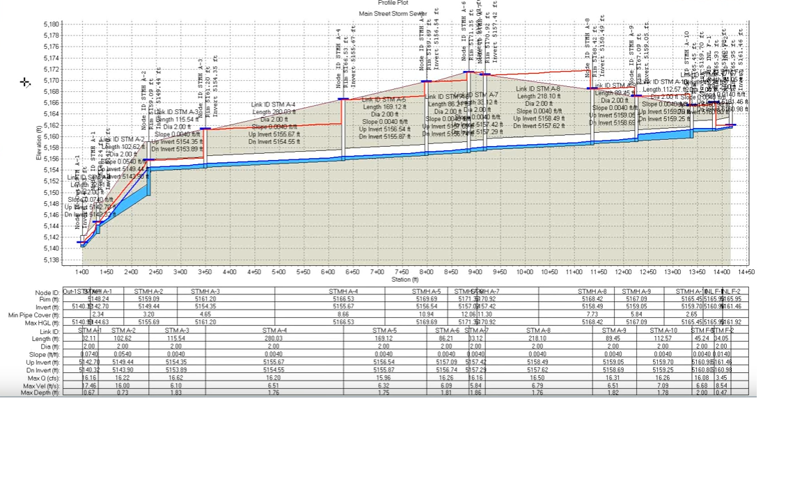

<!--
## Oil separator
> - **Let's try to desing one!**
> - 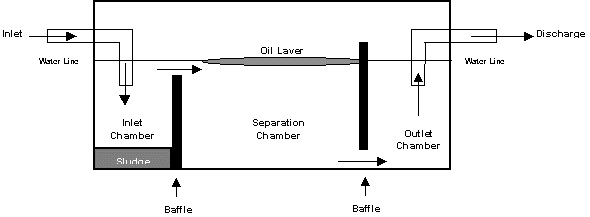

## Oil grit separator
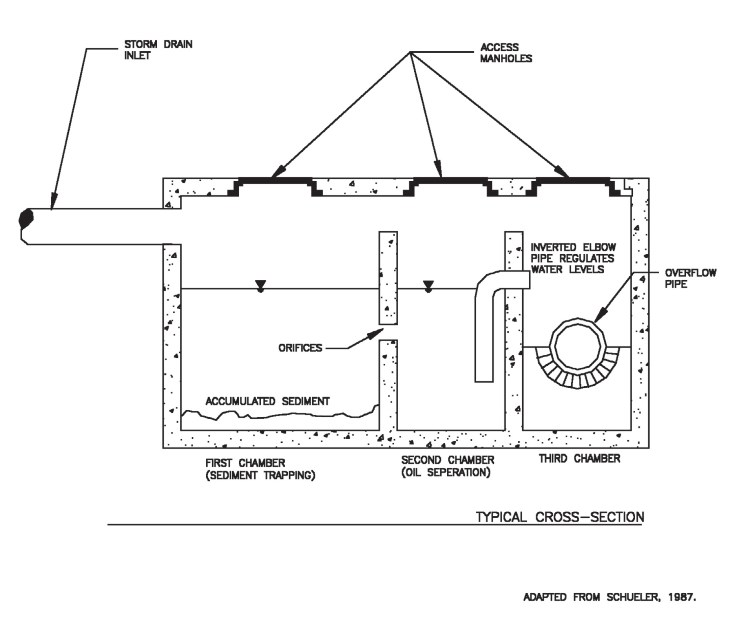

## Flow regulator
> - **Let's try to design one!**
> - 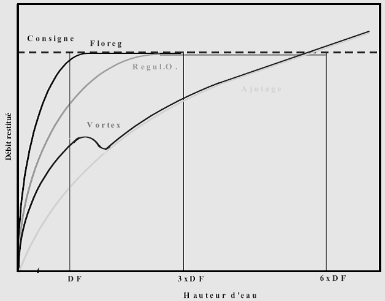

## Vancia: 2 underground storages

## Vancia: surface reservoir
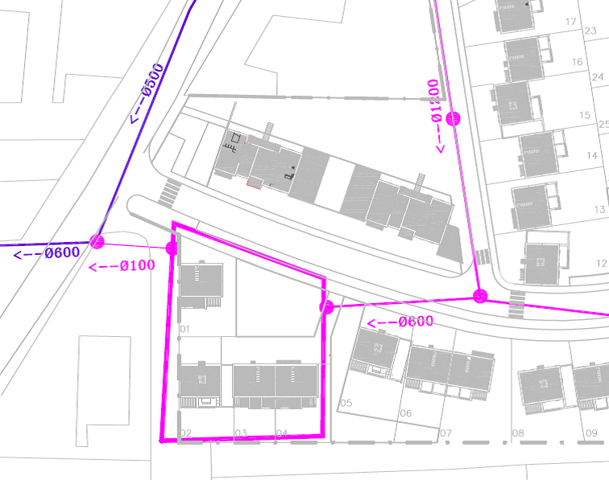

## Flow regulators

## Kalbskopf factors (width pb)
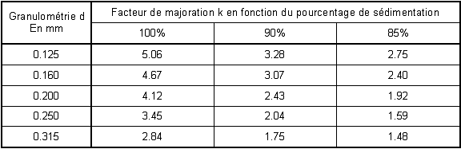

## Vancia: Decantation and infiltration model

## Vancia: Decantation and infiltration bassins
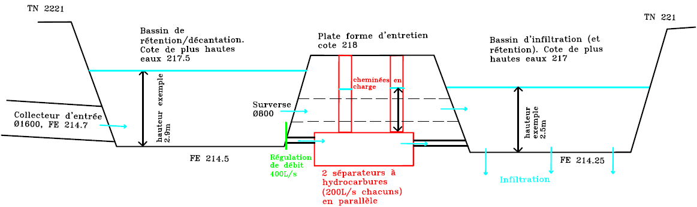
-->