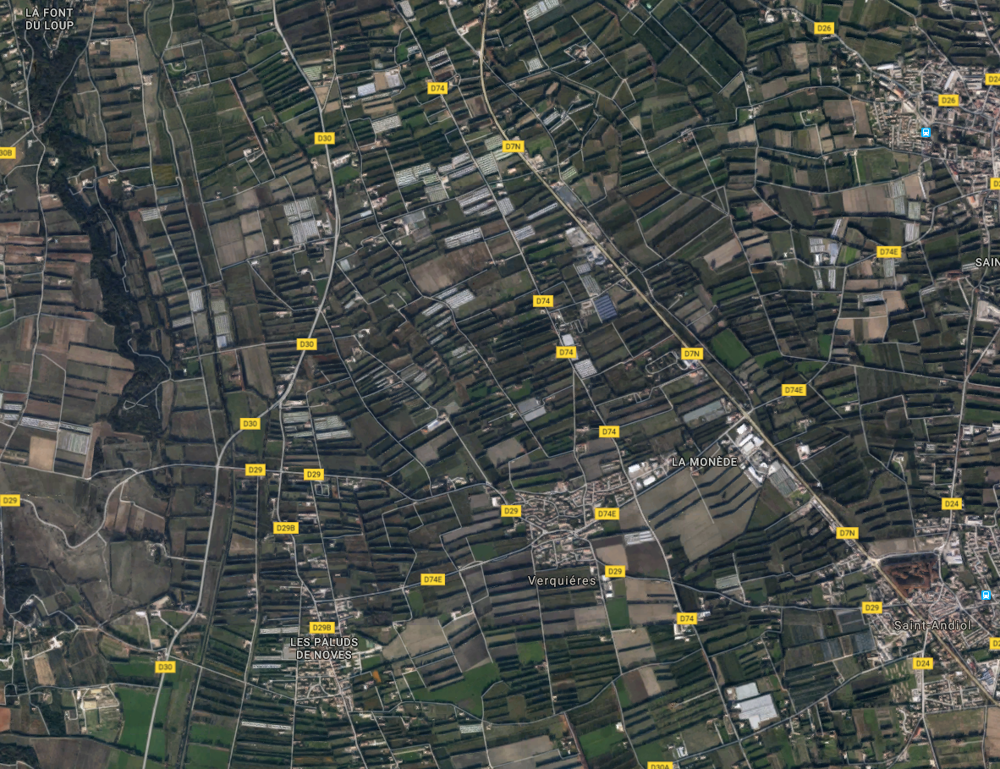
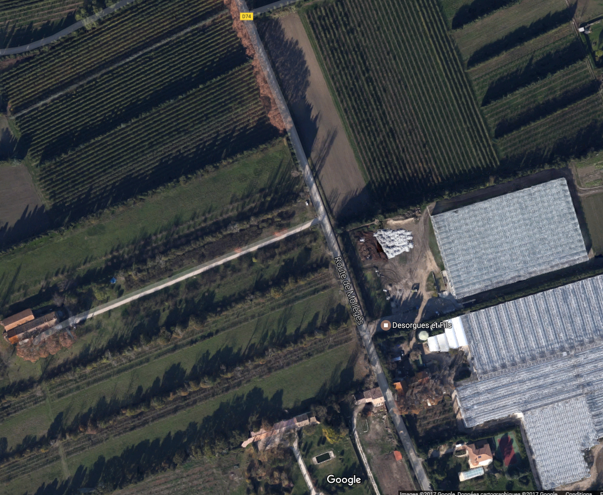
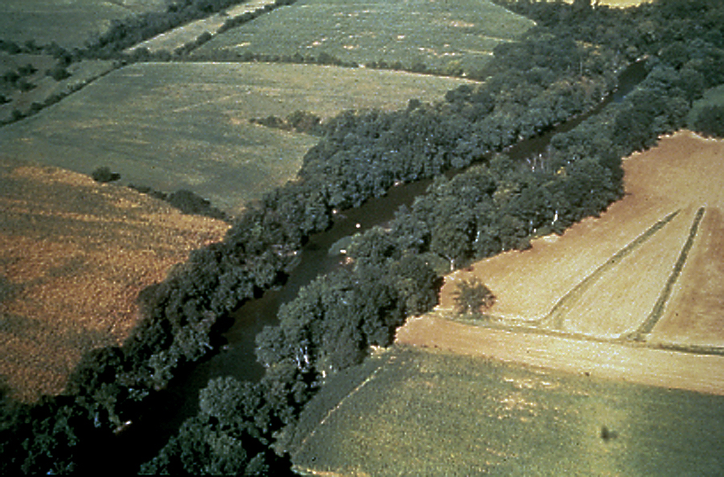
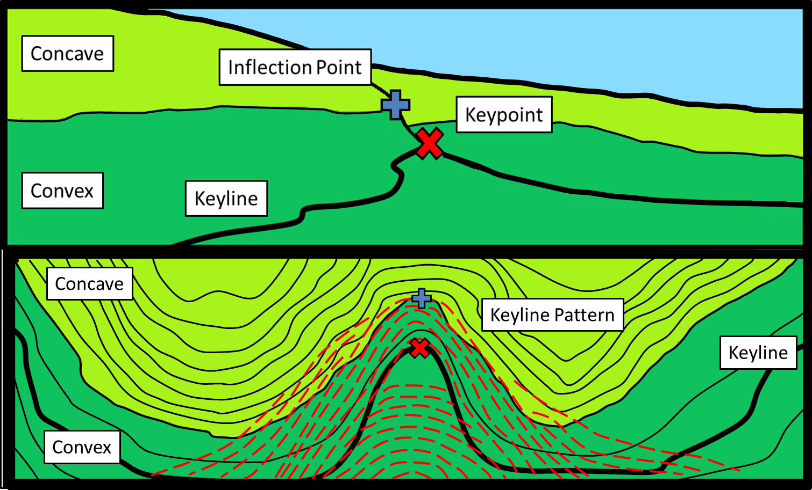
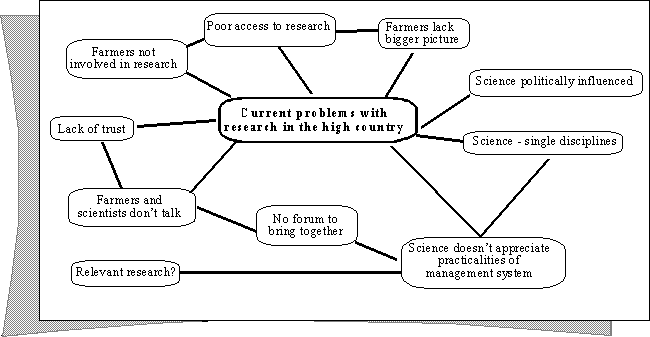

## Plan

[Agriculture and erosion](./4_land_use.html#agriculture-and-erosion)

[Land use alternatives](./4_land_use.html#land-use-alternatives)

[Working examples](./4_land_use.html#working-examples)

[Further resources](./4_land_use.html#further-resources)

<!--
## Deborahs comment
Butterflies and other animals used to pasture can be in trouble if a landscape of reforested. During the succession toward forest climax, the scrubs such as braken fern cover the land extensively and destroy specific pasture habitats.
-->

# Agriculture and soil erosion

## Erosion rates: calculate mm/ha/yr
Location | Land use | Soil loss (t/ha/yr)
--- | --- | --- | --- 
Philippines | Reforested and agricultural | 22-39.7 
Morocco | Arid, grazing | 25.0-59.0 
Kenya |Semi-arid grazing | 79.5 
Bolivia | Andean arid, semi-arid | 5.21-51.8
United Kingdom | Agriculture | 1.9 (net)
Lesotho |Agriculture | 7.8 (net)

## Erosion and land use change (FAO report: Walling and Webb, 1983; Ostry, 1982)

Location | Land use change | Increase in sediment yield
--- | --- | ---
Rajasthan, India | Overgrazing | × 4-18
Utah, USA | Overgrazing of rangeland | × 10-100
Oklahoma, USA | Overgrazing and cultivation | × 50-100
Texas, USA | Forest clearance and cultivation | × 340
N. California, USA | Conversion of steep forest to grassland |× 5-25
Mississippi, USA | Forest clearance and cultivation | × 10-100
S, Brazil | Forest clearance and cultivation | × 4500
Westland, N. Zealand | Clearfelling | × 8
Oregon, USA | Clearfelling forest | × 39

## Soil carbon

> - **What is the typical carbon content of agricultural soils in Europe?**
> - 1-2%

> - **what is typical carbon content of forest soils?**
> - 10% (up to 30% in wetlands in Scandinavia)

> - **What about peat?**
> - more than 30%

## Soil carbon

> - **At the carbon capture conference, a forestry expert showed that the north side of a grass roof had accumulated soil over it's lifetime but no on the south side: why?**
> - The organic matter in the soil decomposes quicker when exposed to sunlight and higher temperatures. 
> - The annual rate of biomass production <= rate of decomposition

## Soil carbon

Some research on this:

- Climate change effects on organic matter decomposition rates in ecosystems from the Maritime Antarctic and Falkland Islands
http://onlinelibrary.wiley.com/doi/10.1111/j.1365-2486.2007.01468.x/abstract
- Sunlight drives decay
http://www.nature.com/nature/journal/v442/n7102/edsumm/e060803-11.html

Case study of soil degradation in Norway:
http://www.recare-hub.eu/case-studies/vansjo-hobol-catchment-norway
Other interesting european case studies on this website

## Soil carbon

> - **Factors responsible for decline in SOM?**
> 1. Conversion of grassland, forests and
natural vegetation to arable land;
> 2. Deep ploughing of arable soils causing
rapid mineralization of labile
components of OM;
> 3. Overgrazing, with high stocking rates;
> 4. Soil erosion, by water and wind;
> 5. Leaching;
> 6. Forest fires.

[Map of soil organic carbon in topsoil in Europe - JRC report](http://eusoils.jrc.ec.europa.eu/ESDB_Archive/eusoils_docs/other/OCtopMapBkLet76.pdf)

## Wind erosion

> - **What is commonly called the "Dust Bowl"?**
> - Period of severe dust storms in the American mid-west during the 30s.
> - 

## Wind erosion
> - **What were the causes?**
> - Strong winds blowing on dry degraded soils.
> - Farmers had been deeply plowing the virgin topsoil of the Great Plains, destroying deep-rooted native grasses
> - **How was it remediated?**
> - Anti-erosion techniques: crop rotation, strip farming, contour plowing, terracing...
> - [New Deal: Great plains shelterbelt](https://en.wikipedia.org/wiki/Great_Plains_Shelterbelt): 200 million trees planted to...
> - break the wind
> - improve water infiltration
> - trap soil that may erode

## Wind erosion

## Wind breaks

## Wind breaks

> - Protection from which winds?
> - Cold northern winds channeling down the Rhone valley

# Land use alternatives

<!--
## Different land uses in the region
> - Pasture
> - Orchards
> - Wetlands
> - Forests
> - Alpine rocky areas
> - Glaciers
> - Built areas
> - Roads
-->

## Impact of land use in riparian areas on water quality?
> - Rapid mobilization of pollutants
> - Importance of stream / groundwater interactions

## Riparian buffers

## Erosion control measures

- Silt fences
- Cover and green manure crops
- Contour farming and strip cropping
- Planting in critical areas (i.e. ripiarian areas)
- Reduced or no tillage
- Perennial field borders and filter strips
- Strip cropping
- Terracing

<!--
The island of La gomera is a good example of degrading terraces. Try to get some historical aerial photos.
Madera on the other hand is a good example of well-maintained traditional water canals
-->

## Natural water retention measures

[European website](http://nwrm.eu/measures-catalogue) documenting an exhaustive list of natural water retention and erosion control techniques.

An [illustrated guide](http://nwrm.eu/sites/default/files/documents-docs/53-nwrm-illustrated.pdf) lists them all.

All techniques are also covered in detail, for example [strip cropping along contours](http://nwrm.eu/sites/default/files/nwrm_ressources/a4_-_strip_cropping_along_contours.pdf)

<!--
## Impact of land use in a river delta on flooding?
> - Forested areas will slow the flow
> - This can lead to higher water levels
> - Those areas could be more dynamic as more sediment is blocked

## How can land use on mountain tops and steep slopes have an impact on flooding?
> If the slopes are bare, the concentration time will be very low

## List some techniques that have traditionally been used to deal with temporally and geographically heterogeneous water resources.
> - Irrigation canals
> - Reservoirs
> - Terracing
> - Nomadism! Including pastoralism in southern Europe
-->

## [Chinampas](http://www.chinampas.info)
<!--
http://www.chinampas.info/virtualfieldtrips/chinampazoneofxochi/9.htm
-->

Small sections of different crops each at a different stage of maturity
Wooden supports for suspending tarps to protect young plants. 
The water level in this photo is considered by many farmers to be ideal.
Duckweed and water hyacinth on the surface of the canal"

## Chinampas
> - **What's interesting about them?**
> - Sub-irrigation
> - Aquaponics: fish litter can be harvested
> - Agroforestry: helps stabilitzing the banks

## Low-impact solutions to homogeneize soil moisture at the farm-scale?
> - Plant water loving trees in saturated areas
> - Keyline design

## Keyline

P.A. Yeomans - The Keyline plan:
"A Keyline is a level or sloping line extended in both directions from a certain point in a valley, called the "keypoint".
This marks or divides the two types of relationship, always in the same vertical interval, that a valley bears to its adjacent ridges. In one of these relationships, that above the Keyline, the valley will be narrower and steeper generally than the adjacent ridges on either side of it. In the second relationship, existing below the Keyline, the valley will be wider and flatter than its immediately adjacent ridges, or shoulders."

## Interesting idea, but this description is unclear!

## Keyline design

## Keyline subsoiling

- Homogeneizing soil moisture in hilly landscape

<!--
> - **What impact can excess groundwater pumping have on civil infrastructure?**
> -

> - **Sinking of cities due to groundwater puming: bangkok, mexico city (find pictures)**
> -
-->

## [Holistic management](https://holisticmanagement.org/)

Intensive rotational grazing with an adaptative plan: 
- animals are forced to eat stuff they like less
- controls unwanted plants
- can improve soil infiltration properties
- can improve root depth by stressing the grass more but less often
- can thus help sequester more carbon

## [Pasture cropping](http://www.pasturecropping.com/articles)

Planting winter cereals directly in a pasture

Case study in [Australia](http://www.pasturecropping.com/images/PDF/Winona%20Case%20Study.pdf)

# Working examples

## Permaculture

Many of the examples that follow are inspired by the Permaculture movement: 

"Permaculture is a philosophy of working with, rather than against nature; of protracted and thoughtful observation rather than protracted and thoughtless labor; and of looking at plants and animals in all their functions, rather than treating any area as a single product system." (Bill Mollison)

## [Ridgedale permaculture](http://www.ridgedalepermaculture.com/)

- Approx 10 Ha
- 59N, Sunne, Sweden

Richard Perkins: one permaculture farm where swales are banned

<iframe width="560" height="315" src="https://www.youtube.com/embed/Ro2J4IIJyxY" frameborder="0" allowfullscreen></iframe>

[Irrigation on the farm](https://www.youtube.com/watch?v=S3eXR6_MxNQ)

## [Polyface farm](http://www.polyfacefarms.com/)

- Virginia, USA

Polyface farm: very innovative, both technically and socially
[Scratching the Surface: Soil biology in agriculture, March 2017 - Joel Salatin](https://www.youtube.com/watch?v=lXHrkPC5bok)

## [Krameterhof](http://www.krameterhof.at/cms60/index.php?id=151)

- Sepp Holzer
- 45 Ha, between 1100 and 1500m
- Salzburg region, Austria

## Other examples 

Homesteader in Vermont: [Ben Falk - Whole Systems Design](http://www.wholesystemsdesign.com/what-we-do/)

Interesting orchard concept in Quebec, Canada: [Miracle orchard](https://miracle.farm/en/)

Grant Schulz - Versaland: Iowa, USA: [Water farming upstream - Silvopasture on keyline](http://ppc.uiowa.edu/sites/default/files/schultz_solutions_for_water_quality.pdf)

# Further resources

## Books

Some of those alternative land uses are listed in this book on solutions against climate change:
http://www.drawdown.org/solutions

## Always read the critics!

Critique of permaculture: [skepteco.wordpress - Bill Mollison](https://skepteco.wordpress.com/2016/09/29/r-i-p-bill-mollison-father-of-permaculture/), [The cult of perma](https://skepteco.wordpress.com/2013/10/12/the-cult-of-perma/)

Not opponent, but smart blog overall on the [future of small-scale farming](http://smallfarmfuture.org.uk/)

Interesting debate on a TED talk from [Willie Smits](https://www.ted.com/about/programs-initiatives/ted-talks/willie-smits-ted-talk-challenged)

[The carbon farming solution](http://carbonfarmingsolution.com/resources)

## On vegetated buffer and mixed cropping

from http://www.resilience.org/stories/2017-01-31/multifunctional-agriculture-a-new-paradigm-of-mixed-cropping/
"The ability of some perennial forage and bioenergy crops to tolerate wet conditions makes it feasible to design harvestable saturated buffers or seasonal wetlands in which nitrate that would otherwise reach surface waters, fertilizes a biomass crop lower on the landscape."

<!--
## Monbiot
[Chris Smaje on Monbiots "How did we get into this mess?"](http://www.resilience.org/stories/2017-03-01/songs-of-the-uplands/). He focuses on food issues but general land use policies have an impact on food production so it does make sense

"In my review of George’s book How Did We Get Into This Mess I made the point that there’s a tension in it between the perspective of the indigene trying to figure out how to make a living from the land, and that of the rational-bureaucratic planner trying to figure out how to deliver services to the existing population."

http://www.monbiot.com/2015/12/08/a-storm-of-ignorance/

Monbiot
http://www.filmsforaction.org/articles/drowning-in-money/#.VoLlVEknpu8.facebook
[The impact of rural land management changes on soil hydraulic properties and runoff processes](http://onlinelibrary.wiley.com/doi/10.1002/hyp.9826/abstract)

This more modelling oriented paper could also be interesting:
Effects of climate and land-use change on storm runoffgeneration: present knowledge and modelling capabilities
http://onlinelibrary.wiley.com/doi/10.1002/hyp.326/epdf
-->

## Europe

An interesting report linking land management issues to flooding, and how experimental and modelling studies can help: [impact of upland land management on flood risk](http://nora.nerc.ac.uk/5890/1/ur16_impacts_upland_land_management_wp2_2_v1_0.pdf)

[Linking hydrological modelling, catchment management and land use](http://nora.nerc.ac.uk/5890/1/ur16_impacts_upland_land_management_wp2_2_v1_0.pdf)

Conclusions are interesting to show results of hydrological modelling that can be use for policy-making: "Both experimental and modelling studies from this site illustrate the potential significance of
small-scale land management changes for reducing hillslope runoff peaks: this poses a challenge
to scientists, land managers and policy makers. How can we best establish and optimise strategies for
mitigation of flood peaks, given other landscape objectives such as economically viable farming,
ecological needs, legislative requirements and leisure utilisation? "

<!--
[The potential for reducing flood risk through changes to rural land management: outcomes from the Flood Risk Management Research Consortium](./pdf/The potential for reducing flood risk through changes to rural land use.pdf)
-->

## Food and agriculture

Linked to the intensification and re-wilding debate:

[Soil conservation in the 21st century: why we need smart agricultural intensification](http://www.soil-journal.net/3/45/2017/soil-3-45-2017.pdf)

Old FAO book, that can still be an interesting read:

[Dimensions of need - An atlas of food and agriculture](http://www.fao.org/docrep/u8480e/U8480E01.htm#Contents)

<!--
“David Holmgren On The Social And Political Underpinnings Of Permaculture” we see the solution-oriented focus of Permaculture clearly stated by David:
from:
http://permaculturenews.org/2017/01/31/permaculture-politics-solutions-thinking/?inf_contact_key=c3590e3edfefea4993b57ac812e2045f7a40644f0ac389a6e428765f48a8bdfc

“David Holmgren On The Social And Political Underpinnings Of Permaculture” we see the solution-oriented focus of Permaculture clearly stated by David:

“I think that to some extent both for me and Bill Mollison, when we met we were at a point, for slightly different reasons, we’d both come to the conclusion that we didn’t want to fight against the world we didn’t want, but wanted to just actively create the world we do want.”

In the article, David mentions the influences of anarchist thinkers such as Peter Kropotkin and his work “Mutual Aid [a Factor of Evolution] and Solidarity”, as well as Murray Bookchin and his work in the area of Social Ecology.
-->

# Annoted video resources

## [Tony Rinaudo: Against the odds - Reversing desertification in arid and semi arid lands](https://www.youtube.com/watch?v=Dm_qlyvdZ_A)

- 17: Profesionals have tried to fix desertification with great funds and you can tell me you can fix it with a pocket knife...
- 22: Freedom of people to experiment
- 23:30 Shading effect, decreased wind speeds, increased organic matter
- 24:30 if I leave those trees, will I get food. hard to get past. importance of early adopters
- 36:30 it is people's project: farmers talk to farmer
- 37: every community has champion (for a cause)
- 38: plant the rain and the plants will plant themselves

## Tony Rinaudo: Against the odds - Reversing desertification in arid and semi arid lands
- 44: awareness: need for a few guidelines
- 45: the forest will come back on it's own if we stop burning it
give the people the freedom, the user rights.

## [Dr Sampurno Bruijnzeel - Breakthroughs in Tropical landuse change impacts](https://www.youtube.com/watch?v=p0jwQm-GP7I)
- Main topics: Erosion, sedimentation, nutrient cycling
- 02: Hydrological impact of deforestation in the tropics...
- 03: flooding potential in holland 
- 04: forest imapcts: traditional vs scientific views
- 05: ref to "forest and floods: drowning or thriving on facts"
- 06: distinction old growth, new growth... not all forest are equal. importance of soil degradation
quote fromSherlock holmes "it is a capital mistake to theorize before one has data. Insensibly, one is led to twist the facts to suit one's theories, instead of the theories to suit the facts"

## Dr Sampurno Bruijnzeel - Breakthroughs in Tropical landuse change impacts
- 08: contrasting infiltration patterns
- 09: clear signs of big floods with forest
- 10: forest vs non forest: no difference with huge rain events.
- 13: soil in forest whereas no soil in the open
- 15: degraded grassland vs forest exmaple: % of new water is higher.
- 18: increase in peakflows after urbanisation, also in large river basins
- 20: soil degradation map of the world
- 21: forest and total water yield. forest use more water. less forest, more streamflow per year

## Dr Sampurno Bruijnzeel - Breakthroughs in Tropical landuse change impacts
- 23: post forest land use may vary widely
- 24: tropical montane cloud forest. capture of fog by the trees. they do produce extra streamflow.
- 26: forest and baseflow. 
post forest soil degradation: rule or exception (argue that it is rather the rule)
In some case, streamflow is higher in non-forest throughout the whole year, but in some other cases with soil degradation the streamflow is higher during the dry season with forest.
In definitely smooth the yearly hydrograph
- 29: hydrological change due to land degradation. increase during the wet season adn decrease during the dry season

## Dr Sampurno Bruijnzeel - Breakthroughs in Tropical landuse change impacts
- 30: water shortage in india due to lost infiltration opportunities
boosting baseflow: a key question
- 31: conceptual summary of forest hydrology
- 32: forest coming back in south america, mediteraen. regenerating forest use a lot more water than old growth forest (quite an unresearched topic yet)
- 34: 2 key processes: ET and infiltration. 2 cases: high/ high with forest. low / low without.
Rebuilding of infiltration capacity: poorly documented
- 38: > 2billion ha degraded land in the world: where might we expect improved flows
- 40: net effect of reforestation,

## Dr Sampurno Bruijnzeel - Breakthroughs in Tropical landuse change impacts
- 41: recent experiments. south korea. streamflow is now perennial.
- 43: same thing in south china. improved flows. loess plateau?
formerly ephemeral stream became perennial in philipines.
- 57: mixed species improve the soil faster, especially importance of nitrogen fixers. you do lose water more quickly though linked to higher productivity

## Ben Falk selected principles

Homestead and Farm Resiliency: Adaptive Land and Infrastructure Systems for a Changing World
https://www.youtube.com/watch?v=xRXtQUVNzqs

Biological complexity, technological simplicity
Transfrom dead matter into living matter
Maximum outputs for minimum inputs
Resilience: diversity x redundancy x connectivity x manageability
System establishment distinguished from system maintenance

Vermont: "non britle" climate

## Increasing the roughness value of the flood plain

Flooding and Drought: Designing Agroforestry Systems to Create Ecosystem Resilience
https://www.youtube.com/watch?v=k7PO3SHeIPE&index=223&list=WL

with a riparian buffer before it hits productive land
Perennial wild rices in flood plains
Conventional pasture vs silvopasture
With silvopasture: earlier start in spring, then lower than conventional mid summer, then continues later in fall

advantage of root depth differences

## Introduction to Agroforestry Systems
https://www.youtube.com/watch?v=nuplHZRijqg

## Soil aggregation and water infiltration

<iframe width="800" height="450" src="https://www.youtube.com/embed/d1M7EFqqsMM" frameborder="0" allowfullscreen></iframe>

<!--
## Forests and water quality
The concept of nature for water takes into account the role of terrestrial ecosystems in enhancing water yields and water quality. For instance, the Lange Erlen forested area in Switzerland is flooded a dozen days a month with water from the Rhine to allow forest soil to filter the water to improve its quality and recharge the groundwater of the nearby city of Basel. "

## Forests and water quantity
- Water use by forests depends on climate, forest and soil type...
- Forest typically have: high ET, lower surface runoff and groundwater recharge
- forests reduce dry-season flows as much as or more than they reduce annual water yields. 
- in degraded agricultural catchments the extra infiltration associated with afforested land might outweigh the extra evaporation loss from forests, resulting in increased rather than reduced dry-season flows – but this has rarely been seen.

cloud forests are likely to increase water, some old natural forests may also increase flow, and young forests and plantations are likely to decrease flow. Individual cases need to be assessed, depending on soil, climate, forest types and age, and management regime.

## Forests and flooding
- Reduction of downstream flooding by floodplain forest, where hydraulic roughness (the combination of all elements that may cause flow resistance, such as forest litter, dead wood, twigs and tree trunks) may slow down flood flows.
- Natural forests and well-managed plantations can protect drinking-water supplies. 
- Managed forests usually have low input of nutrients, pesticides and other chemicals
- Forests planted in agricultural and urban areas can reduce pollutants, especially when located on runoff pathways or in riparian zones

## Forests and erosion
- Forests protect soils and reduce erosion rates and sediment delivery to rivers.
- Forestry operations may increase sediment losses, but best management practices can control this risk. 
- Planting forest on erosion-prone soils and runoff pathways can reduce and intercept sediment.

## Forests and climate change
- Global climate models predict marked changes in seasonal snowfall, rainfall and evaporation in many parts of the world. 
- In the context of these changes the influence of forests on water quantity and quality may be negative or positive. 
- Where large-scale forest planting is contemplated for climate change mitigation, it is essential to ensure that it will not accentuate water shortages. 
- Shade provided by riparian forests may help reduce thermal stress to aquatic life as climate warming intensifies.

## Forests and energy
Fast-growing forest crops have potential for high water demand which can lead to reduced water yields. The local trade-off between energy generation opportunities and water impacts may be a key issue in regions where climate change threatens water resources.

## Example participatory mind maps about complex systems research

## wished mindmap

## Importance of those processes for water resources
- Forestation has been substantial in Norway since XXX. It may increase in the future with climate change.
- Impact on the quantity and quality of surface waters and groundwater.
- In all climates, rural land use can have a significant impact on water resources 

## Forests and water resources
From http://www.fao.org/docrep/010/a1598e/a1598e02.htm

- Relationship between forests and water is difficult but not straighforward

- At the macro scale, natural processes in the upper watershed are more important than land management practices in the development of large floods. 
- Does deforestation in the Himalayas causes bigger floods in the lowlands?
- Strong scientific evidence against: large-scale floods combination of simultaneous discharge peaks of the large rivers, heavy rainfall, high groundwater tables, disappearance of storage areas in the lowlands (Hofer and Messerli, 2006).

Good reasons for reforesting watersheds:
- reducing soil loss
- keeping sediments out of streams
- maintain wildlife habitat 

- Flood risk reduction or even control is not necessarily one of them

- Reforestation to prevent or reduce floods is effective only at a local scale of a few hundred hectares. 
- The complex relationships between forests and water in large river basins continue to be debated (see CIFOR, 2007), and it is clear that more work is needed for full understanding of these relationships."

-->

