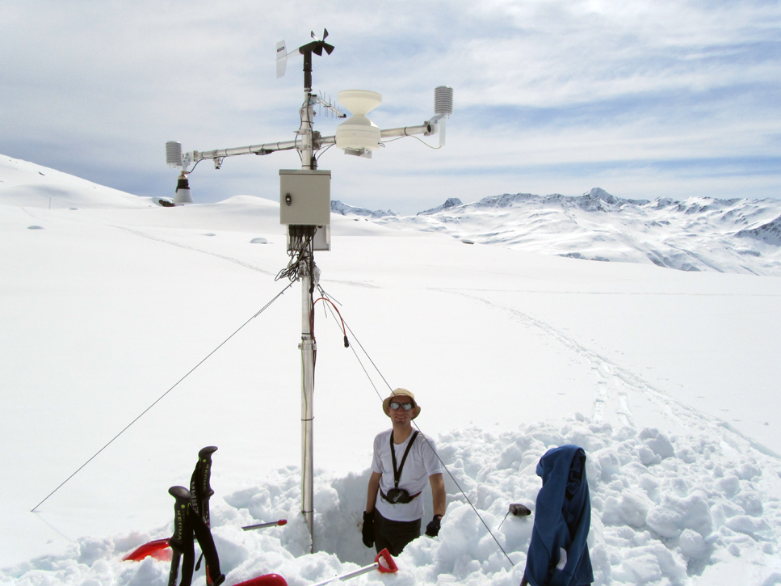

# Introduction

<!--

## test

TEST

pbr = function(text) {
  x = '
'
  sprintf("%s%s
", x, text)
}
`#r pbr("citation goes here")`
-->

## Plan

- [Contact details](./index.html#something-about-me)
- [Course plan, learning outcomes and teaching philosophy](./index.html#course-plan)
- [Course schedule](./index.html#course-schedule)
- [Lectures: hydrology](./index.html#hydrology)
- [Lectures: hydraulics](./index.html#hydraulics)
- [Lectures: catchment-scale flooding](./index.html#catchment-scale-flooding)
- [Lectures: urban stormwater management](./index.html#urban-stormwater-management)
- [Exercise sessions](./index.html#exercise-sessions)
- [Assessment](./index.html#assessment)
- [Further resources](./index.html#resources)

## [Something about me!](./pdf/personal_presentation.pdf)

Florian Kobierska Baffie

Cell: +33 78369 0626

Email: fbaffie (at) gmail (dot) com

<!--
Tel: +47 57677604
-->

## Something about you!

- Where do you come from?
- What have you studied?
- Motivation for the master?
- Motivation for this course?!
- Master project idea?
- Post-master plans?

<!--
Ask students to prepare a sketch of their ideas/interests on the course based on the learning outcomes and some hints. 
They put their name on the backside of the sheet.
Discuss it an create a master-sketch on the board.
Keep each student's sketch, make a copy and put it on the website.
Print all the keywords and get 3-4 groups of students to build a conceptual map of the course
-->

## Course plan

Approximately half of the course will be focused on the basics of:

- Hydrology: how rainfall becomes streamflow?
- Hydraulics: how water moves in open channels and under pressure?

Before looking at two quite disctinct scenarios (in Norway):

- Catchment scale flooding: how to deal with large-scale flooding?
- Urban stormwater (SW) and flooding: how to best manage urbanized catchments?

## Learning outcomes

Knowledge of:

- the different components in the hydrological cycle and local water balance
- the challenges and possibilities related to local runoff management
- erosion and sediment transport in catchments and related mitigation measures
- land use planning for local runoff management
- potential impacts of climate change on water resources

## Skills

- Understand hydrological and hydraulics processes.
- Make simple hydrological, hydrogeological  and hydraulic calculations relevant to runoff management. 
- Use processes understanding to have a critical view on those calculations
- Provide input for action plans and suggests solutions for local runoff management
- Use different measuring techniques and carry out simple dimensional calculations of green infrastructure systems for urban runoff management

## Teaching philosophy

- Active learning
- Resource for further learning
- [More on my teaching philosophy and notes on last year's feedback](./teaching.html)

# Course schedule

## Agenda: 02-04 May

Day	| Time	| Topic	| Room
--- | --- | --- | --- 
Wed. 02 May | 09:15-12:00	| [The water cycle](01_Hydrology/1_water_cycle.html)	| Svingen F2
Thu. 03 May | 09:15-12:00	| [Hydrological processes 1](01_Hydrology/2_hydrological_processes_1.html) | Svingen F3
Thu. 03 May | 12:30-14:00	| Excursion drinking water | Svingen F3
Fri. 04 May | 09:15-12:00	| [Hydrological processes 2](01_Hydrology/2_hydrological_processes_2.html) | Svingen F2
Fri. 04 May | 13:15-16:00	| Exercises: hydrology | Fossbygget-F208  Kjelda

## Agenda 07-09 May

Day	| Time	| Topic	| Room
--- | --- | --- | --- 
Mon. 07 May | 09:15-12:00	| [Hydrological extremes](01_Hydrology/3_hydrological_extremes.html)	| Svingen F2
Mon. 07 May | 13:15-16:00	| Introduction to SW	| Svingen F2
Tue. 08 May | 09:15-12:00	| [Hydrological modelling](01_Hydrology/4_hydrological_modelling.html) | Svingen F1
Tue. 08 May | 13:15-16:00	| Constraints in green infra. | Svingen F2
Wed. 09 May | Whenever	| Project discussions | My office

## Agenda 14-16 May

Day	| Time	| Topic	| Room
--- | --- | --- | --- 
Mon. 14 May | 09:15-12:00	| [Fluid dynamics](02_Hydraulics/1_fluid_dynamics.html)	| Svingen F2
Tue. 15 May | 09:15-12:00	| [Open channel](02_Hydraulics/2_open_channel.html)	| Svingen F2
Wed. 16 May | 09:15-12:00	| [Soils, erosion and deposition](02_Hydraulics/3_erosion_deposition.html)	| Svingen F2
Wed. 16 May | 13:15-16:00	| Exercises: hydraulics	| Fossbygget-F208  Kjelda

## Agenda 22-25 May

Day	| Time	| Topic	| Room
--- | --- | --- | --- 
Tue. 22 May | 09:15-12:00	| [Urban hydraulics](02_Hydraulics/4_urban_hydraulics.html)	| Svingen F2
Wed. 23 May | 08:00-17:30	| Excursion	| Gaupne and Jostedal
Thu. 24 May | 09:15-12:00	| [Flood mapping](03_Catchment_scale/1_flood_mapping.html) | Svingen F2
Fri. 25 May | 09:15-12:00	| Exercises: urban, rural	| Fossbygget-F208  Kjelda

## Agenda: 28-31 May
   

Day	| Time	| Topic	| Room
--- | --- | --- | --- 
Mon. 28 May | 09:15-12:00	| [Land use](03_Catchment_scale/4_land_use.html)		| Svingen F2
Tue. 29 May | 09:15-12:00	| [Design examples](04_Urban_SW/3_design.html)	| Svingen F2
Wed. 30 May | 09:15-12:00	| Excursion	| Lærdal / Flåm
Thu. 31 May | 09:15-12:00	| [Debriefing and keywords](./keywords/keywords.html) 	| Svingen F2
Thu. 31 May | 13:15-16:00	| Exercises: SW design | Svingen F2

## Agenda: 09-15 June

Day	| Time	| Topic	| Room
--- | --- | --- | --- 
Fri. 08 Jun | 24:00 | Send project reports | fkba@hvl.no + fronter
Tue. 12 Jun | 08:00-16:00 | Group presentations | ?
Thu. 14 Jun | 08:00-17:00 | Individual exam | SOG-Møterom 3.etg Stadionbygg

## Time blocks 

Most teaching blocks will be structured as follows:

- 09:15-10:00 Quiz on previous session.
- 10:00-12:00 Lecture, exercises, discussion
- Homework: prepare 2-3 questions AND answers for the next quiz. Send them latest midnight before the quiz to fkba@hvl.no in this format:

`## Your Name`

`> - **Your Question**`

`> - Your Answer`

<!--

To give you an area of focus, they will be based on a wide variety of self-learning materials:

- California water case study
- Scientific paper: coupled hydropower and flood management in Zürich
- Governmental report
- Video: permaculture initiative?
- Natural site: the Sogndalselvi catchment
- Set of drawings / city guidelines: Philadelphia, New York
- Book chapter
Quiz prizes: Local apple juice, home-made jam, home-made ridiculous savory spread, arduino, issue of research journal...
And of course, if you want a reference letter, participating in the quizzes will help
-->

# HYDROLOGY

## The water cycle

[Lecture](01_Hydrology/1_water_cycle.html)

We look at different components of the water cycle before diving into more detail.
Climate change will impact various components of the hydrological cycle. We will quickly review potential evolutions and base our first quizz on this theme.

Quiz for next monday:

Send me 2 questions and answers on this scientific presentation: [Sonia Seneviratne - Effects of land hydrology on atmospheric processes and climate change](https://www.youtube.com/watch?v=zMjchti6LdM)

Or on this book chapter of "Global environmental change":
[water cycles and climate change](http://www.cgd.ucar.edu/staff/trenbert/trenberth.papers/Hydrological%20cycleSpringer.pdf)

<!--

[Quiz](01_Hydrology/1_water_cycle_quiz.html)

"Hydrology is the science which deals with terrestrial waters, their occurrence, circulation and distribution on our planet, their physical and chemical properties and their interaction with the physical and biological environment, including the effect on them of the activity of man".

Session time plan:
- Brainstorming:

Ask students to prepare a sketch of the water cycle. They put their name on the backside of the sheet.
Keep each student's sketch, make a copy and put it on the website.

- Discuss the student's suggestions and create a master-sketch on the board.

What other "cycles" do they know? should we have a catch-up on the carbon cycle? How are the different cycles inter-related?

This is a good opportunity to see what was forgotten and small discussing the relative importance of each element.
Introduce numbers now, or get students to estimate some of them.

Exercise on R: 
Sogndal catchment using historical data: catchment size, catchment altitude, catchment mean slope, % of the various land uses, mean annual flow, mean annual snow cover at Anestølen (how many days of snow cover), how many days of precipitation? mean precipitation, median precipication, mean glacier ablation rate, cumulated glacier ablation rate.

-->

## Hydrological processes

We will first discuss hydrological processes most relevant to hydrology in Norway: snow hydrology and vegetation processes: [Lecture](01_Hydrology/2_hydrological_processes_1.html)

We then cover groundwater, soil water and runoff generation which are important for the design of green stormwater infrastructure: [Lecture](01_Hydrology/2_hydrological_processes_2.html)

<!--
Forest, tress and water in arid lands: a delicate balance
http://www.fao.org/docrep/010/a1598e/a1598e06.htm

the impact of forest on water resources.
Schaochun: too many tress in germany? emptying aquifers?
Stephanie's project

Discuss specific hydrological processes with students before the lecture to get an understanding of their intuitions or previous knowledge.
This could maybe also be written down and collected for research purposes.
Present documents for the quiz: impact of forest on hydrological resources
-->

## Hydrological extremes

[Lecture](01_Hydrology/3_hydrological_extremes.html)

Quantifying floods and droughts helps better designing protection / adaptation measures. 

Quiz for next monday:

Send me 2 questions and answers on this scientific article:
[A restatement of the natural science evidence concerning catchment-based ‘natural’ flood management in the UK](http://rspa.royalsocietypublishing.org/content/473/2199/20160706?utm_source=TrendMD&utm_medium=cpc&utm_campaign=Proceedings_A_TrendMD_1)

or this one:
[Differences in flood hazard projections in Europe – their causes and consequences for decision making](http://www.tandfonline.com/doi/full/10.1080/02626667.2016.1241398?src=recsys)

<!--
- Brainstorming hydrological extremes
Discuss hydrological extremes with students before the lecture to get an understanding of their intuitions or previous knowledge.
This could maybe also be written down and collected for research purposes.

- Present the slides
- Do some exercises. computer??
Box plot / historgram of precipitation and discharge for the sogndal catchment. Seasonality of rain events. Trends?
Fit some distributions to the historical data: annual maximum, peak over threshold...

- Present documents for the quiz: extremes in California / mediteranean climates? or my work at NVE?
-->

## Hydrological modelling

[Lecture](01_Hydrology/4_hydrological_modelling.html)

Being able to model streamflow helps make better management decisions such as sizing of reservoirs, culverts or allowances for irrigation. We will look at different modelling concepts used in hydrology, their data requirements, forecasting abilities and limitations.

<!--
Discuss hydrological modelling with students before the lecture to get an understanding of their intuitions or previous knowledge.
This could maybe also be written down and collected for research purposes.

Flood generating processes in the Sogndal catchment.
Linear reservoir model
Landscape-based reservoirs...
Rational method
-->

# HYDRAULICS

## Fluid dynamics

[Lecture](02_Hydraulics/1_fluid_dynamics.html)

We will look at water in pressure pipes. This is usually the domain of drinking water only but in somes instances, SW will have to be pumped out of a depression. Alternatively, SW could be used in off-grid design for micro-hydropower production or gravity fed irrigation schemes.

Quiz for next monday:

Send me 2 questions and answers on this NVE report:
[Identification of areas exposed to flooding in Norway at a national level](https://gis3.nve.no/metadata/rapporter/SmallScaleFloodAssesment_v3.pdf)

<!--
Microhydro, ram pump, pumps, off the grid gravity fed networks...
-->

## Open channel hydraulics

[Lecture](02_Hydraulics/2_open_channel.html)

How much flow can an open channel convey? How high will the water level be for a specifc discharge rate and slope?
Those questions are important when sizing infrastructure or defining the extend of flood zones.

<!--
Irrigation schemes in the US west (Arizona, maps and drawings?). Open water irrigation schemes
-->

## Soils, erosion and deposition

[Lecture](02_Hydraulics/3_erosion_deposition.html)

Water can mobilize particules of various sizes. In extreme cases, boulders can be taken with the flow and form devastating debris flows.
On the other hand, the smallest suspended particules are those that carry most pollution in SW runoff

<!--
[Quiz](02_Hydraulics/3_erosion_deposition_quiz.html)
Quiz on Illgraben: you tube videos...
-->

## Urban hydraulics

[Lecture](02_Hydraulics/4_urban_hydraulics.html)

We will try to summarize how hydrology and hydraulic come into play for the design of (green) SW infrastructure.
this will involve simplified calculations for small catchments.

<!--
[Quiz](02_Hydraulics/4_urban_hydraulics_quiz.html)
Sets of drawings / infrastructure in Sogndal (visit 3 waters network)
-->

# CATCHMENT SCALE FLOODING

## Flood vulnerability assessment

<!--
[Lecture](03_Catchment_scale/1_floodplain_management.html)
-->

We saw how precipitation led to runoff and how water level in channels varies as a function of discharge.
Those results are used to produce flood zoning maps. We will look at different methods to do so and discuss assessment of vulnerability to flooding.

Quiz for next monday:
Send me 4 questions and answers on your group project.

<!--

-->

## Flood protection works

Based on flood zoning maps and the quantification of hydrological extremes in specifc catchments, protection measures can be designed. Those consist of riverbank engineering features such as dikes, diverting channels. We will look at a simple design during an exercise session

This session consists of a full-day excursion with Svein Vågane from NVE Førde.
We will look at flash flooding that occured in [Utvik last autumn](https://www.vg.no/nyheter/innenriks/vaer-og-uvaer/flommen-i-utvik-vann-ekspert-varslet-om-flomfare/a/24103915/)

<!--
[Lecture](03_Catchment_scale/2_flood_protection.html)
Quiz / exercises on the infrastructure in Laerdal
-->

<!--
## Hydropower and flooding

[Lecture](03_Catchment_scale/3_hydropower_management.html)

Hydropower reservoirs can store substantial amounts of water and can therefore be managed specifically to avoid flooding downstream.
Flood forecasting becomes particularly important as a reservoir may first need emptying before acting as a damper to a flooding event. We will focus on a case study in Zürich, Switzerland. 

Quiz / exercises on the Swiss case studies and possibilities in Norway.
-->

## Land use 

[Lecture](03_Catchment_scale/4_land_use.html)

We will see how alternative land uses may help mitigate catchment-scale flooding and erosion. Some agricultural practices could be applied in urban areas to link SW green infrastrure to local food production.

<!--
Key words: urban stormwater agriculture, permaculture
Potential quiz / discussion: http://www.monbiot.com/2015/12/08/a-storm-of-ignorance/ Village homes in Davis Versaland? Willie Smits in Indonesia?
Flood's ecological functions, bridge between rural land use and urban flooding
Session in collaboration with Deborah: we could use the the scotish case study in Gairlochy (changes in rural land use and protection measures to avoid urban flooding lead to rural flooding and erosion problems)
-->

# URBAN STORMWATER MANAGEMENT

## Introduction to green SW infrastructure

<!--
[Lecture by Kyrre Groven (Vestland Forskning)](04_Urban_SW/1_introduction.html)
-->

Lecture by Kyrre Groven (Vestland Forskning)

We will look at the history of reticulated networks for SW and sewage. What are their limitations?
Which pollution and flooding problems can be caused by sW runoff?
Green SW infrastructure techniques will be introduced.

<!-- KYRRE
- Start with brainstorming keywords and a conceptual sketch
- Exercises on the network in Sogndal and the potential / difficulties associated with green infrastructure in Sogndal / Norway.
Get students to brainstorm on potential green infrastructure techniques. Then list a few and ask them to draw how they think those features should be designed.
Then present some typical drawings, discuss and get them to explore further for the next session.
-->

## Green SW infrastructure  

<!--
[Lecture](04_Urban_SW/2_constraints.html)
-->

Lecture by Eli Heiberg (HVL)

Role of green infrastructure in urban storm water management:

Principles, measures and technology for local, open runoff management. 
We will also discuss the multifunctionality of green infrastructure

[Quiz](04_Urban_SW/2_green_infra_quiz.html)

<!-- ELI

This session will focus on green SW infrastructure and their non-physical design constraints.
Those include cost and maintenance issues, social acceptance, multifunctionality (depollution, recreation, agriculture).
What are the responsibilities of decision makers regarding the design of such infrastructure?
Which official design guidelines exist and why do they matter?

- Quiz: discuss paper "Stormwater management and urban planning:Lessons from 40 years of innovation"
- Lecture topics:
National guidelines in development
Maintenance aspects
Social acceptance (recreational use, ready to do some maintenance?, understanding of the risks)
Relation between private developers, private design firms and municipalities (do all waters assets typically get vested to council in Norway?)
Do the municipalities have specific requirements for new developments? If not, what should they do and how?
Constructive critiscm on the blue/green factor method could be used as an exercise.
- Exercises or maybe project presentation / discussion as this session might come early in the course
-->

## Designing resilient infrastructure

[Lecture](04_Urban_SW/3_design.html)

We look at some good and bad design examples and try to understand the reasons behing design choices and possibly unintended consequences / uses. Some examples focus on SW infrastructures but not all, in an effort to distinguish important design principles and constraints. This includes legibility. practicallity, multi-functionnality...

<!--
Quiz / exercises on design calculations / drawings (redesign the campus?)
Or ask everyone to come with 1 example of good and bad design on the campus (or in Sogndal). Could be water-related but also other.
The example of bad design should come with a suggested better option.
- Brainstorming:
Ask students to brainstorm their ideas on good design principles for resilient SW infrastructure / water resources management
- Lecture linking all previous elements: hydrology, hydraulics, non-technical constraints.
- Design exercises
-->

# EXERCISE SESSIONS

## Hydrological processes

- Some simple exercises from textbooks
- Flow through sand filters
- Designing drinking water infrastructure
- Steady flow in an unconfined aquifer
- Link between groundwater drop and streamflow recession
- Temperature index modelling of snowmelt

## Hydrological modelling

- Exercises using the hydrological model HBV light

- Data preparation for modelling the Sogndalselvi catchment
- Key hydrological figures at various time scales
- Experiment with hydrological extremes at various time scales

## Hydropower and hydraulics

- Case study of Statkraft's hydropower infrastructure in Jostedal
- Designing flood protection measures in Lærdal

## Urban hydrology and green infrastructure

- Some calculations and drawings based on this water harvesting video in Tucson, Arizona.

## Urban and rural hydrology. Field observations and planning

- Visit of a site where 100 new dwellings had been suggested. 
- Field excursion and diagnostic of the existing hydrologic /  hydraulic situation
- Presentation on past flooding events
- Open discussion on the design of new dwellings
- NVE case study: new flood flow paths. critical points in catchment management

# ASSESSMENT

## Exam details

1. Written group [project work](./projects.html) (+ oral presentation). The group gets one common grading. If not approved, a new version of the project work must be handed in. Grading A-F.
2. Individual in-depth oral discussion on the project work, the "second" project and finally some aspects of the course material (remembering the most difficult equations will not be required, but they should be qualitatively understood and you should have an idea on how to apply them).
Grading A-F.

# RESOURCES

## Books

All books are referenced in the HVL library system:
https://www.hisf.no/biblioteket/

The are available either *onsite* at the library, for *online* reading, or both. 
Those online can usually be downloaded for 21 days. Some without limits (*DL*). 

- **Elements of physical hydrology** George M Hornberger et al. (*onsite*)
- **Elements of Geographical Hydrology** Knapp, B.J. (*online*)
- **Hydrology in Practice** Elizabeth M Shaw (*onsite*)
- **Vassdragshaandboka** NVE 2010 (*onsite*)
- **Landscape planning: environmental applications** 5th edition (2010), William M. Marsch. (*onsite*)

## Books

- **Stormwater management for smart growth** A.P. Davis and R.H. McCuen. (*DL*) 
Good mix of theory and practice
- **Optimizing Stormwater Treatment Practices  - A handbook of assessment and maintenance** A.J. Erickson (*DL*)
Very applied
- **Urban stormwater management in the US** National Research Council (*online*) 
- **Public safety guidance for urban SW facilities** ASCE Task Committee. (*online*) Lots of good drawings
- **Low impact development of sustainable stormwater management** T.H. Cahill and W. Horner. (*online*) 
Good balance of theory, planning. Good overview of LID systems

## Books

- **Design for water** (*onsite*)
- **Site engineering for landscape architects** Steven Strim and Kurt Nathan. (*onsite*, *online*)
- **Site engineering workbook** Jake Woland. (*onsite*, *online*)
- **Grading** P. Petschek. Birhäuser. (*onsite*, *online*)
- **Advances in Water Resources Engineering** C.T. Yang and L.K. Wang. (*DL*) 
Math-heavy!
- **Modern Water Resources Engineering** L.K. Wang and C.T. Yang.(*DL*)
Math-heavy!

## Online

[Hydrology textbook by H. Savenije](http://ocw.unesco-ihe.org/pluginfile.php/548/mod_folder/content/0/Hydrology_LN0262.09.1.pdf?forcedownload=1)

A (not very good looking) resource, but very complete on most aspects of this course:

http://echo2.epfl.ch/VICAIRE/mod_4/chapt_8/main.htm

[USDA National Engineering Handbook - Hydrology](C:\Privat\fkba\Nedlastinger\USDA Handbook - Hydrology\National Engineering Handbook Hydrology Chapters _ NRCS.html)

[USDA Urban hydrology for small watersheds](https://www.nrcs.usda.gov/Internet/FSE_DOCUMENTS/stelprdb1044171.pdf)

## Keywords

For future reference, here is a list of [keywords](./keywords/keywords.html) (loosely) organized in themes.

## Referencing / credits

Most graphs / pictures from others are not explicitely referenced in the presentations to avoid surcharging them.
I tried to save them all in specific pinterest collections (also serves as a list of interesting websites):
https://no.pinterest.com/fbaffie

In parallel, I have compiled a youtube playlist for the course:
https://www.youtube.com/playlist?list=PLsnOsjFNnFqacBToigfx0YeDee7Tlqeli

Other credits go to Wikipedia, Google maps, Norwegian maps (https://kart.finn.no/, https://norgeskart.no), Swiss Topo (https://map.geo.admin.ch), Sebastian Mermild and previous colleagues for some pictures

