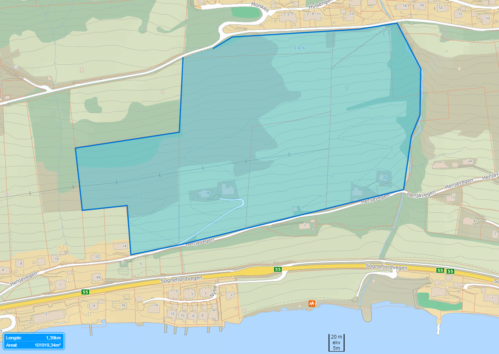

# Introduction

## [Something about me!](./pdf/personal_presentation.pdf)

Florian Kobierska Baffie

Tel: +47 57677604

Cell: +33 783690626

Email: fkba@hvl.no (best)

Office: 3 past Tarald, on the left

## Something about you!

- Where do you come from?
- What have you studied?
- Motivation for the master?
- Motivation for this course?!
- Master project idea?
- Post-master plans?

<!--
Ask students to prepare a sketch of their ideas/interests on the course based on the learning outcomes and some hints. 
They put their name on the backside of the sheet.
Discuss it an create a master-sketch on the board.
Keep each student's sketch, make a copy and put it on the website.
Print all the keywords and get 3-4 groups of students to build a conceptual map of the course
-->

## Course plan

Approximately half of the course will be focused on the basics of:

- Hydrology: how rainfall becomes streamflow?
- Hydraulics: how water moves in open channels and under pressure?

Before looking at two quite disctinct scenarios (in Norway):

- Catchment scale flooding: how to deal with large-scale flooding?
- Urban stormwater (SW) and flooding: how to best manage urbanized catchments?

## Learning outcomes

Knowledge of:

- the different components in the hydrological cycle and local water balance
- the challenges and possibilities related to local runoff management
- erosion and sediment transport in catchments and related mitigation measures
- land use planning for local runoff management
- potential impacts of climate change on water resources

## Skills

- Understand hydrological and hydraulics processes.
- Make simple hydrological, hydrogeological  and hydraulic calculations relevant to runoff management. 
- Use processes understanding to have a critical view on those calculations
- Provide input for action plans and suggests solutions for local runoff management
- Use different measuring techniques and carry out simple dimensional calculations of green infrastructure systems for urban runoff management
- Use relevant computer software and GIS to identify flood-prone areas and potential problems arising from urban flooding and runoff 

## Teaching philosophy

"It is essential to see lectures as a means of helping students learn to think about the key concepts of a particular subject, rather than primarily as a means of transferring knowledge from instructor to student."

## Teaching philosophy

- Open source text-based material (for collaboration), available [online](https://fbaffie.github.io/Runoff_management_course/)
- Links to a lot freely available material
- Lots of questions to force thinking / active learning
- Open to a variety of projects this year

Given those course design choices:

- Be active: take part in brainstorming exercises and questions
- Be creative in your projects
- Don't hesitate to ask questions and reach for help
- Give feedback: The course is a living document, please suggest improvements!

<!--
1.  Intellectual Community
2.  A high degree of interactivity between instructor and student, as well as between students.
3.  Active Learning
4.  Reflection
5.  Self-directed Learning

This master programm introduces you to a lot of material, which is good to give you different perspectices and widen your horizons, but it presents the risk of covering too supercially key concepts.
In order to achieve the difficult balance between those 2 aspects, I have choosen to have simple lectures on important processes and concepts, backed by group exercises on specific case studies or scientific findings. A substantial list of written and video resources is listed at the end of each topic.

It is a bit hypocritical to tell you not to do copy/paste, as I do it and it is very human to do it...
My role is to orient you in the best way to book and interent resources for the future, while forcing you to have some internet-free discoveries during the course. The wealth of information available to us is both a miracle and a curse!

Mark said that students were lacking pro-activity. He was maybe right.
-->

## Soft skills: learning

- [Deliberate practice](http://www.bulletproofmusician.com/how-many-hours-a-day-should-you-practice/) (Focus, challenge, feedback, repeat!)
- Deconstruct skills (music, sport, coding...)
- Learn from contradictory views, from your "opponents" (climate deniers, politics, some large companies...), or apparently unrelated fields
- Be open to change
- [How to get better at the things you care about? Alternate between learning zone and performing zone](https://www.ted.com/playlists/497/practice_makes_perfect)
- [Scott Young: Interesting blog on learning strategies](https://www.scotthyoung.com/)
- Mistakes are not failure, only [learning](https://www.youtube.com/watch?v=_xti05V24S4)

## Soft skills: work / life

- [Deep work](http://calnewport.com/books/deep-work/), grit
- [Start with the why. How great leaders inspire action. Simon Sinek](https://www.youtube.com/watch?v=u4ZoJKF_VuA)
- Be a helper vs a taker: the person who serves the most, prospers the most
- See some [positive](http://www.positivityblog.com/16-things-i-wish-they-had-taught-me-in-school/) in everyone, everything (with clients, bosses, adverse situations...)
- Recognize assumptions and test them (i.e. do the math when buying property, getting a job)
- Steal like an artist!
- [Useful mental models](https://medium.com/@yegg/mental-models-i-find-repeatedly-useful-936f1cc405d)

## Soft skills: leadership

- Run your own race
- Humble servant of your craft: do not behave like an expert
- Lead without the title: leader vs victim mentality
- Leaders criticize by [creating](http://jamesclear.com/creativity): execute your ideas
- Leadership with a balanced ego:[the rarest commodity is leadership without ego. Bob Davids](https://www.youtube.com/watch?v=UQrPVmcgJJk)
- Give and receive [feeback](http://www.bbc.com/future/story/20170308-why-even-the-best-feedback-can-bring-out-the-worst-in-us) with a "take it or leave it" attitude.

<!--
Implementing change requires strong convincing / argumentation abilities. Developing alternative ways to manage stormwater is for example much more difficult from an organizational point of view than from a technical aspect.
There are probably smart introverts in your group that I hope will contribute actively.
-->

## Agenda: 02-05 May

Day	| Time	| Topic	| Room
--- | --- | --- | --- 
Tue. 02 May | 09:15-12:00	| The water cycle	| Høgskbygget 2.etg kl Stad
Wed. 03 May | 09:15-12:00	| Introduction to SW | Svingen F3
Wed. 03 May | 12:30-16:00	| Excursion drinking water | Stadionbygget 02-02
Thu. 04 May | 09:15-12:00	| Hydrological processes 1 | Svingen F3
Fri. 05 May | 09:15-12:00	| Hydrological processes 2	| Svingen F3

## Agenda 08-12 May

Day	| Time	| Topic	| Room
--- | --- | --- | --- 
Mon. 08 May | 09:15-12:00	| Hydrological modelling	| Svingen F3
Tue. 09 May | 12:15-15:00	| Constraints in green infra. | Stadionbygget 02-02
Wed. 10 May | 09:15-12:00	| Hydrological extremes	| Svingen F3
Thu. 11 May | 09:15-12:00	| Fluids dynamics	| Svingen F3
Fri. 12 May | 09:15-12:00	| Project discussions | My office

## Agenda: 15-16, 22-24 May

Day	| Time	| Topic	| Room
--- | --- | --- | --- 
Mon. 15 May | 12:15-15:00	| Urban hydraulics	| Stadionbygget 02-02
Tue. 16 May | 12:15-15:00	| Floodplain  management	| Stadionbygget 02-02

## Agenda: 22-24 May

Day	| Time	| Topic	| Room
--- | --- | --- | --- 
Mon. 22 May | 09:15-10:30	| Floods in Flåm	| Svingen F3
Mon. 22 May | 10:30-12:00	| Open channel	| Svingen F3
Mon. 22 May | 13:00-14:00	| Excursion SW + sewage | Sogndal
Tue. 23 May | 09:15-10:30	| Society and green infra | Stadionbygget 02-04
Tue. 23 May | 10:30-12:00	| Exercises | Stadionbygget 02-04
Wed. 24 May | 08:00-17:30	| Excursion	| Lærdal / Flåm

## Agenda: 29-31 May

Day	| Time	| Topic	| Room
--- | --- | --- | --- 
Mon. 29 May | 09:15-10:30	| Leikanger design	| Svingen F3
Mon. 29 May | 10:30-12:00	| Erosion and land use	| Svingen F3
Tue. 30 May | 09:15-10:30	| Floods in Voss	| Stadionbygget 02-02
Tue. 30 May | 10:30-12:00	| Design examples	| Stadionbygget 02-02
Wed. 31 May | 09:15-10:30	| Infiltration experiments	| Stadionbygget 02-02
Wed. 31 May | 10:30-12:00	| Debriefing and keywords 	| Stadionbygget 02-02

## Agenda: 09-15 June

Day	| Time	| Topic	| Room
--- | --- | --- | --- 
Fri. 09 Jun | 24:00 | Send project reports | fkba@hvl.no + fronter
Tue. 13 Jun | 08:00-16:00 | Group presentations | ?
Thu. 15 Jun | 08:00-16:00 | Individual exam | ? 

## Time blocks 

Most teaching blocks will be structured as follows:

- 09:15-10:00 Quiz on previous session.
- 10:00-12:00 Lecture, exercises, discussion
- Homework: prepare 2-3 questions AND answers for the next quiz. Send them latest midnight before the quiz to fkba@hvl.no in this format:

`## Your Name`

`> - **Your Question**`

`> - Your Answer`

<!--

To give you an area of focus, they will be based on a wide variety of self-learning materials:

- California water case study
- Scientific paper: coupled hydropower and flood management in Zürich
- Governmental report
- Video: permaculture initiative?
- Natural site: the Sogndalselvi catchment
- Set of drawings / city guidelines: Philadelphia, New York
- Book chapter
Quiz prizes: Local apple juice, home-made jam, home-made ridiculous savory spread, arduino, issue of research journal...
And of course, if you want a reference letter, participating in the quizzes will help
-->

# HYDROLOGY

## The water cycle

[Lecture](01_Hydrology/1_water_cycle.html)

We look at different components of the water cycle before diving into more detail.

[Quiz](01_Hydrology/1_water_cycle_quiz.html)

<!--
"Hydrology is the science which deals with terrestrial waters, their occurrence, circulation and distribution on our planet, their physical and chemical properties and their interaction with the physical and biological environment, including the effect on them of the activity of man".

Session time plan:
- Brainstorming:

Ask students to prepare a sketch of the water cycle. They put their name on the backside of the sheet.
Keep each student's sketch, make a copy and put it on the website.

- Discuss the student's suggestions and create a master-sketch on the board.

What other "cycles" do they know? should we have a catch-up on the carbon cycle? How are the different cycles inter-related?

This is a good opportunity to see what was forgotten and small discussing the relative importance of each element.
Introduce numbers now, or get students to estimate some of them.

Exercise on R: try to do general functions that could quickly be used with other catchments (I NEED TO PREPARE A PARAMETRIZED NOTEBOOK) 
Sogndal catchment using historical data: catchment size, catchment altitude, catchment mean slope, % of the various land uses, mean annual flow, mean annual snow cover at Anestølen (how many days of snow cover), how many days of precipitation? mean precipitation, median precipication, mean glacier ablation rate, cumulated glacier ablation rate.

Why does it rain more in Fjaerland than in Sogndal? Why is it warmer...

- Quick lecture on what was not covered
- Do exercises on the water cycle and start linking to the next sessions
- Quiz theme: general knowledge on the water cycle in various parts of the world
-->

## Hydrological processes

We will first discuss hydrological processes most relevant to hydrology in Norway: snow hydrology and vegetation processes: [Lecture](01_Hydrology/2_hydrological_processes_1.html)

We then cover groundwater, soil water and runoff generation which are important for the design of green stormwater infrastructure: [Lecture](01_Hydrology/2_hydrological_processes_2.html)

The quiz focuses on the impact of forest on water resources: [Quiz](01_Hydrology/2_hydrological_processes_quiz.html)

<!--
Forest, tress and water in arid lands: a delicate balance
http://www.fao.org/docrep/010/a1598e/a1598e06.htm

the impact of forest on water resources.
Schaochun: too many tress in germany? emptying aquifers?
Stephanie's project

Discuss specific hydrological processes with students before the lecture to get an understanding of their intuitions or previous knowledge.
This could maybe also be written down and collected for research purposes.
Present documents for the quiz: impact of forest on hydrological resources
-->

## Hydrological extremes

[Lecture](01_Hydrology/3_hydrological_extremes.html)

Quantifying floods and droughts helps better designing protection / adaptation measures. 

<!--
- Brainstorming hydrological extremes
Discuss hydrological extremes with students before the lecture to get an understanding of their intuitions or previous knowledge.
This could maybe also be written down and collected for research purposes.

- Present the slides
- Do some exercises. computer??
Box plot / historgram of precipitation and discharge for the sogndal catchment. Seasonality of rain events. Trends?
Fit some distributions to the historical data: annual maximum, peak over threshold...

- Present documents for the quiz: extremes in California / mediteranean climates? or my work at NVE?
-->

## Hydrological modelling

[Lecture](01_Hydrology/4_hydrological_modelling.html)

Being able to model streamflow helps make better management decisions such as sizing of reservoirs, culverts or allowances for irrigation. We will look at different modelling concepts used in hydrology, their data requirements, forecasting abilities and limitations.

<!--
Discuss hydrological modelling with students before the lecture to get an understanding of their intuitions or previous knowledge.
This could maybe also be written down and collected for research purposes.

Flood generating processes in the Sogndal catchment.
Linear reservoir model
Landscape-based reservoirs...
Rational method
-->

# HYDRAULICS

## Fluid dynamics

[Lecture](02_Hydraulics/1_fluid_dynamics.html)

We will look at water in pressure pipes. This is usually the domain of drinking water only but in somes instances, SW will have to be pumped out of a depression. Alternatively, SW could be used in off-grid design for micro-hydropower production or gravity fed irrigation schemes.

<!--
Microhydro, ram pump, pumps, off the grid gravity fed networks...
-->

## Open channel hydraulics

[Lecture](02_Hydraulics/2_open_channel.html)

How much flow can an open channel convey? How high will the water level be for a specifc discharge rate and slope?
Those questions are important when sizing infrastructure or defining the extend of flood zones.

<!--
Irrigation schemes in the US west (Arizona, maps and drawings?). Open water irrigation schemes
-->

## Soils, erosion and deposition

[Lecture](02_Hydraulics/3_erosion_deposition.html)

Water can mobilize particules of various sizes. In extreme cases, boulders can be taken with the flow and form devastating debris flows.
On the other hand, the smallest suspended particules are those that carry most pollution in SW runoff

<!--
[Quiz](02_Hydraulics/3_erosion_deposition_quiz.html)
Quiz on Illgraben: you tube videos...
-->

## Urban hydraulics

[Lecture](02_Hydraulics/4_urban_hydraulics.html)

We will try to summarize how hydrology and hydraulic come into play for the design of (green) SW infrastructure.
this will involve simplified calculations for small catchments.

<!--
[Quiz](02_Hydraulics/4_urban_hydraulics_quiz.html)
Sets of drawings / infrastructure in Sogndal (visit 3 waters network)
-->

# CATCHMENT SCALE FLOODING

## Floodplain management

<!--
[Lecture](03_Catchment_scale/1_floodplain_management.html)
-->
Lecture by Deborah Davies (HVL) on natural flood management.

We saw how precipitation led to runoff and how water level in channels varies as a function of discharge.
Those results are used to produce flood zoning maps. We will now focus on the bigger picture of flood management in large catchments.

<!--

-->

## Flood protection works

Based on flood zoning maps and the quantification of hydrological extremes in specifc catchments, protection measures can be designed. Those consist of dikes, diverting channels.

This session consists of a full-day excursion with Sven Vågane from NVE Førde.

<!--
[Lecture](03_Catchment_scale/2_flood_protection.html)
Quiz / exercises on the infrastructure in Laerdal
-->

<!--
## Hydropower and flooding

[Lecture](03_Catchment_scale/3_hydropower_management.html)

Hydropower reservoirs can store substantial amounts of water and can therefore be managed specifically to avoid flooding downstream.
Flood forecasting becomes particularly important as a reservoir may first need emptying before acting as a damper to a flooding event. We will focus on a case study in Zürich, Switzerland. 

Quiz / exercises on the Swiss case studies and possibilities in Norway.
-->

## Land use 

[Lecture](03_Catchment_scale/4_land_use.html)

We will see how alternative land uses may help mitigate catchment-scale flooding and erosion. Some agricultural practices could be applied in urban areas to link SW green infrastrure to local food production.

<!--
Key words: urban stormwater agriculture, permaculture
Potential quiz / discussion: http://www.monbiot.com/2015/12/08/a-storm-of-ignorance/ Village homes in Davis Versaland? Willie Smits in Indonesia?
Flood's ecological functions, bridge between rural land use and urban flooding
Session in collaboration with Deborah: we could use the the scotish case study in Gairlochy (changes in rural land use and protection measures to avoid urban flooding lead to rural flooding and erosion problems)
-->

# URBAN STORMWATER MANAGEMENT

## Introduction to green SW infrastructure

<!--
[Lecture by Kyrre Groven (Vestland Forskning)](04_Urban_SW/1_introduction.html)
-->

Lecture by Kyrre Groven (Vestland Forskning)

We will look at the history of reticulated networks for SW and sewage. What are their limitations?
Which pollution and flooding problems can be caused by sW runoff?
Green SW infrastructure techniques will be introduced.

<!-- KYRRE
- Start with brainstorming keywords and a conceptual sketch
- Exercises on the network in Sogndal and the potential / difficulties associated with green infrastructure in Sogndal / Norway.
Get students to brainstorm on potential green infrastructure techniques. Then list a few and ask them to draw how they think those features should be designed.
Then present some typical drawings, discuss and get them to explore further for the next session.
-->

## Green SW infrastructure  

<!--
[Lecture](04_Urban_SW/2_constraints.html)
-->

Lecture by Eli Heiberg (HVL)

Role of green infrastructure in urban storm water management:

Principles, measures and technology for local, open runoff management. 
We will also discuss the multifunctionality of green infrastructure

[Quiz](04_Urban_SW/2_green_infra_quiz.html)

<!-- ELI

This session will focus on green SW infrastructure and their non-physical design constraints.
Those include cost and maintenance issues, social acceptance, multifunctionality (depollution, recreation, agriculture).
What are the responsibilities of decision makers regarding the design of such infrastructure?
Which official design guidelines exist and why do they matter?

- Quiz: discuss paper "Stormwater management and urban planning:Lessons from 40 years of innovation"
- Lecture topics:
National guidelines in development
Maintenance aspects
Social acceptance (recreational use, ready to do some maintenance?, understanding of the risks)
Relation between private developers, private design firms and municipalities (do all waters assets typically get vested to council in Norway?)
Do the municipalities have specific requirements for new developments? If not, what should they do and how?
Constructive critiscm on the blue/green factor method could be used as an exercise.
- Exercises or maybe project presentation / discussion as this session might come early in the course
-->

## Designing resilient infrastructure

[Lecture](04_Urban_SW/3_design.html)

We look at some good and bad design examples and try to understand the reasons behing design choices and possibly unintended consequences / uses. Some examples focus on SW infrastructures but not all, in an effort to distinguish important design principles and constraints. This includes legibility. practicallity, multi-functionnality...

<!--
Quiz / exercises on design calculations / drawings (redesign the campus?)
Or ask everyone to come with 1 example of good and bad design on the campus (or in Sogndal). Could be water-related but also other.
The example of bad design should come with a suggested better option.
- Brainstorming:
Ask students to brainstorm their ideas on good design principles for resilient SW infrastructure / water resources management
- Lecture linking all previous elements: hydrology, hydraulics, non-technical constraints.
- Design exercises
-->

# Suggested projects

## Design projects: Leikanger 100 dwellings, 10ha

## Design projects: site map

## Design projects: catchment

## Design projects: options

Different groups could tackle different design challenges:

- minimum extra outflow (least hydrological impact)
- off the grid design
- most agriculture / food production friendly design
- design (incl. climate change) for its actual climate or 
- semi-arid climate (US mid-west, middle east)
- mediteranean climate (Marseille, California)
- (sub)tropical climate (NSW, central America)

## Design projects: example drawings

## Design projects: example drawings

## Design projects: other ideas

- You can suggest another area to be developed
- Re-design the campus for water harvesting and irrigation of urban agriculture. This could be linked to smart reservoirs.
- Look for problems involving SW in the region and propose solutions (dirt roads, specific locations in Sogndal)

## Design projects: expectations

- Drawings (hand, sketchup...) are encouraged. 
- Try to specify construction requirements: inputs / outputs in materials, timing
- Explain the process: your assumptions, calculations, context, design choices...
- Be creative: do not give only 1 option
- No need for huge report

## Synthesis projects

- Recommendation for green infrastructure design in Norway: which techniques are promising, where, under which circumstances...
- Prepare a set of reference drawings / specifications on stormwater management for Western Norway?
- Develop a cheatsheet on green SW infrastructure (i.e [nervous system](https://www.cheatography.com/davidpol/cheat-sheets/sympathetic-nervous-systems/pdf/), [R programming](https://www.rstudio.com/wp-content/uploads/2016/11/ggplot2-cheatsheet-2.1.pdf))

## Synthesis projects: expectations

- Explanation of choices
- Steal like an artist: build upon the resources synthesized
- Neat and practical final product

## Modelling projects

- Data exploration and hydrological modelling of the Sogndal catchment using R
- Flood frequency analysis for the catchment
- Relationship between measured flow at Sogndalsvatn and flow in Sogndal (can be experimental too)

<!--
- Instrument the Sogndal stream close to the campus or lower towards the outlet, do fluorometer / salt experiments and try to understand: how much more flow is there here than at Sogndalsvatn, how much time does river routing take, is it dependent on discharge rate? discuss the limitations
-->
## Modelling projects: expectations

- Structured programs with R
- Use of best practice for coding
- Good explanation of the analysis: available data, methods, assumptions, results

## Building projects

- Design / Build a water pump or any other hydraulic  feature (i.e ram pump). 2000 Kr available. 

Expectations: similar to design projects + explain why it works as it does.

## Experimental projects

- Implement a data acquisition experiment in sogndal or in the Sogndal catchment. (available equipment: portable EC/pH meter, soil moisture sensors, soil temperature sensors, water pressure sensors, fluorometer)
- Biochar properties: available water capacity, hydraulic conductivity, erodability...

## Experimental projects

Repair and experiment with the fied infiltrometer and lab permeameter. This could include a review of infiltration measurement methods and improvement of this wikipedia article:

https://en.wikipedia.org/wiki/Infiltrometer

## Experimental projects: expectations

- Explain the why, what and how of experimental setup
- Present results in a critical way: what went well and what didn't

## Social projects

- Serious game development for stormwater management in Norway
- Analyze the barriers to implementation of innovative SW practices in Norway.
- Compare them with other countries
- Compare them with other topics, for example composting toilets.
- Discuss how crowd-based approaches could influence design / planning decisions (i.e. design of the campus)

## Social projects: expectations

- Have a scientific approach to the issue: what methods did you use, which assumptions did you make
- High quality reporting

# Project assessment

## Project groups + second project

People	| Main project	|  Second project
--- | --- | --- 
Tew. Ragn. Bjø. Rann. |Design |  Social
Håk. Chr. Cal. | Social |  Flåm
Ann. Mar. Mat. | Flåm |  Lab
Jan. Oli. Sim. | Lab |  Voss
Tro. Jos. Vic. Gur. | Voss |  Design 

## Project development

- Last 2 weeks of the course: project discussion instead of quiz
- Every project gets 1-2h of everyone's time: come with a short presentation of the project and first ideas. 
- Prepare good questions that the group can contribute to. 
- Animate the discussion.
- During the 10 day period before the exam, every project gets a 2-hour block of my time.

<!--
For example students would work on a project that develops their weak point why being client on a topic they feel more at ease with.
-->

## Project reporting and presentation

- The reports are sent to fkba@hvl.no and uploaded to fronter: Friday 9th of June. 24:00 
- Slide show of 5 minutes per person (so 15 or 20 min total depending on the group)
- Videos could be part of the reporting, but not only
- The group with the same "second project" as the presenters gets priority for questions. They should have read the "second project" report in detail.
- The individual exam will then discuss the personal project, the second project and the course material

## Assessment

1. Written group project work (+ oral presentation). The group gets one common grading. If not approved, a new version of the project work must be handed in. Grading A-F.
2. Individual in-depth oral discussion on the project work, the "second" project and finally some aspects of the course material (remembering the most difficult equations will not be required, but they should be qualitatively understood and you should have an idea on how to apply them).
Grading A-F.

# Resources

## Books

All books are referenced in the HVL library system:
https://www.hisf.no/biblioteket/

The are available either *onsite* at the library, for *online* reading, or both. 
Those online can usually be downloaded for 21 days. Some without limits (*DL*). 

- **Elements of physical hydrology** George M Hornberger et al. (*onsite*)
- **Elements of Geographical Hydrology** Knapp, B.J. (*online*)
- **Hydrology in Practice** Elizabeth M Shaw (*onsite*)
- **Vassdragshaandboka** NVE 2010 (*onsite*)
- **Landscape planning: environmental applications** 5th edition (2010), William M. Marsch. (*onsite*)

## Books

- **Stormwater management for smart growth** A.P. Davis and R.H. McCuen. (*DL*) 
Good mix of theory and practice
- **Optimizing Stormwater Treatment Practices  - A handbook of assessment and maintenance** A.J. Erickson (*DL*)
Very applied
- **Urban stormwater management in the US** National Research Council (*online*) 
- **Public safety guidance for urban SW facilities** ASCE Task Committee. (*online*) Lots of good drawings
- **Low impact development of sustainable stormwater management** T.H. Cahill and W. Horner. (*online*) 
Good balance of theory, planning. Good overview of LID systems

## Books

- **Design for water** (*onsite*)
- **Site engineering for landscape architects** Steven Strim and Kurt Nathan. (*onsite*, *online*)
- **Site engineering workbook** Jake Woland. (*onsite*, *online*)
- **Grading** P. Petschek. Birhäuser. (*onsite*, *online*)
- **Advances in Water Resources Engineering** C.T. Yang and L.K. Wang. (*DL*) 
Math-heavy!
- **Modern Water Resources Engineering** L.K. Wang and C.T. Yang.(*DL*)
Math-heavy!

## Online

[Hydrology textbook by H. Savenije](http://ocw.unesco-ihe.org/pluginfile.php/548/mod_folder/content/0/Hydrology_LN0262.09.1.pdf?forcedownload=1)

A (not very good looking) resource, but very complete on most aspects of this course:

http://echo2.epfl.ch/VICAIRE/mod_4/chapt_8/main.htm

[USDA National Engineering Handbook - Hydrology](C:\Privat\fkba\Nedlastinger\USDA Handbook - Hydrology\National Engineering Handbook Hydrology Chapters _ NRCS.html)

[USDA Urban hydrology for small watersheds](https://www.nrcs.usda.gov/Internet/FSE_DOCUMENTS/stelprdb1044171.pdf)

## Keywords

For future reference, here is a list of [keywords](./keywords/keywords.html) (loosely) organized in themes.

## Referencing / credits

Most graphs / pictures from others are not explicitely referenced in the presentations to avoid surcharging them.
I tried to save them all in specific pinterest collections (also serves as a list of interesting websites):
https://no.pinterest.com/fbaffie

In parallel, I have compiled a youtube playlist for the course:
https://www.youtube.com/playlist?list=PLsnOsjFNnFqacBToigfx0YeDee7Tlqeli

Other credits go to Wikipedia, Google maps, Norwegian maps (https://kart.finn.no/, https://norgeskart.no), Swiss Topo (https://map.geo.admin.ch), previous colleagues for some pictures

