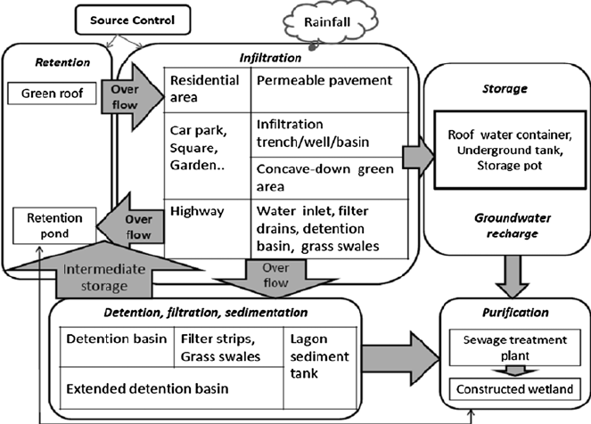

## Example: urban SW conceptual network

## Actors
- State government
- Governmental water resources manager (NVE)
- Regional authority
- Local authority political
- Local authority technical
- Local authority's planner
- Maintenance team
- Property owner
- Neighbor
- Visitor

## Actors
- Private consultancy company
- Private consultancy's project manager
- Private consultancy's planner
- Private consultancy's landscape architect
- Private consultancy's water utilities engineer
- Private consultancy's geotechnical engineer
- Private consultancy's civil construction engineer
- Land developer
- Owner of constructible land
- Contractor project manager

## Actors
- Contractor site engineer
- Farmer
- Forest owner
- Forest manager
- Research institutes
- Grassroot innovative farmers
- Supplier of SW infrastructure: pipes, valves, filters, storage solutions
- Non profit organisations
- Local home owners / residents groups
<!--
- BOKU Vienna
- Land institute
- WSL / SLF
- Irstea
-->

<!--
- Grant Schutlz (Versaland)
- Joe Shepard
- Ben Falk
- Ridgedale Permaculture
-->

## Civil engineering
- Technical drawings
- Technical specifications
- Scoping engineering report
- Detailed engineering report
- Local authority: capital works plan
- Local authority: renewals plan
- Asset management
- Maintenance costs
- Design lifetime
- Safety and climate factors

## Physical processes
- Condensation
- Rain
- Snow
- Hail
- Sublimation
- Interception
- Evaporation
- Evapotranspiration
- Potential evapotranspiration

## Physical processes
- Actual evapotranspiration
- Horton overland flow (exceeded infiltration capacity)
- Interfow
- Baseflow
- Exfiltration
- Infiltration
- Deep percolation
- Erosion
- Sedimentation

## Physical processes
- Turbulent heat fluxes
- Sensible heat flux
- Latent heat flux
- Temperature lapse rate
- Orographic forcing of precipitation
- Foehn
- Atmospheric rivers
- Flow in unsaturated soils
- Flow in saturated soils
- Preferential flow paths

## Physical processes
- Soil fractions
- Clay
- Silt
- Sand
- Gravel
- Cobble
- Water retention curve
- Field capacity
- Soil saturation
- Soil moisture deficit

<!--
- Soil horizons
-->

## Physical processes
- Porosity
- Hydraulic conductivity
- Permeability
- Aquifer depth
- Depth to bedrock
- Root zone depth
- Water table depth
- Debris flow
- Flash flood

## Physical processes
- Eutrophication
- Nutrient trapping / cycling
- Particulate pollution
- Gaining stream reach
- Losing stream reach
- Confined aquifer
- Unconfined aquifer

<!--
- Cavitation
- Pump priming
-->

## Physical processes
- Wilting point
- Precipitation undercatch
- Wetting front
- Critical zone
- Soil horizons
- Tilling pane

## Measurement techniques
- Tipping bucket precipitation sensor
- Water pressure sensor
- Water temperature sensor
- Soil temperature sensor
- Soil moisture sensor
- Soil matric potential: tensiometer, neutron probes, time-domain reflectometry
- Wind speed and direction
- Air temperature
- Air relative humidity
- Salt dilution with electrical conductivity meter

## Measurement techniques
- Dye dilution with fluorometer
- In-stream flowmeter
- Natural isotopes
- Radon content in groundwater
- Geo-electrics
- Ground penetrating radar
- Gravitation methods
- Pumping tests
- Snow water equivalent measurement
- Electrical conductivity meter

## Measurement techniques
- pH meter
- Turbidity meter
- Infiltrometer
- Permeameter

## Analogies and pre-requisites
- Gradient
- Fourier's thermal conductivity law
- Mass balance
- Energy balance
- Cardiovascular system
- Barriers to implementation: composting toilets

<!--
- Tree sap rise
-->

## Physical equations
- Deterministic model
- Statistical model
- Darcy's Law
- Poiseuille's Law
- Penman Monteith equation
- Bernouilli
- Horton's equation
- Richard's equation
- Green Ampt's equation

## Physical equations
- Rational formula
- Manning's formula
- Stokes equation
- Hjulström curve
- Shields diagram

<!--
- Navier Stokes
-->

## Physical equations
- Viscosity
- Turbulent flow
- Laminar flow
- Meteorological variables
- Pressure
- Temperature
- Wind speed
- Long wave radiation
- Short wave radiation

## Calculation methods
- Intensity-Duration-Frequency curves for rainfall (IVF in Norwegian)
- Rational method
- Time of concentration
- Runoff coefficient
- Runoff curve number
- Temperature-index snowmelt
- Linear reservoir model
- Mixing model with conservative tracers

<!--
- Time-area method
- Flow duration curve
- Unit hydrograph method
- Runoff routing models
-->

## Calculation methods
- Flood frequency analysis
- Peak over threshold or annual maximum values
- Stage-discharge relationship: rating curve
- Peak annual discharge
- Date of peak annual discharge
- Water stage
- Recurrence interval
- Design flood (return level)
- Rainfall runoff models
- Flood routing

## Calculation methods
- Conceptual hydrological models
- Validation period
- Calibration period
- Nash-Sutcliffe performance
- Benchmark performance
- Root Mean Square Error
- Equifinaly
- Blue green factor method
- Forecasting
- Now-casting

## Software tools
- Digital Terrain Model
- ArcGIS or QGIS
- Autocad (tech drawing)
- Sketchup
- Inkscape
- HEC-RAS, MIKE (Hydraulics)
- MODFLOW (GW)
- R Programming

## Design philosophies
- Redundancy
- Multifunctionality
- contingency
- Constructability
- Simplicity
- Durability
- Usability
- Legibility
- Maintainability
- Context (social and physical)

## SW infrastructure
- Pipe
- Green roof
- Rain garden
- Swale
- Bio-swale
- Infiltration trench
- Porous pavement
- Onsite water tank
- Detention basin / pond
- Infiltration basin / pond

## SW infrastructure
- Keyline trench off contour
- Pond on keypoint
- Water pumps
- Air valve
- Stop valve
- Pressure reducing valve
- Thrust block
- Manhole
- Overflow
- Rock rip-rap

## SW infrastructure
- Culvert
- Drainage channel
- Irrigation canal
- Weir
- Roof washing
- Rooftop
- Gutter
- Downspout
- Downspout filter
<!--
- Downspout extention
-->

## SW infrastructure
- First-flush devices
- Water treatment technologies: sand filters, uv...
- Fog collection 
- Greywater collection
- Rainwater harvesting
- Permaculture
- Urban farming
- Micro-climate
<!--
cooling towers
-->

## SW infrastructure
- Mulch
- Gravel ballast
- Root barrier
- Access
- Geotextile
- Annual plants
- Perennial plants
- Check dam
- Curb extension

<!--
road subgrade
-->
## SW infrastructure

- Setback (i.e. from foundations)
- Water sensitive urban design
- Blue green infrastructure
- Best Management Practices (BMPs)
- Low Impact Development (LID)
- Sustainable Urban Design (SUD)
- Sustainable Drainage System (SuDS) 
- Temporary infrastructure for erosion control
- Sediment traps
- Erosion control blankets

## SW infrastructure
- Surface roughening
- Armoring, energy disspator
- Gabions
- Live fascines for riverbank stabilitzation
- Turbidity curtain
- Riparian buffer
- Pumps, submersible pumps
- Debris screen
- Flood levee

## Land uses
- Conifer forest
- Deciduous forest
- Snow covered area
- Lakes
- Glacier
- Bushes
- Wetland
- Bare rock
- Pasture
- Orchard

## Land uses
- Plowed cereal field
- Plowed vegetable field
- Agro-forestry
- Constructed
- Asphalt road
- Gravel road
- Recreation area
- Permafrost

## Land uses
- Catchment
- Flood plain
- Riparian zone
- River channel
- River delta

## Innovative agriculture
- No-till farming
- Intensive adaptative rotational grazing
- Holistic management
- Keyline design
- Permaculture
- Alley cropping
- Pasture cropping
- Agroforestry
- Perennial agriculture

