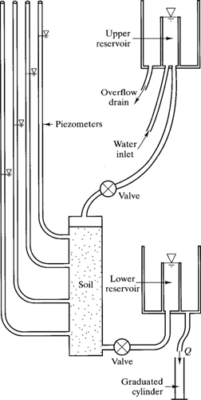

# Suggested group projects

## Ideas to develop

Designing new hydropower projects
Green roofs: there is good pdf from NVE, soil moisture sensors good be installed in a roof. Maybe the roof of Sogndal hotel?
Flood routing in Sogndal, Jostedal
Flooding of the Opo in Odda: discussing mitigation measures, including hydropower reservoir.
Compute IVF curves for sogndal, selseng

Glacier lake outburst flood in Norway, with focus on a specific location, like harbardsbreen, breheimen, or Blaamannsisen, Nordland

Muskingum flood routing for Sogndalselvi?

## Erosion experiment with soil moisture sensors

Using the plexiglas apparatus in the geolab
This could include piping experiments [Laboratory soil piping and internal erosion experiments](https://onlinelibrary.wiley.com/doi/full/10.1002/esp.3508)

## Design projects: Leikanger 100 dwellings, 10ha

## Design projects: site map

## Design projects: catchment

## Design projects: options

Different groups could tackle different design challenges:

- minimum extra outflow (least hydrological impact)
- off the grid design
- most agriculture / food production friendly design
- design (incl. climate change) for its actual climate or 
- semi-arid climate (US mid-west, middle east)
- mediteranean climate (Marseille, California)
- (sub)tropical climate (NSW, central America)

## Design projects: example drawings

## Design projects: example drawings

## Design projects: other ideas

- You can suggest another area to be developed
- Re-design the campus for water harvesting and irrigation of urban agriculture. This could be linked to smart reservoirs.
- Look for problems involving SW in the region and propose solutions (dirt roads, specific locations in Sogndal)

## Design projects: expectations

- Drawings (hand, sketchup...) are encouraged. 
- Try to specify construction requirements: inputs / outputs in materials, timing
- Explain the process: your assumptions, calculations, context, design choices...
- Be creative: do not give only 1 option
- No need for huge report

## Synthesis projects

- Recommendation for green infrastructure design in Norway: which techniques are promising, where, under which circumstances...
- Prepare a set of reference drawings / specifications on stormwater management for Western Norway?
- Develop a cheatsheet on green SW infrastructure (i.e [nervous system](https://www.cheatography.com/davidpol/cheat-sheets/sympathetic-nervous-systems/pdf/), [R programming](https://www.rstudio.com/wp-content/uploads/2016/11/ggplot2-cheatsheet-2.1.pdf))

## Synthesis projects: expectations

- Explanation of choices
- Steal like an artist: build upon the resources synthesized
- Neat and practical final product

## Modelling projects

- Data exploration and hydrological modelling of the Sogndal catchment using R
- Flood frequency analysis for the catchment
- Relationship between measured flow at Sogndalsvatn and flow in Sogndal (can be experimental too)

<!--
- Instrument the Sogndal stream close to the campus or lower towards the outlet, do fluorometer / salt experiments and try to understand: how much more flow is there here than at Sogndalsvatn, how much time does river routing take, is it dependent on discharge rate? discuss the limitations
-->
## Modelling projects: expectations

- Structured programs with R
- Use of best practice for coding
- Good explanation of the analysis: available data, methods, assumptions, results

## Building projects

- Design / Build a water pump or any other hydraulic  feature (i.e ram pump). 2000 Kr available. 

Expectations: similar to design projects + explain why it works as it does.

## Experimental projects

- Implement a data acquisition experiment in sogndal or in the Sogndal catchment. (available equipment: portable EC/pH meter, soil moisture sensors, soil temperature sensors, water pressure sensors, fluorometer)
- Biochar properties: available water capacity, hydraulic conductivity, erodability...

## Experimental projects

Repair and experiment with the fied infiltrometer and lab permeameter. This could include a review of infiltration measurement methods and improvement of this wikipedia article:

https://en.wikipedia.org/wiki/Infiltrometer

## Experimental projects: expectations

- Explain the why, what and how of experimental setup
- Present results in a critical way: what went well and what didn't

## Social projects

- Serious game development for stormwater management in Norway
- Analyze the barriers to implementation of innovative SW practices in Norway.
- Compare them with other countries
- Compare them with other topics, for example composting toilets.
- Discuss how crowd-based approaches could influence design / planning decisions (i.e. design of the campus)

## Social projects: expectations

- Have a scientific approach to the issue: what methods did you use, which assumptions did you make
- High quality reporting

# Project assessment

## Project groups + second project

People	| Main project	|  Second project
--- | --- | --- 
People | project |  project2

## Project development

- Last 2 weeks of the course: project discussion instead of quiz
- Every project gets 1-2h of everyone's time: come with a short presentation of the project and first ideas. 
- Prepare good questions that the group can contribute to. 
- Animate the discussion.
- During the 10 day period before the exam, every project gets a 2-hour block of my time.

<!--
For example students would work on a project that develops their weak point why being client on a topic they feel more at ease with.
-->

## Project reporting and presentation

- The reports are sent to fkba@hvl.no and uploaded to fronter: Friday 9th of June. 24:00 
- Slide show of 5 minutes per person (so 15 or 20 min total depending on the group)
- Videos could be part of the reporting, but not only
- The group with the same "second project" as the presenters gets priority for questions. They should have read the "second project" report in detail.
- The individual exam will then discuss the personal project, the second project and the course material

